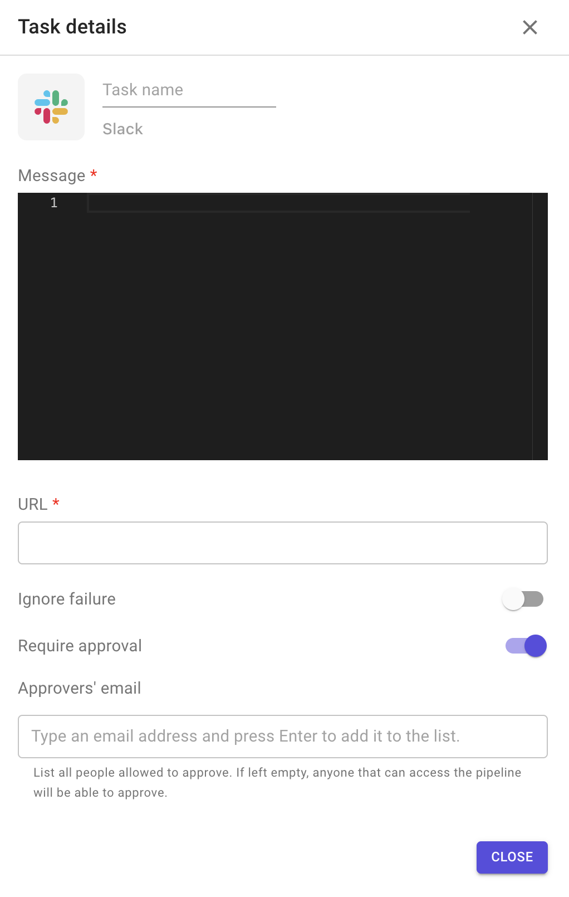

# Slack

This plugin allows you to send a notification to your Slack channel.

**Configuration options**

1. Message: YAML content to be sent.
2. URL of your Slack channel.
3. Custom arguments.
4. Ignore failure: if enabled, the execution of the following stage will be triggered even if the task fails.
5. Require approval: means that this task will not be executed until approved by people added in the approvers' list.
   * The task remains blocked until all approvers added in the list approve it.
   *   When enabled, it allows you to add approvers to the list 

       <figcaption></figcaption>
   * The approver has to be Brainboard user
