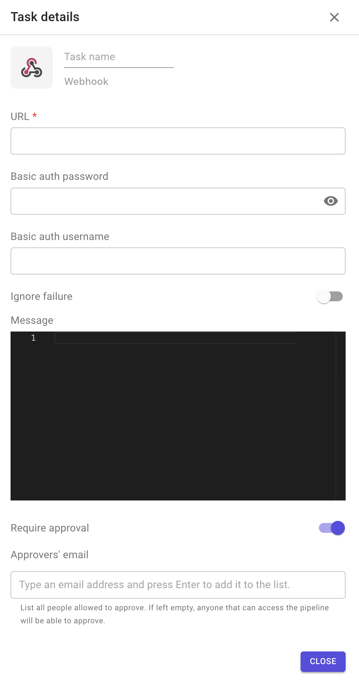

# Webhooks

This plugin allows you to communicate with an external system that is accessible through an API.

This is Brainboard plugin.

**Configuration options**

1. URL of the external system.
2. Basic auth password.
3. Basic auth username.
4. Ignore failure: if enabled, the execution of the following stage will be triggered even if the task fails.
5. Message: payload to send with the API post request.
6. Require approval: means that this task will not be executed until approved by people added in the approvers' list.
   * The task remains blocked until all approvers added in the list approve it.
   *   When enabled, it allows you to add approvers to the list 

       <figcaption></figcaption>
   * The approver has to be Brainboard user
