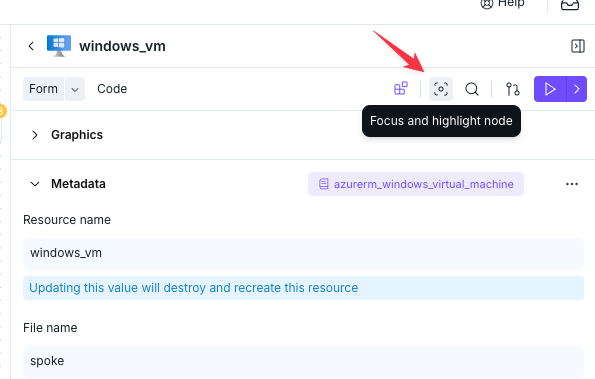
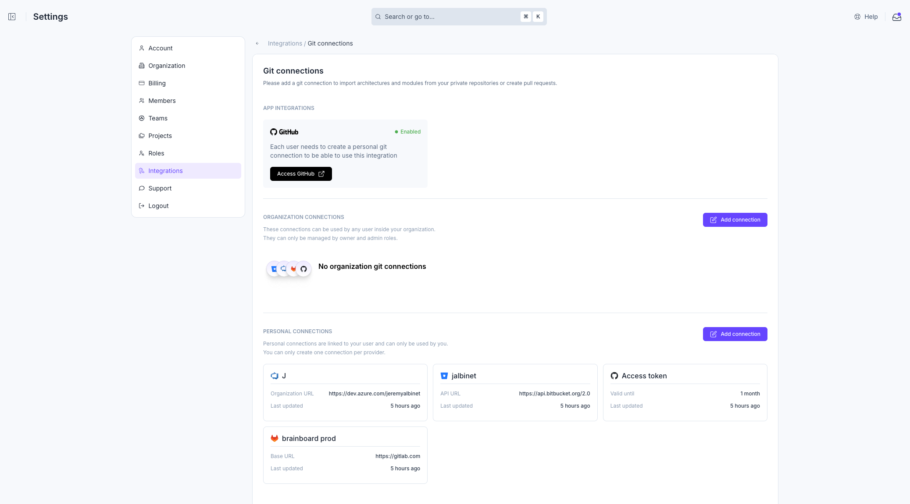
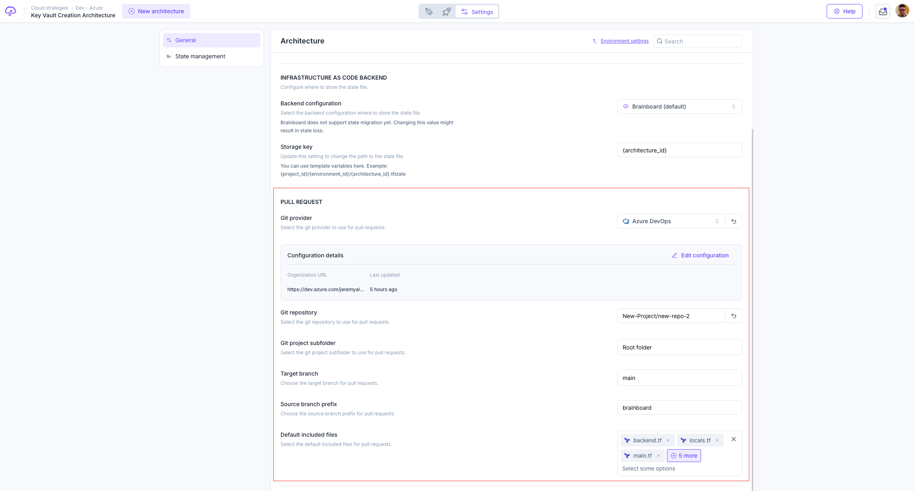
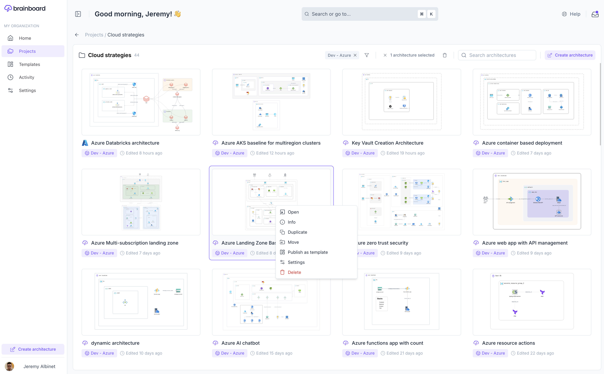
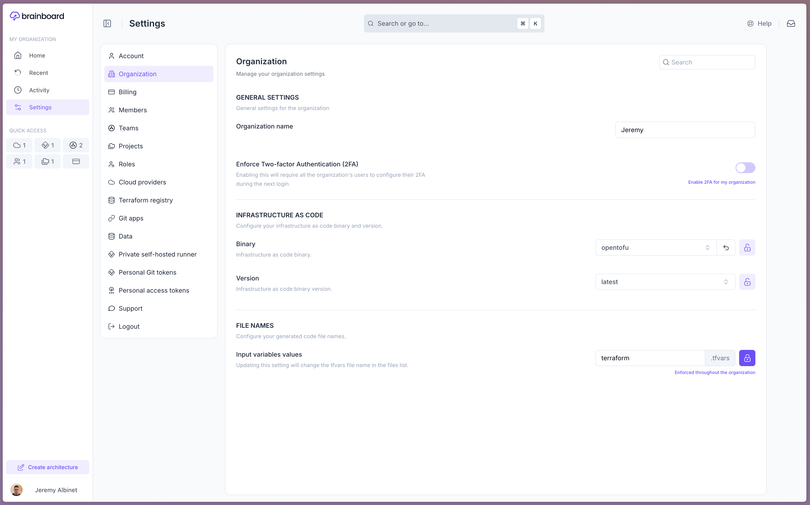
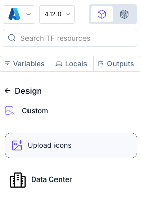
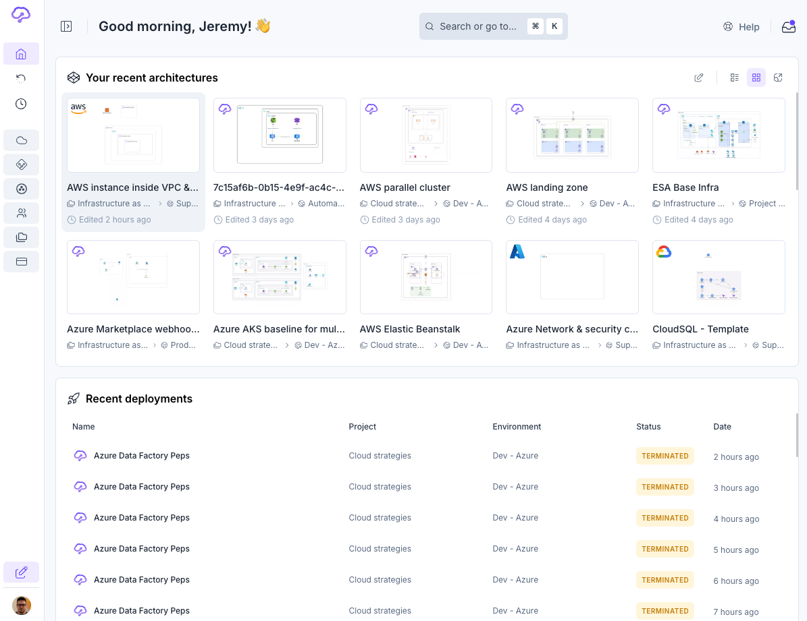
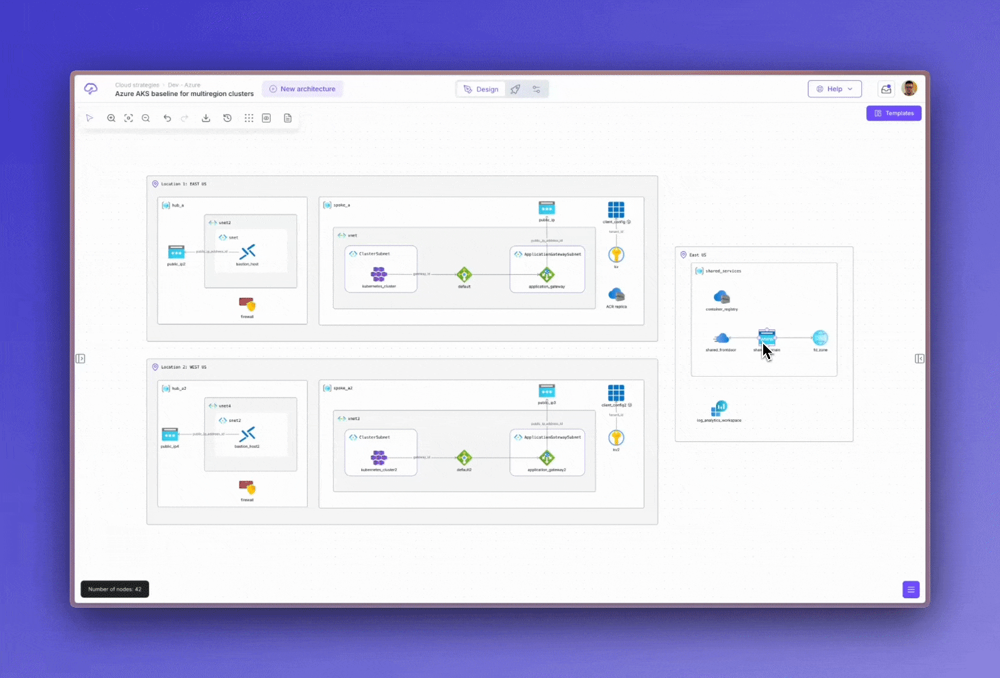

# 2025

### 2025.12.11 - Dec 19, 2025

#### 🎉 Features and Improvements

* Design area / diagram
  * Improved how code highlights follow resource selection so the editor automatically focuses on the right block with less overhead.
  * Optimized Identity card fetching so each unique resource type is loaded only once, reducing unnecessary network calls on large diagrams.
  * Simplified the right pane and resource configurator behavior by removing the forced file view mode, making the UI more responsive and predictable.
* Variables / Locals / Output
  * Added a “Select all” option for variables so you can bulk-select and manage them in a single action.

#### ✅ Bug Fixes

* Home / Projects
  * Fixed an interpolation bug in the project deletion modal so the number of projects being deleted is displayed correctly.

***

### 2025.12.10 - Dec 16, 2025

#### 🎉 Features and Improvements

* Architecture
  * Optimized the “Get architecture” API to exclude heavy diagram data, improving performance for tools and views that only need architecture metadata.
* Infrastructure as Code / Connectors
  * Improved handling of inherited cloud configuration and connector references to avoid creating duplicate or unnecessary links between resources.

#### ✅ Bug Fixes

* Infrastructure as Code / Bidirectional editor
  * Fixed an issue where Terraform `count` indexes could disappear after saving in bidirectional mode, ensuring generated code stays consistent with the diagram.

***

### 2025.12.9 - Dec 12, 2025

#### 🎉 Features and Improvements

* Identity Card
  * Improved how resource configuration is checked so file-type attributes on identity cards no longer trigger false “missing configuration” warnings.

#### ✅ Bug Fixes

* Project selector / Architecture selector
  * Resolved a bug that could prevent opening projects and environments in the tree view, especially when searching across many items.

***

### 2025.12.7 - Dec 11, 2025

#### 🎉 Features and Improvements

* Variables/Locals/Output
  * Variable usage detection now also scans custom provider configurations, giving you more accurate insights into where variables are used across your architectures.

#### ✅ Bug Fixes

* Design area / diagram
  * Fixed an issue where selecting a node could unexpectedly move the diagram, which previously disrupted precise editing for all users.
  * Resolved a bug where double‑clicking resources only sometimes opened them, particularly when zoomed, affecting users working on dense diagrams.
* Code edition/Bidirectional
  * Fixed a problem where pressing the space bar in bidirectional mode could cause the editor to lose focus, interrupting typing for users editing code or text.
* Infrastructure as Code / Export
  * Exporting an architecture no longer triggers two file downloads in a row; each export action now produces a single, correct file for all users.
* Variables/Locals/Output
  * Fixed variable search returning incomplete or incorrect results, which previously made it hard for users with many variables to locate specific entries.
* Identity Card / File inputs
  * Corrected validation so “missing file name” errors only appear when the name is truly absent, and file upload fields no longer block submission unnecessarily, improving file handling for all architectures using file attributes.

***

### 2025.12.4 - Dec 10, 2025

#### 🎉 Features and Improvements

* Identity Card / Terraform Modules
  * Improved Terraform module identity cards for git-based modules so that when the target version is empty or set to `HEAD`, the correct git ref is resolved and used reliably.

#### ✅ Bug Fixes

* Code edition/Bidirectional
  * Fixed an issue where global keyboard shortcuts could interfere with typing in the code editor or text fields, which previously caused unexpected actions while editing.
* Project selector / Architecture selector
  * Fixed a problem where the “Move architecture” button stayed disabled even when all fields were correctly filled, which affected users reorganizing architectures across projects or environments.
* Settings / Team
  * Fixed the “Invite new member” button staying disabled despite all required fields being completed, which affected organizations adding new collaborators.
* Import from cloud provider (Azure)
  * Fixed Azure imports failing entirely when a single resource group returned an error, which previously blocked customers with partially misconfigured subscriptions from importing any resources.

***

### 2025.12.3 - Dec 05, 2025

#### ✅ Bug Fixes

* Git credentials
  * Fixed an issue where the “Save and Add” button for new Git credentials stayed disabled even when all required fields were correctly filled, ensuring users can now add Git connections without workarounds.
* Terraform / Remote backend
  * Fixed validation behavior in the “New Terraform Backend” form so that the action buttons correctly enable as users complete the form, preventing blocked backend configuration setups.

***

### 2025.12.2 - Dec 04, 2025

#### 🎉 Features and Improvements

* Import from cloud provider
  * Import tasks now provide clearer warnings and richer internal logging when validation is skipped or errors occur, making it easier to understand and troubleshoot import outcomes.
  * Improved cloud resource import so resources sharing the same Terraform reference (for example, across regions) are automatically deduplicated and renamed, preventing conflicts in the generated Terraform code
* Terraform/Opentofu
  * Introduced smart caching for Terraform and OpenTofu version lists to speed up version discovery and reduce waiting time when running plans or updates.

***

### 2025.11.8 - Nov 26, 2025

#### ✅ Bug Fixes

* Design area / diagram
  * The design area now automatically adapts to the available window size, improving readability on different screen resolutions.
  * Click detection on resizers has been tightened so normal canvas interactions are not mistaken for resize actions, preventing unexpected layout changes.
  * The options bar is now consistently positioned and no longer shifts when toggling the left panel, providing a more stable editing experience.
* Cloud configuration (import & parsing)
  * Fixed an issue where attributes that should be represented as blocks were mishandled during import, which previously could lead to incomplete or incorrect cloud configs for some resources.
* Leftbar
  * Dragging and placing resources from the left bar now correctly accounts for whether the left panel is visible, ensuring nodes land exactly where you expect on the canvas.
* Right pane / Resource configurator
  * Opening node configuration or cloud configuration actions now reliably opens the right panel, so you always see the relevant settings when you need them.
  * Closing the right panel from headers, compact views, or configurator back buttons now uses a unified toggle, giving a more predictable and responsive side-panel behavior.
  * The table of contents inside the configurator now positions itself based on the actual right panel width, improving usability on wide and narrow screens.
* Node / Containers
  * Clicking on nodes to edit or inspect them now consistently opens the configuration panel and focuses the selected resource, streamlining day‑to‑day editing flows.
  * Guided configuration steps that highlight nodes and warnings now ensure the right panel is opened automatically, making onboarding and tutorials smoother.

***

### 2025.11.6 - Nov 21, 2025

#### 🎉 Features and Improvements

* Global
  * Unified the global command palette into a new Brainboard Command Search with grouped commands for design, CI/CD, exports, and settings, making keyboard-driven navigation faster and more discoverable.
* File upload
  * Introduced a new File upload component with drag‑and‑drop, size/type/count validation, progress feedback, and rich documentation for consistent file uploads across the app.
  * Ensured unsupported file types show a clear overlay message without leaving the editor in a broken or loading state.
* Resource configurator
  * Used new HCL formatting helpers for lists and maps in the configurator, so what you see in the editor more closely matches what Terraform expects.
  * Removed legacy map-reset logic when toggling between automatic and advanced modes, so users no longer lose map values when switching editing modes.
  * Improved object-array editing (key/value lists) to avoid unnecessary updates and better handle duplicate keys, making complex map editing more reliable.
  * Added an exception for `brainboard_file.file` attributes so required file fields are considered satisfied when a file is actually uploaded  not just when a text value is present.
* Infrastructure as Code – Terraform / OpenTofu
  * Ensured `depends_on` values are never quoted in generated HCL, preventing Terraform from misinterpreting dependencies as strings.
  * Improved import parsing to correctly escape embedded quotes in strings, avoiding syntax errors when importing complex expressions.
  * Updated Terraform module generation to use a more accurate “root attribute” notion when deciding whether to quote values, leading to cleaner, more idiomatic HCL.
* Screenshot
  * Updated screenshot service dependencies and observability stack, ensuring screenshot capture continues to work reliably on newer runtimes.

#### ✅ Bug Fixes

* Architecture versions
  * Fixed the "duplicate diagram key" error when checking out architecture versions by acquiring a diagram lock during the operation, preventing concurrent edits from corrupting the diagram.
  * Also, improved architecture version history by showing a spinner while a version is being restored, preventing accidental double actions.
* Design area / diagram
  * Repaired Brainboard icon nodes after diagram migrations, ensuring custom icons render correctly in existing diagrams.
  * Resolved a “dead zone” in the Terraform file selector where clicks between the filename and arrows were ignored, making file switching more predictable.
  * Corrected search focus behavior in the TF file selection dropdown so typing always targets the search field as expected.
* Resource configurator
  * Fixed validation for `brainboard_file.file` attributes so architectures no longer appear invalid when a file has been uploaded but the text field is empty.
* Leftbar / Icons & custom icons
  * Prevented custom icons from “leaking” when switching from a node with a custom icon to one without, so icons no longer appear on the wrong resources.
  * Made custom icon deletion fully consistent by locking diagrams and updating nodes in a transaction, avoiding partial updates or stale icons.
* Git configuration
  * Repaired broken GitHub logos in Git app and registry provider settings so users see the correct branding instead of missing images.
* Terraform import / Parser
  * Fixed import parsing of strings containing quotes so they are correctly escaped, eliminating syntax errors in imported Terraform code.
  * Ensured heredoc and `jsonencode` transformations in the import parser still behave correctly after the quote-escaping change.
* Terraform / HCL generation
  * Corrected quoting rules so `depends_on` and `ignore_changes` lists are never emitted with quoted values, avoiding invalid dependency expressions.
  * Fixed several edge cases where values that looked like references were incorrectly quoted (or vice versa), resulting in cleaner, valid HCL.

***

### 2025.11.5 - Nov 12, 2025

#### 🎉 Features and Improvements

* Resource Configurator for `brainboard_file`
  * When uploading files, the filename field is now auto-filled, saving time and reducing errors for users configuring resources.

#### ✅ Bug Fixes

* Code generation
  * The handling of custom Terraform resource has been simplified, making code generation more reliable and maintainable.
* Module
  * Fixed issues with updating module versions when using custom SSH sources, ensuring compatibility for teams with private module repositories.
* CI/CD
  * Fixed duplicate approval emails by ensuring the job state is always checked from the database before notifications are sent, benefiting all teams using approval workflows.
* Resource Configurator
  * Fixed a bug when clicking on "New Instance" were creating the block at the root level instead of the intended block, improving accuracy for users managing complex configurations.

***

### 2025.11.4 - Nov 10, 2025

#### ✅ Bug Fixes

* Right panel - resource menu action
  * The "Switch to data source" option is now only shown for supported nodes, making the interface clearer and reducing confusion for users working with modules or icon-only nodes.
* Diagram / Inheritance
  * Improved inheritance logic to ensure configurations are inherited from the closest parent, enhancing accuracy for complex AzureRM architectures.
* Import from Cloud Provider
  * Importing large numbers of cloud resources now fails early and provides clear feedback when limits are exceeded, preventing partial or failed imports for customers with extensive cloud inventories.
* Modules
  * Fixed an issue that prevented users from changing the version of a module, restoring full control over module sources.
* Code Generation
  * Fixed provider code generation when a custom provider source is set, ensuring Terraform configurations are always valid for custom and official providers.
* Pipelines
  * Ensured pipeline data reflects real-time status by always fetching the latest information, preventing outdated or stale job output.

***

### 2025.11.3 - Nov 06, 2025

#### ✅ Bug Fixes

* Code edition / Bidirectional
  * Enhanced the reliability of repeatable block ordering, ensuring that code imports and diagram updates remain consistent and predictable for all users.
* Resource Configurator
  * Fixed an issue where text fields would lose focus unexpectedly after clearing, streamlining the editing experience for all users.

***

### 2025.11.2 - Nov 05, 2025

#### 🎉 Features and Improvements

* Resource Configurator
  * Added a button to manually refresh the Terraform Module form, making it easier to update module information on demand.
  * Map fields now automatically generate unique keys, preventing accidental duplicates and reducing manual correction for users.
* Design Area / Diagram
  * Switching from the Code panel to the Resource panel now scrolls instantly to the selected resource, providing a smoother and faster navigation experience.

#### ✅ Bug Fixes

* New architecture
  * New blank architectures now use your preferred cloud provider by default, streamlining setup for users with specific provider preferences.
* Design Area / Diagram
  * Fixed an issue where editing a tag could cause text to overflow when the builder was open, ensuring clear and readable labels for all users.
* Resource TF filename Modal
  * Addressed a bug that caused unnecessary horizontal scrolling in modals, resulting in a cleaner and more user-friendly interface.

***

### 2025.11.1 - Nov 03, 2025

#### ✅ Bug Fixes

* Diagram
  * Fixed diagram undo/redo boundaries ensuring users can undo their first action.
* Deployment Preflight
  * Fixed an issue where some nodes appeared in the deployment preflight modal without warnings, ensuring errors are now displayed only when relevant for a clearer review process.
* Resource configurator
  * Resolved a problem where clearing a select field with a reference did not actually remove the value, ensuring selections are accurately updated for all users.

***

### 2025.10.11 - Oct 30, 2025

#### 🎉 Features and Improvements

* Nodes / Containers
  * You can now easily convert custom resources into standard nodes, making it simpler to transition to fully supported resource types and ensure long-term stability.
* Identity Card
  * When the resource name and title differ, the resource card tooltip now clearly displays the resource name, helping users quickly identify and differentiate resources.

#### ✅ Bug Fixes

* Architecture checkout
  * Error notifications no longer appear when checking out a different architecture version, providing a smoother experience for users working with version history.
* Code generation
  * Custom node attributes created by previous code edition sessions are now handled correctly in code generation, ensuring the generated code is the same before the 2025.10.4 release.

***

### 2025.10.10 - Oct 30, 2025

#### 🎉 Features and Improvements

* Design Area / Code Edition
  * You can now use CMD+F or CTRL+F to quickly open the contextual search either in the code editor or right pane, making it easier to find what you need.
* Architecture Configurator
  * Searching for resources is now more accurate, as the resource name in addition to node title and resource type are always included in search results.

#### ✅ Bug Fixes

* Code generation (for custom node)
  * Custom nodes now support for\_each/count/depends\_on and can generate Terraform code, unlocking more flexibility for advanced users.
* General Stability
  * Improved error handling in cloud configuration and architecture actions, so users receive clearer notifications and errors are better tracked.
* Architecture Diagrams
  * Circular dependencies between nodes are now detected and handled, preventing potential crashes or infinite processing loops.

***

### 2025.10.8 - Oct 29, 2025

#### ✅ Bug Fixes

* Code generation
  * Block order in code generation now produces consistent and predictable ordering, reducing confusion and making version control reviews easier for all users.

***

### 2025.10.7 - Oct 29, 2025

#### 🎉 Features and Improvements

* Design Area / Diagram
  * Improved the auto-scroll behavior so that when switching between panel modes, the selected resource in the diagram is always visible.
* Resource Configurator
  * Added a confirmation modal before deleting blocks with existing configurations, helping prevent accidental data loss.

#### ✅ Bug Fixes

* Code generation
  * Enhanced the map input to automatically quote keys with special characters and restrict invalid characters, preventing errors during code generation.
* API
  * Added back a dedicated API endpoint to list all architectures by environment, making it easier to discover and manage architectures in specific environments.
* Auto-Scroll / Resource Selection
  * Fixed the auto-scroll to selected resource when toggling between code and resources mode, so users always see the selected resource in view.

***

### 2025.10.6 - Oct 28, 2025

#### 🎉 Features and Improvements

* Design Area / Diagram
  *   Introduced a new button to focus and highlight the active configuration node for quicker access. 

      <figcaption></figcaption>
* Map Input
  * Added validation for map keys, ensuring only valid characters are used to prevent configuration issues.

#### ✅ Bug Fixes

* Resource Card
  * Enhanced display of local and variable references, ensuring accurate and clear labeling for users.
* Resource Configurator
  * Improved restoration of field types when switching from advanced mode, ensuring data consistency and reducing user confusion.
  * Added support for sections with multiple nested blocks, allowing more complex configurations and improved flexibility.
  * Improved search to support case-insensitive matching, making it easier to find regions and locations.

***

### 2025.10.4 - Oct 27, 2025

#### 🎉 Features and Improvements

* New [Right panel](../cloud-design/right-panel.md)

<figcaption></figcaption>

***

### 2025.09.1 - Sep 08, 2025

#### 🎉 Features and Improvements

* RBAC
  * Introduced new permissions regarding organization/project/environment/architecture settings, giving organizations more control over settings management.

***

### 2025.08.2 - Aug 18, 2025

#### 🎉 Features and Improvements

* CICD - Plugins - Webhook
  * Added support for custom HTTP methods and headers in webhook scripts, enabling more flexible integrations with external systems.

***

### 2025.08.1 - Aug 13, 2025

#### ✅ Bug Fixes

* Cloud Provider Import
  * Improved the parallel import feature to automatically optimize performance, helping users import resources more efficiently from cloud providers.
* Team Management
  * Fixed an issue allowing teams to be created programmatically even if they are empty, ensuring smoother automation and onboarding processes for organizations.

***

### 2025.07.4 - Jul 28, 2025

#### ✅ Bug Fixes

* Cloud Provider Credentials
  * Automatically removes related cloud provider credential links when deleting an architecture, environment, or project, ensuring your credential data stays clean and secure.
  * Fixed an issue where some projects were not correctly listed based on cloud credential scope, providing more accurate and reliable project views for all users.

***

### 2025.07.2 - Jul 16, 2025

#### ✅ Bug Fixes

* Plugins Drift
  * Added support for including Terraform provider schemas in release workflows, making it easier to stay up to date with the latest provider features.

***

### 2025.07.1 - Jul 01, 2025

#### 🎉 Features and Improvements

* Design Area / Diagram
  * Improved label visibility by increasing the maximum text width, making complex diagrams easier to read.
  * Enhanced container title text color for better readability.
* Remote Backend / Cloud Providers (Azure)
  * Added support for Azure remote backend authentication via Active Directory, allowing secure access without an account key

#### ✅ Bug Fixes

* Code edition
  * Fixed _locals.tf_ file edition, ensuring more accurate and reliable code changes.
* Templates
  * Improved loading skeleton padding for a smoother visual experience when browsing architecture templates.
* Global - Dropdown menus
  * Fixed an issue where dropdown menus did not close when clicking the trigger button, improving user interactions throughout the app.
* Git Configuration / CI/CD / Pull Request Plugin
  * Resolved an issue that prevented configuring Git integration in the CI/CD Pull Request plugin, streamlining setup for teams using Git workflows.

***

### 2025.06.3 - Jun 11, 2025

#### ✅ Bug Fixes

* Design Area - Right-panel (TF Code/One-action)
  * Improved the right pane experience by ensuring tab selections are now session-based and not browser based, providing a more predictable and consistent workflow for users.
* Text Node
  * Fixed list style rendering issues, ensuring that bullet points and lists appear as intended for all users.
* brainboard\_file Identity Card
  * Resolved file type restrictions, allowing users to upload any file type without encountering errors.

***

### 2025.06.2 - Jun 05, 2025

#### ✅ Bug Fixes

* CI/CD / Pipelines
  * Improved error handling and logging to prevent deadlocks during pipeline updates, resulting in more robust and reliable pipeline execution for all users.
  * Enhanced URL validation to support complex URLs with ports and query parameters, ensuring smoother integrations (e.g., MS Teams).
* Code edition
  * Removed unnecessary initialization of module graphics, ensuring that module containers correctly retain their existing children—improving diagram accuracy and consistency.

***

### 2025.06.1 - Jun 03, 2025

#### ✅ Bug Fixes

* Cloud Provider Credentials
  * Introduced a custom tree view to manage credential scopes, offering a more intuitive interface and removing reliance on external UI libraries.
* Workflow
  * Enhanced logging and error handling for job processing, making troubleshooting and monitoring more reliable for all users running pipelines and automations.

***

### 2025.05.9 - May 30, 2025

#### ✅ Bug Fixes

* Project Creation
  * Fixed an issue that prevented users from creating new projects, ensuring all users can now reliably add projects.
* Project & Environment Selection
  * Resolved a bug that caused broken project and environment selection in the architecture wizard, ensuring users can now select the correct context for their work.
  * Addressed scenarios where the wrong project or environment could be selected, improving consistency for all users working with templates and new architectures.

***

### 2025.05.7 & 2025.05.8 - May 29, 2025

#### 🎉 Features and Improvements

* Leftbar
  * The Leftbar and related components have been fully redesigned and migrated from Material-UI to SCSS, delivering a faster, more modern, and visually consistent interface.
  * Improved usability and clarity when selecting cloud providers and versions, with a streamlined dropdown experience and better feedback.

#### ✅ Bug Fixes

* General
  * Fixed an issue where list selection was not working as expected, ensuring accurate selection and improved usability for all users.
* Architecture Warnings
  * Architecture warnings now ignore "brainboard\_group" resources in hierarchy checks, reducing unnecessary alerts and making warnings more relevant.
* Settings - Architecture
  * Git-related errors are now clearly displayed in the settings page, making it easier to diagnose and resolve configuration issues.
* Import from files
  * When importing architectures, resources from reserved files (like `providers.tf`, `variables.tf`, `outputs.tf`, `locals.tf`, and `backend.tf`) are now automatically moved to the `main.tf`, ensuring a smoother and more consistent import experience.
* Git Configuration
  * Fixed error handling across Git settings, selectors, and API calls, so users now receive clearer feedback when issues arise.
* Project selector / Architecture selector
  * Resolved a bug that caused the same project to appear multiple times in the selector, providing a cleaner and more accurate project selection experience for all users.

***

### 2025.05.6 - May 27, 2025

#### 🎉 Features and Improvements

* **Infrastructure Management**
  * Introduced a new Terraform provider schemas service, enabling more accurate validation and support for the latest provider features.
* **Code Edition / Bidirectional**
  * Added autocomplete suggestions for Terraform/OpenTofu attributes and variables in the Monaco editor, streamlining code editing and reducing errors.

#### ✅ Bug Fixes

* **Design Area / Diagram**
  * Fixed an issue where nodes could become detached from their parent when another child was deleted, improving diagram stability for all users.
* **Identity Card**
  * Resolved problems with the retrieval of the resource identity card in multi-cloud architectures, ensuring accurate attribute display and editing.
* **CI/CD**
  * Fixed saving and display of custom CI/CD task names, so custom names now persist as expected.
* **Architecture Warnings**
  * The warnings indicator now hides when there are no active (non-ignored) warnings, reducing unnecessary distractions for users.
* **Modules**
  * Enhanced the module card source field with better text overflow handling for improved readability.

***

### 2025.05.5 - May 15, 2025

#### 🎉 Features and Improvements

* Design Area - Architecture Warnings
  * Locating resources with warnings now animate and auto-focus when selected from the warnings tab, making it easier to locate and address issues.
  * Added a new warning type to detect connectors linked to non-existent nodes, automatically  resolving diagram inconsistencies.
  * Improved feedback and visibility for architecture warnings, including clearer grouping, new button placement, and enhanced notification styles.
* Design Area - Nodes & Contextual Menus
  * The contextual menu now allows you to duplicate or lock nodes directly, streamlining common actions for faster diagram editing.
  * Group actions (like duplicate and lock) are now available when selecting multiple nodes for more efficient bulk operations.
* Code Editor
  * When variables, locals, or outputs are moved between files, the code editor now provides clear feedback so you always know what changed and where.
* Home Tab - Recent Architectures
  * Added a contextual menu to architecture cards in the home tab grid view, allowing quick actions and detailed views right from your dashboard.
  * Double-clicking an architecture card now takes you directly to the design page, speeding up navigation.

#### ✅ Bug Fixes

* Design Area - Layout & Usability
  * The "Templates Catalog" and "Architecture Warnings" buttons have been repositioned for better accessibility and no longer overlap other controls.
* Project Settings / Environment Creation
  * Fixed an issue that prevented creating new environments from the project settings modal, ensuring all users can add environments as needed.
* Code Editor
  * Reverted a change that enforced a specific font in the code editor, restoring your preferred font experience.

***

### 2025.05.4 - May 08, 2025

#### 🎉 Features and Improvements

* Code Edition / Bidirectional
  * Enforced margin for line decorations in the bidirectional code editor, ensuring a consistent and user-friendly experience for all Terraform file edits, regardless of user settings.
* Settings
  * Added easy-access documentation links for Git and Terraform backend provider forms, helping users quickly find relevant setup guides directly from the settings pages.

#### ✅ Bug Fixes

* Design Area / Diagram
  * Fixed an issue where clicking on the resizer panel could cause errors, ensuring stable resizing for all users and preventing unexpected interruptions.

***

### 2025.05.3 - May 07, 2025

#### 🎉 Features and Improvements

* Variables/Locals/Output
  * Improved Terraform variable import: Now creates new variables when changing scope and updates only when values actually change, making variable management more intuitive and accurate.

#### ✅ Bug Fixes

* Screenshot
  * Fixed issues where screenshots and thumbnails could fail due to ignored warnings, ensuring all users receive up-to-date visual previews.
* CI/CD & One Action
  * Pipeline status updates now immediately display the last job status message, giving users real-time feedback on pipeline progress. This fix also ensure one action outputs is updated once the job starts.
  * Resolved terminal height issues in CI/CD pipelines, ensuring a consistent and user-friendly terminal view during deployments.
* Design Area / Diagram
  * Improved handling of missing child nodes when updating positions or finding descendants, preventing errors in complex diagrams.
  * Improved error handling to prevent crashes when updating or searching for non-existent nodes, ensuring smoother diagram editing for all users.
  * Fixed undo/redo metadata for synced architectures, so changes can be reliably reverted or reapplied in collaborative environments.
* Code Edition / Bidirectional
  * Fixed error messages not disappearing when reverting code changes, making the bidirectional editor clearer and less confusing.
  * Prevented errors by clamping line numbers and adding necessary null checks, improving overall code editor stability.

***

### 2025.05.2 - May 07, 2025

#### ✅ Bug Fixes

* Identity Card
  * Fixed an issue where certain fields could cause editors to fail to initialize (e.g. `for_each`), ensuring a smoother experience when editing custom code attributes.
* Infrastructure as Code / Terraform
  * Updated variable validation `error_message` to align with industry standards, providing clearer feedback when variable values do not meet requirements.

***

### 2025.05.1 - May 06, 2025

#### 🎉 Features and Improvements

* Design Area / Diagram
  * Added architecture warnings detection and an autofix mechanism to help users quickly identify and resolve common design issues in cloud diagrams.
  * Improved error handling when updating diagrams, ensuring issues are logged and surfaced appropriately.
  * Enhanced node copy-to-clipboard functionality to support nested children and prevent errors.
* Code Edition / Bidirectional Editor
  * Introduced a new bidirectional code editor design with enhanced feedback, file editing restrictions, and unsaved changes prompts to streamline code and diagram synchronization.
  * Added banners and tooltips to guide users on code edition limitations and best practices.
  * Improved detection and messaging for renaming restrictions and variable warnings in Terraform files.
  * Added support for clickable URLs in job output and editor hints for easier navigation.
  * Improved code editor font consistency and fixed text cursor issues for better editing experience.
* CI/CD / Workflow Designer
  * Improved configuration forms and validation for task and workflow settings.

#### ✅ Bug Fixes

* Design Area / Diagram
  * Fixed an issue where node counts were incorrect when both resources and data were present in an architecture revision.
  * Resolved an error when copying nodes with nested children.

***

### 2025.04.13 - Apr 24, 2025

#### 🎉 Features and Improvements

* Code Edition/Bidirectional
  * Added a new feedback component in the code editor to provide real-time feedback on save operations, including success and error states, improving user interaction with the editor.

#### ✅ Bug Fixes

* Code Edition/Bidirectional
  * Fixed issues with Terraform code unsaved state detection, ensuring users are correctly prompted to save changes.
  * Enhanced Terraform block parsing to support heredoc syntax, expanding the editor's capability to handle complex configurations.
  * Resolved issues where variable warnings appeared incorrectly, ensuring warnings are only shown when necessary.
  * Improved error handling in the Terraform code editor to prevent illegal line number errors, enhancing stability and user experience.

***

### 2025.04.12 - Apr 23, 2025

#### ✅ Bug Fixes

* Design Area / Diagram
  * Enhanced the design area to ensure connectors are always rendered on top even when a container is selected, improving visibility and interaction.
* Code Edition/Bidirectional
  * Removed unnecessary open idcard button for variables, locals or outputs, streamlining the code editing experience.
* Architecture Templates
  * Resolved an issue where scrolling on a template page inadvertently scrolled the readme, improving user navigation and reading experience.
* Global
  * Improved the ComboBox component used in many places like Git repository selection to ensure dropdown options are always visible within the screen, enhancing usability and accessibility.
* Variables/Locals/Output
  * Fixed the premature closing of the variable deletion modal, ensuring it remains open until all processes are complete, thus preventing accidental closures.

***

### 2025.04.11 - Apr 23, 2025

#### 🎉 Features and Improvements

* Code Edition/Bidirectional
  * Introduce a modal to manage unsaved Terraform code changes, prompting users to save or discard unsaved changes.
  * Add Variables, Locals and Outputs cache invalidation after code edition of respectively `variables.tf`, `terraform.tfvars`, `locals.tf` or `outputs.tf` to ensure data freshness.
  * Add a button in the Monaco editor to open the ID card directly from the code, improving the UX and allowing the user to always copy-paste the code.
* Design Area / Diagram
  * Keep selected files persistent when switching between Value and Design areas.
* Topbar
  * Integrate architecture selector into the new topbar for easier project navigation.
* API Documentation
  * Add missing path parameters and operation IDs to enhance API documentation clarity: [https://api-docs.brainboard.co](https://api-docs.brainboard.co)

#### ✅ Bug Fixes

* **Import from Cloud**
  * Fix attribute retrieval in Terraform state when dealing with resources with repeated blocks, ensuring accurate code generation.

***

### 2025.04.10 - Apr 17, 2025

#### 🎉 Features and Improvements

* Integrations - Cloud provider connection
  * Enhanced AWS assume role creation instructions.
* Import from Cloud provider
  * Added support of some AWS Cognito TF resources: `aws_cognito_user_pool` & `aws_cognito_identity_pool`
* Code Edition/Bidirectional
  * Enabled updates to `terraform.tfvars` file
  * Updated graphics via bidirectional synchronization when the architecture diagram is empty.

#### ✅ Bug Fixes

* Identity Card
  * Automatically load the selected cloud provider version when opening the identity card to ensure attributes are properly re-fetched.
* Node / Containers
  * Corrected node metadata region updates from bidirectional synchronization to ensure accurate data representation.
* New architecture - Git import
  * Fixed import of Terraform modules by checking if the module exists in currently imported modules.
  * Automatically select Git credentials if only one option is available, simplifying the setup process.
* CI/CD Designer
  * Resolved double scrolling issue in the CI/CD workflow preview for a more seamless navigation.

***

### 2025.04.9 - Apr 16, 2025

#### 🎉 Features and Improvements

* Git Configuration
  * Automatically set the pull request settings when creating a new architecture via git import, streamlining the setup process.
* Code edition - User Interface
  * Refactored the handling of editor modes in the design area to prevent losing unsaved changes, providing a smoother user experience when the page is refocused.

#### ✅ Bug Fixes

* Terraform Pane
  * Enhanced the Terraform code editor by adjusting the height of the pane for better visual alignment with the future topbar redesign.
* Code edition - locals & variable
  * Enhanced the code parsing process to skip variable or local deletion if they are edited from a different file, ensuring data integrity.
* Terraform Git Module
  * Corrected the handling of Terraform git module versions during import to ensure the correct version is always used.
* Identity Card
  * Fixed a spacing issue in the search functionality, affecting users who frequently use the search feature within the Identity Card.

***

### 2025.04.8 - Apr 15, 2025

#### ✅ Bug Fixes

* Code edition
  * Improved marker hooks and subscription handling for better performance and reliability in bidirectional editing.
  * Enhanced Terraform code import by using architecture provider versions, ensuring compatibility and reducing errors.
* New architecture
  * Resolved crashes at the last step when creating new architectures from the topbar or project selector, enhancing stability for users transitioning between architectures.

 

***

### 2025.04.7 - Apr 15, 2025

#### ✅ Bug Fixes

* Import from Git
  * Fixed search functionality when listing Bitbucket repositories by updating the library and modifying API calls.
  * Updated the interface for a cleaner layout and better visual hierarchy.

***

### 2025.04.6 - Apr 14, 2025

#### ✅ Bug Fixes

* Architecture
  * Enhanced the architecture creation process to prevent mismatches between environments and projects, ensuring data integrity.
* Git Configuration
  * Updated error handling in the Git plugin for better response management.
* Global
  * Prevented unnecessary page refresh during token refreshes, enhancing performance.

***

### 2025.04.4 - Apr 07, 2025

#### ✅ Bug Fixes

* Git Configuration
  * Resolved issues in the migration command to ensure it correctly filters modules with valid credentials.
* Identity Card
  * Improved error notification behavior for ID card fetch failures, ensuring notifications are only shown when opening the ID card, reducing unnecessary alerts.
* RBAC
  * Fixed the default `Admin` role adding `get` and `list` permissions to `User credentials`, enhancing security and reliability.

***

### 2025.04.3 - Apr 07, 2025

#### 🎉 Features and Improvements

* Git Connections & Pull request configuration

<figcaption>
Integrations > Git connections
</figcaption>

<figcaption>
Architecture Settings > Pull request configuration
</figcaption>

#### ✅ Bug Fixes

* Identity Card
  * Prevented the Identity Card from closing when the autocomplete is open, ensuring smoother user interactions.

***

### 2025.04.2 - Apr 03, 2025

#### 🎉 Features and Improvements

* Homepage
  * Added a 'Projects' tab to the homepage, allowing users to view and manage projects & architecture directly from the main interface.

<figcaption>
Homepage - Projects &#x26; Architectures
</figcaption>

#### ✅ Bug Fixes

* Connector
  * Resolved issues with connector paths breaking when moving handlers, ensuring smoother and more reliable diagram adjustments.

***

### 2025.04.1 - Apr 02, 2025

#### ✅ Bug Fixes

* Pipelines - One Actions
  * Send pipeline status update events when creating a pending pipeline, improving real-time notifications and switch to One-Action job's output.
* Pull Request in CI/CD
  * Added support for custom commit messages in pull requests, allowing for more personalized and descriptive commit histories.

***

### 2025.03.11 - Mar 31, 2025

#### 🎉 Features and Improvements

* SSO
  * Enhanced user role assignment using claims for organization roles.

#### ✅ Bug Fixes

* Identity Card
  * Enhanced input focus handling to prevent unexpected closures.
  * Fixed input focus handling to prevent unexpected closures.
* Variables/Locals/Output
  * Improved handling of multi-line descriptions for local variables, ensuring correct formatting.
  * Addressed variable suggestion issues, ensuring variables appear promptly in the list.
* Diagram
  * Only normalized resource names to lowercase for modules, improving consistency.

***

### 2025.03.10 - Mar 24, 2025

#### 🎉 Features and Improvements

* Workflow
  * Introduced a cancel job functionality, allowing users to stop ongoing tasks with ease.

#### ✅ Bug Fixes

* Import from Cloud Provider
  * Enhanced import parser to clean redundant connectors (connectors from a resource to a parent container), ensuring better diagram generation.
  * Fixed issues with Azure certificate credential handling during cloud provider import, ensuring smoother integration for Azure users.
* Infrastructure as Code
  * Improved parsing by quoting block attribute keys that start with "--" ensuring better compatibility and error handling.

***

### 2025.03.9 - Mar 20, 2025

#### 🎉 Features and Improvements

* Design Area / Diagram
  * Enhanced visual feedback during node resizing for a smoother design experience.
* Home Page - Architecture Templates
  * Added homepage templates with new components and design adjustments for a more intuitive user experience.
* Settings
  * Refactored Terraform backend settings to use credentials, improving backend management.

***

### 2025.03.8 - Mar 13, 2025

#### 🎉  Features and Improvements

* Architecture Templates
  * Introduced a new feature for creating architectures using templates, enhancing the setup process with updated components and configurations.

#### ✅ Bug Fixes

* Code edition
  * Improved variable scope management during bidirectional imports, ensuring accurate scope handling and reducing unnecessary filtering.
* Templates
  * Fixed an issue where the modal would close unexpectedly when sorting, improving user interaction by preventing accidental closures.

***

### 2025.03.7 - Mar 12, 2025

#### ✅ Bug Fixes

* RBAC
  * Fixed the issue where role status remained in a loading state when enabling or disabling multiple roles.
* Containers
  * Corrected the bug where resizing a container smaller did not remove its children, preventing duplicate children.

***

### 2025.03.6 - Mar 11, 2025

#### 🎉 Features and Improvements

* Design Area / Diagram
  * Introduced dynamic visual indicators for node parentship changes during movement, enhancing the design experience.
  * Adding text overflow for container titles, ensuring better readability
* Global
  * Improved text overflow handling, ensuring better display of long text.

#### ✅ Bug Fixes

* Connector
  * Fixed the positioning of the Connector Options Bar to ensure it displays correctly relative to the selected connector part.
* Node / Containers
  * Prevented the display of container connector anchors when multiple nodes are selected, ensuring clarity in node selection.
* Cloud connections
  * Corrected the file type restrictions for Google and OCI credentials, ensuring users upload the correct file formats.

***

### 2025.03.5 - Mar 10, 2025

#### 🎉 Features and Improvements

* Design Area / Diagram - Connectors
  * Added offsets to container connector anchor points, improving the accuracy and visual alignment of connections.
* New architecture - all imports
  * Fixed the default style of diagrams created via import to maintain visual consistency.
* Settings
  * Unified the UI across all settings pages for a more consistent user experience.
* Readme
  * Automatically opens the README file in preview mode if it contains content, streamlining the review process.

#### ✅ Bug Fixes

* Git Configuration - Github
  * Fixed the oauth2 route forgotten during settings refactoring, improving flexibility in Git configurations.
* Authentication
  * Corrected the logout functionality, ensuring users can log out without issues.
* Home Page
  * Added missing status badges for recent deployments, providing clearer status updates.
* Design area
  * Prevented code omissions in the node contextual menu for non-TF resources (icons or logos).

***

### 2025.03.4 - Mar 07, 2025

#### 🎉 Features and Improvements

* New version popup
  * Enhanced the design of the new version banner for a more modern look.
* Diagram Generation (Import)
  * Fixed diagram node clustering to improve the accuracy of node placement and connections.
* Settings
  * Updated settings breadcrumbs to align with new identifiers for improved navigation.

#### ✅ Bug Fixes

* Project / Environment / Architecture
  * Architectures are now automatically deleted when environments are removed, streamlining project management.
* Git Configuration
  * Resolved an issue where Git credentials were not loading preventing user to import from Git when they start from the home page, ensuring smoother access.
* Settings
  * Corrected the redirect link in settings documentation to point to the correct page.
  * Fixed the minimum width of text fields in settings for better UI consistency.

***

### 2025.03.3 - Mar 06, 2025

#### 🎉 Features and Improvements

* Settings
  *   New Settings engine with a hierarchical structure that follows this inheritance pattern:

      **Organization → Project → Environment → Architecture**
  * Documentation available here: [overview.md](../settings/overview.md "mention")
  * We will continue to migrate our settings (Remote backend, Git configuration, ...) to this new engine in the coming weeks.

<figcaption>
Organization Setting page
</figcaption>

#### ✅ Bug Fixes

* Architecture
  * Fixed clone architecture functionality to support variable values of any type (including list/array).
* One-action
  * Introduced GraphQL subscription for real-time pipeline status updates, enhancing performance.

***

### 2025.03.2 - Mar 04, 2025

#### ✅ Bug Fixes

* New Architecture
  * Fixed issues with architecture creation by adding template selection and improving project/environment data handling.

***

### 2025.03.1 - Mar 03, 2025

#### 🎉 Features and Improvements

* Global
  * Introduced a new `Time` component for consistent date formatting across the platform.

#### ✅ Bug Fixes

* New architecture - Import from Cloud provider
  * Updated import cloud provider flow to prevent INVALID\_BODY error message, improving the architecture creation process.
* Home page - Recent deployments
  * Added a 'warning' status to deployment status mappings for better status visibility.
* Leftbar
  * Fixed the visibility issue when adding or pinning a module, ensuring all modules are displayed correctly.
* Settings - Projects
  * Resolved the "View details" option in the project list to ensure dropdowns close correctly after selection.
* Architecture Templates
  * Fixed the sync architecture modal to ensure it updates correctly with project data changes.

***

### 2025.02.11 - Feb 27, 2025

#### 🎉 Features and Improvements

* CI/CD - Plugin
  * MS Teams URL validation to include new webhook URL format, ensuring more robust integrations.
* Public API
  * Added VersionArchitecture endpoint to the public API documentation for better version management.
* New version notification
  * Enhanced the "New version available" component for better update notifications.

#### ✅ Bug Fixes

* Architecture
  * Prevented architecture creation if required fields are not filled, ensuring data integrity.
* Design Area
  * Fixed icons rendering issue on Firefox, ensuring a better diagram visualization on all supported browsers.
* Home Page
  * Added trial check in billing handler to correctly process trial subscriptions.
* Node configuration / Identity Card
  * Updated Identity Card component to show the cursor only on the drag handle, enhancing usability.

***

### 2025.02.10 - Feb 19, 2025

#### 🎉 Features and Improvements

* Design Area - Node
  * Enhanced context menu (right-click) for better user interaction.
  * Added state actions (import or delete from state) to the new contextual menu, enhancing Terraform state management and UI interactions.
* Text Node
  * Introduced Markdown support for text nodes, allowing for richer text formatting.

#### ✅ Bug Fixes

* Identity Card
  * Maintains focus on the Identity card during search for a smoother user experience.
* Design Area / Diagram
  * Fixed the Terraform filename selector by adding search functionality and improving dropdown styles.
* CICD Plugins
  * Removed Microsoft Teams URL regex validation to support new webhook URL format.
* Infrastructure Management
  * Skipped decreasing license user count when removing a member with a pending invitation, ensuring accurate license management.

***

### 2025.02.9 - Feb 14, 2025

#### 🎉 Features and Improvements

* Pull Request
  * Refactored the pull request user experience for a more intuitive workflow.

#### ✅ Bug Fixes

* Licensing
  * Resolved licensing issues by removing outdated billing plan references, ensuring compliance and smoother user management.
* Import from Files
  * Corrected file upload validation to accurately handle invalid extensions, improving file import reliability.
* Code edition
  * Added support for GCP region parsing, enhancing the accuracy of resource metadata.

***

### 2025.02.4 - Feb 11, 2025

#### ✅ Bug Fixes

* Architecture creation
  * Improved the summary view UX preventing the user to be softlocked selecting the project/environment where the architecture will be created.
* Screenshot / Export architecture as diagram
  * Screenshot in PRs, manual export are both resolved and working again.
* Node / Containers
  * Improved node action handling by reverting nodes to previous positions on failure and displaying error notifications.

***

### 2025.02.3 - Feb 07, 2025

#### ✅ Bug Fixes

* Import from cloud providers
  * Fixed the final import modal UI, improving error display and overall layout for a smoother user interaction.
* Git Configuration
  * Use user's input for the 'Source branch prefix' configuration
* Variables
  * Put back the 'Return to design area' for the few users that have access to the private alpha of Home page

 

***

### 2025.02.2 - Feb 05, 2025

#### ✅ Bug Fixes

* Import from Git&#x20;
  * Enhanced import functionality by using registry credentials for module imports
  * Improved error message to provide all details
* Git Configuration / Pull request
  * Updated GitLab integration to ensure repositories appear in PR searches, enhancing Git settings management.
  * Improved UI and modal handling in Git settings and pull request components, fixing layout issues.
* Design Area
  * Resolved issue where node selection was cleared when a text node was open, ensuring consistent selection behavior.

***

### 2025.02.1 - Feb 03, 2025

#### 🎉 Features and Improvements

*   Leftbar - Custom icons 

    * Introduced custom icon management, allowing users to add, edit, and delete icons for a personalized experience.

    <figcaption></figcaption>
*   Home Page \[Private access]

    <figcaption>
New home page
</figcaption>

    * Launched a new homepage with recent architectures, deployments, and activities
    * Reach out to the support team to get access to it

#### ✅ Bug Fixes

* Git Configuration
  * Resolved an issue where the incorrect version of a Terraform module was used during refresh, ensuring accurate module management.

***

### 2025.01.8 - Jan 31, 2025

#### 🎉 Features and Improvements

* Leftbar
  * Introduced the ability to expand and collapse the Leftbar and Terraform code panels via shortcuts `[` or `]`, enhancing user navigation and interface customization.

#### ✅ Bug Fixes

* Git Configuration
  * Implemented pagination for listing Git repositories, ensuring efficient loading and management of large repository lists.

***

### 2025.01.7 - Jan 30, 2025

#### 🎉 Features and Improvements

* Import files/git/modules
  * Added custom error messages for module variable parsing failures, enhancing error clarity and debugging.
* CICD: Architecture Version Plugin
  * Added success and error messages, improving user feedback and error handling.

#### ✅ Bug Fixes

* Git Configuration
  * Fixed handling of excluded files in Git pull requests within CI/CD jobs, ensuring correct file management.
  * Simplified Git settings submission logic, removing redundant functions for a cleaner user experience.

***

### 2025.01.6 - Jan 29, 2025

#### 🎉 Features and Improvements

* Design area
  *   Enhanced node inheritance, parenting, resize, and movement logic for more intuitive design interactions.\
      Inheritance and parent <> child relation will be triggered when you resize a container over nodes/containers. 

      <figcaption></figcaption>
* CI/CD Plugin
  * Introduced a new architecture version plugin to streamline version management.
* Identity Card & Terraform
  * Added support for boolean and ternary expressions, improving logic handling in configurations.
* API
  * Added API base URL display and documentation link to personal access token settings for easier API integration.

#### ✅ Bug Fixes

* Git Configuration
  * Re-fetch Git configuration when switching to another architecture within CI/CD workflow.
* Project Selector / Architecture Selector
  * Resolved crashes in the project selector, ensuring stability for users without assigned projects or architectures.

***

### 2025.01.5 - Jan 23, 2025

#### 🎉 Features and Improvements

* Connectors
  * Introduced animation options for connector lines and circles, allowing for a more dynamic and visually appealing design experience.
* CI/CD Plugins
  * Added the Trivy plugin, enhancing security scanning capabilities within CI/CD workflows.
* Import from Files
  * Implemented error handling for duplicate Terraform blocks during import, providing clear feedback to users.

#### ✅ Bug Fixes

* Readme
  * Enhanced the markdown editor with a switch between edit and preview modes, improving user experience when editing documents.
* Architecture Selector
  * Fixed an issue when updating the current architecture, ensuring users receive notifications if the architecture doesn't exist anymore.
  * The project selector now unfolds automatically, streamlining navigation and project management.

***

### 2025.01.4 - Jan 22, 2025

#### 🎉 Features and Improvements

* Synced architectures
  * Created architecture revisions for all synced architectures, ensuring up-to-date versions.
* CI/CD
  * Added a scrollbar to the CI/CD workflow view in pipeline details for improved navigation.

#### ✅ Bug Fixes

* Architecture selector
  * Fixed an issue where the architecture list remained empty when the last search did not match any record, ensuring accurate search results.
  * Prevented crashes if the current architecture was deleted, enhancing stability.
* Import from Cloud Provider
  * Created Terraform variables for empty required password attributes during cloud import, improving import accuracy.

***

### 2025.01.3 - Jan 16, 2025

#### 🎉 Features and Improvements

* Plugins
  * Introduced environment variable support for the Wiz plugin, enhancing configuration flexibility.

#### ✅ Bug Fixes

* Import from Cloud Provider
  * Corrected the error message when attempting to create an import with an existing name, ensuring clarity for users.
* Team Management
  * Resolved an issue with the click outside functionality when adding team members, improving user interaction and experience.

***

### 2025.01.2 - Jan 16, 2025

#### 🎉 Features and Improvements

* Design Area / Diagram
  * Revamped the Design Area Options Bar for a more intuitive user experience.
* Code edition (bidirectional)
  * Improved node creation order logic for better resource management.
* Import from Cloud
  * Added support for fetching Azure nested cloud resources by CloudID and Terraform Type like NSG subnet association (`azurerm_subnet_network_security_group_association` )

#### ✅ Bug Fixes

* Leftbar
  * Fixed broken shapes, logos, and icons when searching, improving the user interface for all users.
* Screenshot
  * Resolved issues with screenshots breaking when using custom icons or text.
* Import from Cloud Provider
  * Fixed import view issues and infinite table rendering for a smoother import experience.

***

### 2025.01.1 - Jan 07, 2025

#### 🎉 Features and Improvements

* Code Edition (Bidirectional) & Connector
  * Enabled bidirectional parsing and management of connectors for better integration and functionality.
  * Enhanced HCL parser to support bidirectional parsing of connectors, improving code management.
* Import from Cloud Provider
  * Ensured Azure resources' terraformID includes the correct case-sensitive resource group for accurate deployments.
  * Fixed JSON format issues during import to ensure correct data handling and display.

