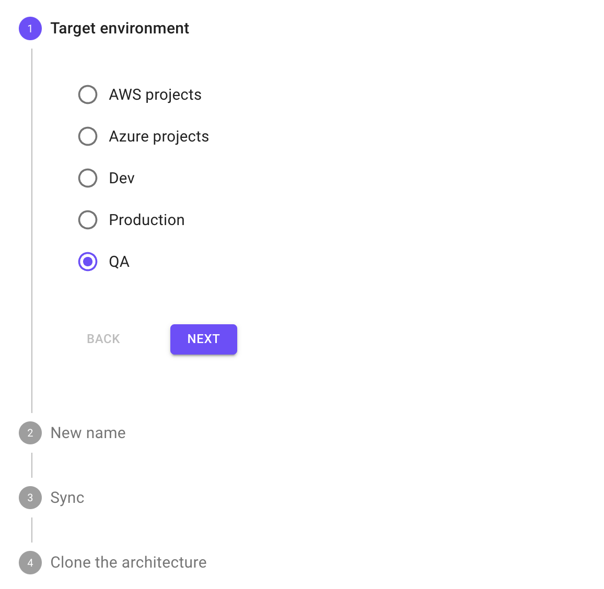
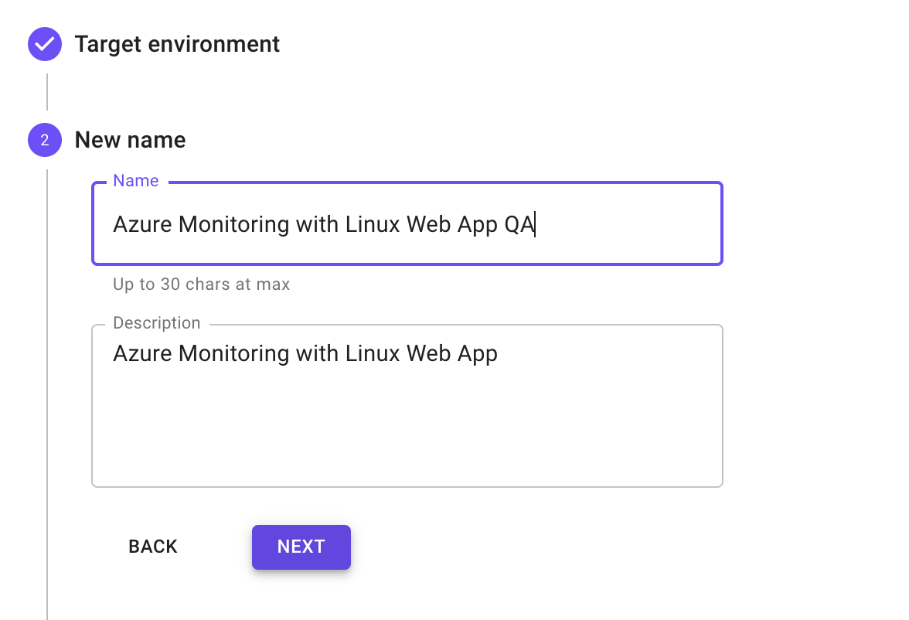
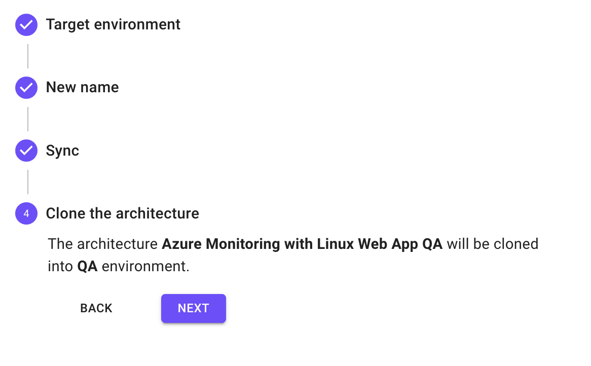
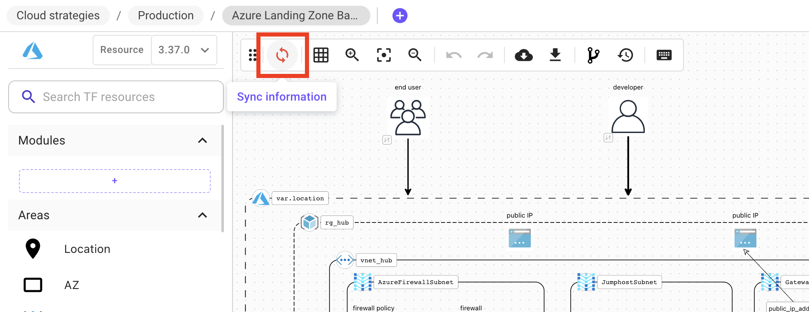
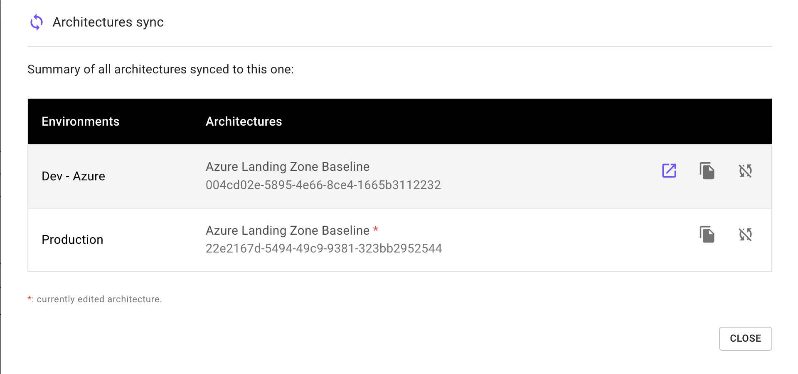
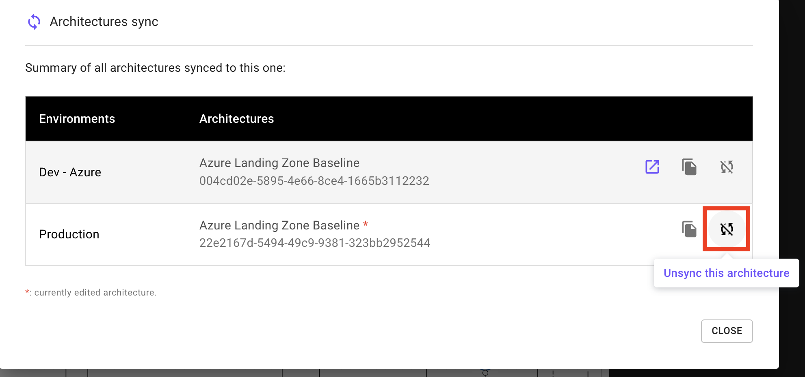

# Architecture Synchronization

### Definition

When managing cloud infrastructures at scale, you may want to keep your environments (e.g. QA, staging, prod...) close to each other.

You can achieve this by synchronizing an architecture across multiple environments, which means that any modification you do on one environment will be automatically replicated/synchronized with all synced environments except the values of the variables that are supposed to be specific to each env.

This allows you to maintain a consistent infrastructure across all your development, testing, and production environments.

### Create a synced environment

Here are the steps you can follow to implement environment sync in Brainboard:

1. Create the design and Terraform configuration for a specific architecture within a specific environment, for example: dev.
2.  Go to the project selector and select hover the architecture that you want to sync and click on the clone button:&#x20;

    <figcaption></figcaption>
3.  Follow the steps as below

    * Add the target environment where you want to clone your architecture. For example QA.

    

    * Choose a new name for the architecture

    

    * Click on the sync button to keep the source and destination architecture synced

    .png>)

    * Apply the changes by clicking on next

    

:::note
The variables values are not synced so you can use different values for different environments. Refer to the [Variables](../../../input-output/variables.md) to know more about the variables
:::

### View synced environments

Once the architecture is synced, you see a new button in the options bar to indicate that:

When you click on the sync button you can see all synchronized environments for this architecture.

### Un-sync environment

To un-sync a specific architecture or environment, click on the sync button available in the options bar, then click on the `Unsync this architecture` to unlink it from the synchronized environments. 

### Best practices

* Use this process to apply changes to all environments consistently. For example, you might use Brainboard CI/CD engine to apply different pipelines to different environments while keeping the design of the cloud architecture consistent through all environments.
  * Refer to the [CI/CD Engine](../../../automation/ci-cd-designer.md) to know more about it.
* Use variables and other configuration options to customize each environment as needed. For example, you might use different values for variables like the number of instances or the size of a database depending on the environment.

:::note
By using Brainboard to implement environment sync, organizations can ensure that their infrastructure is consistent across different environments, reducing the risk of a drift, configuration errors and improving overall reliability.
:::
