# 可视化 ER 图

## 表结构

### 🧠 系统与全文索引表（FTS）

> 索引表，存储全文搜索内容

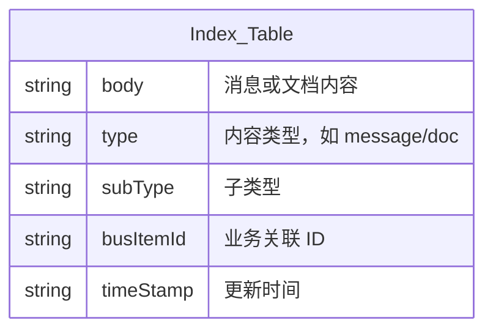

> 索引配置表

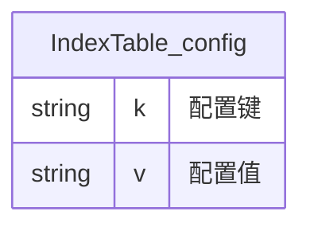

> 索引内容表

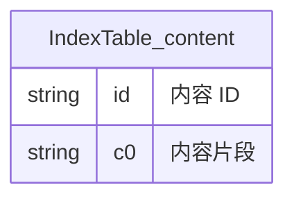

> 索引数据块表

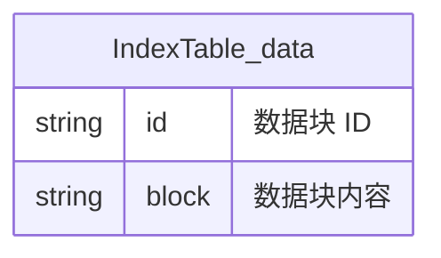

> 索引文档大小表

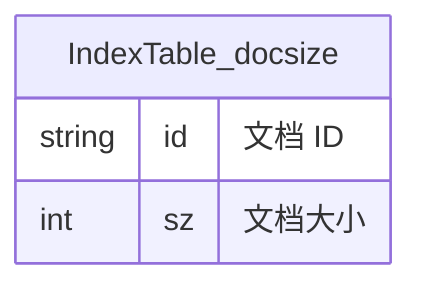

> 索引倒排表

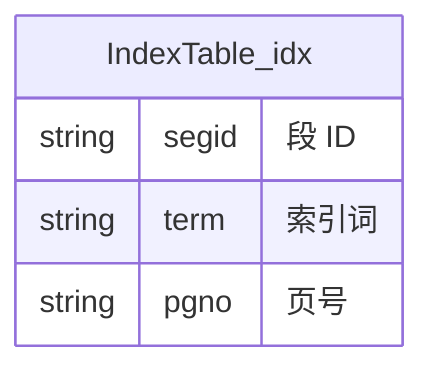

### 💬 消息与会话模块

> 消息表

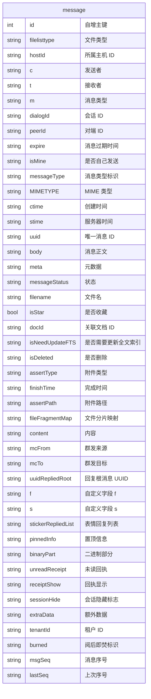

> 会话表

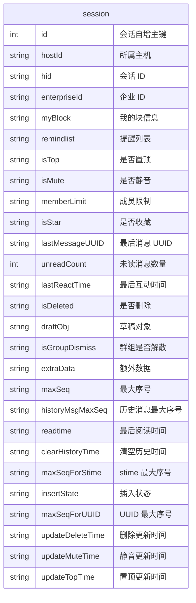

> 临时待发送消息表：记录未成功发送的临时消息

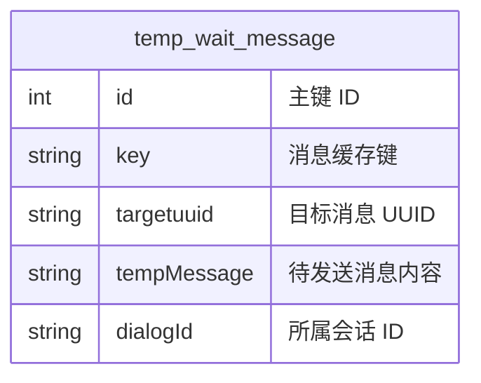

> 语音消息表：记录语音消息播放状态

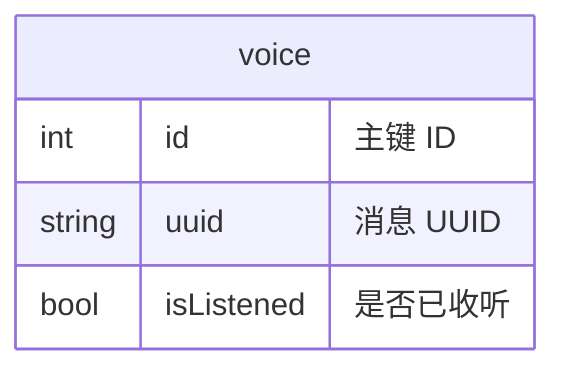

> 会议表：记录消息关联会议信息

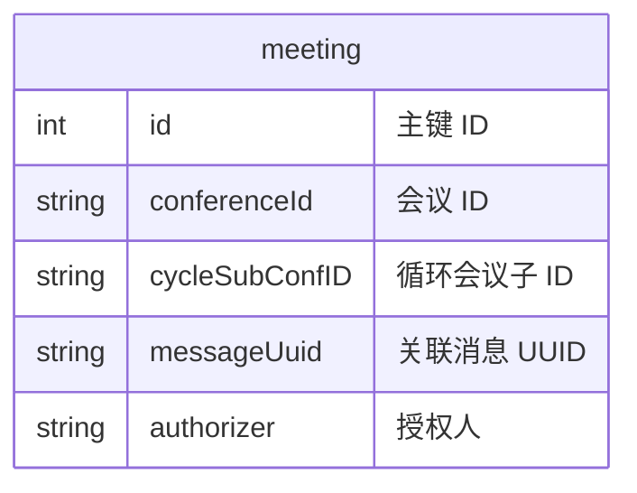

> 文件表：记录消息中附带的文件信息

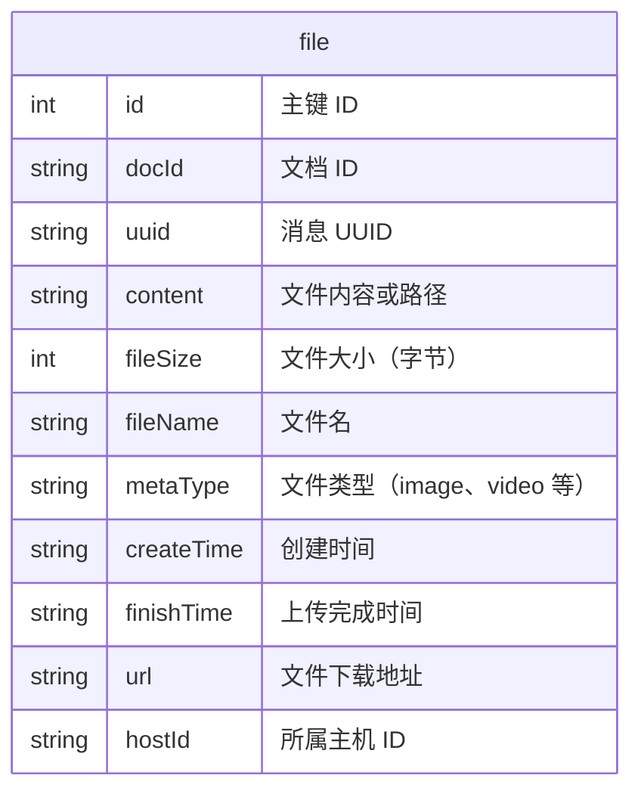

> 元数据表：记录消息关联的业务元信息

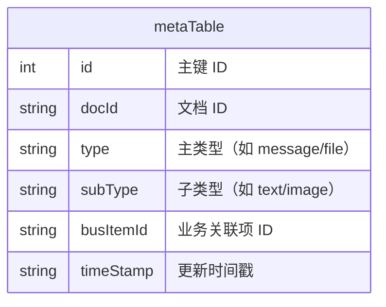

> 联系人/群组表：存储用户、群组、会议室等信息

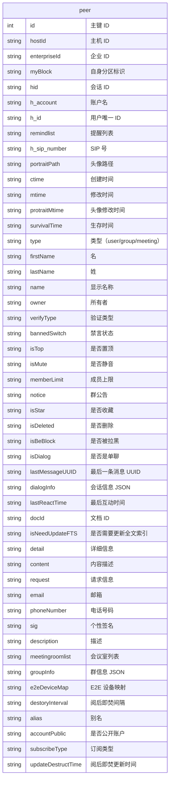

> 组织表：记录企业/部门层级结构

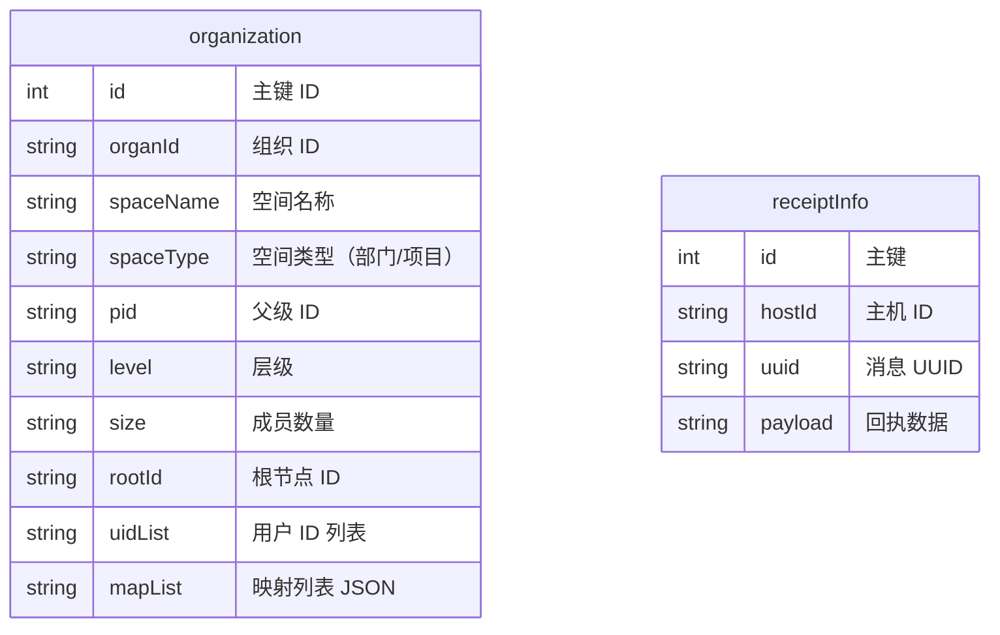

### 🧾 任务与审批流程

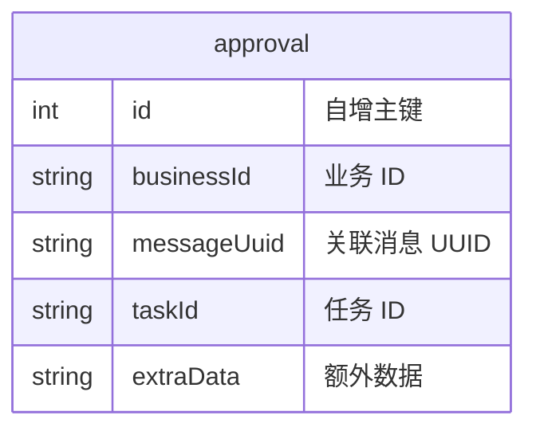

### 🚻 表关系

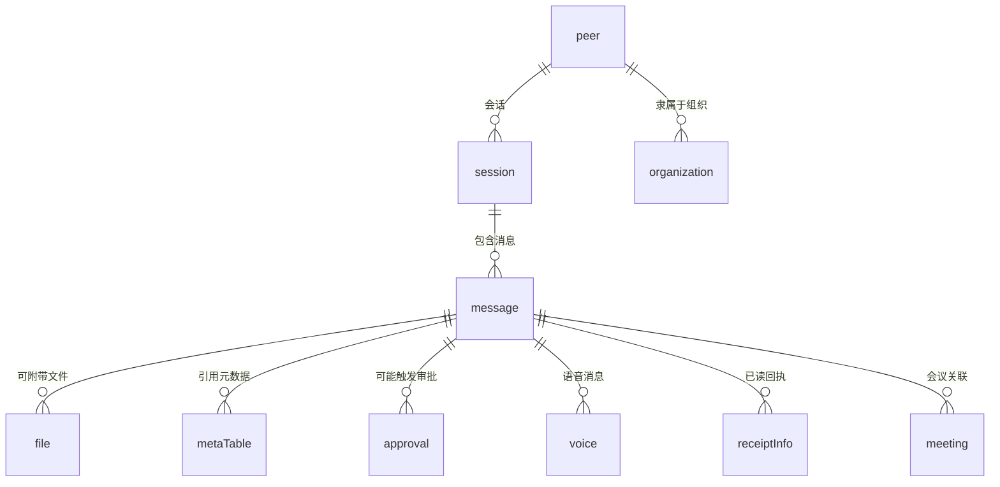

### 👥 联系人与组织架构

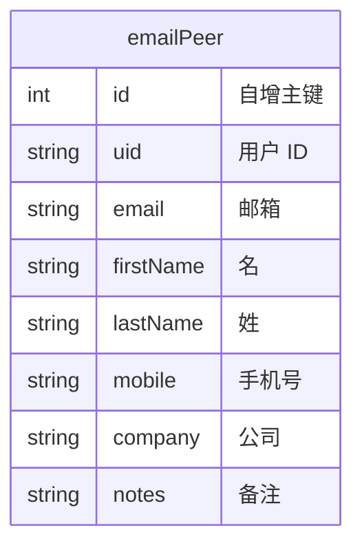

### 🧠 系统配置与状态表

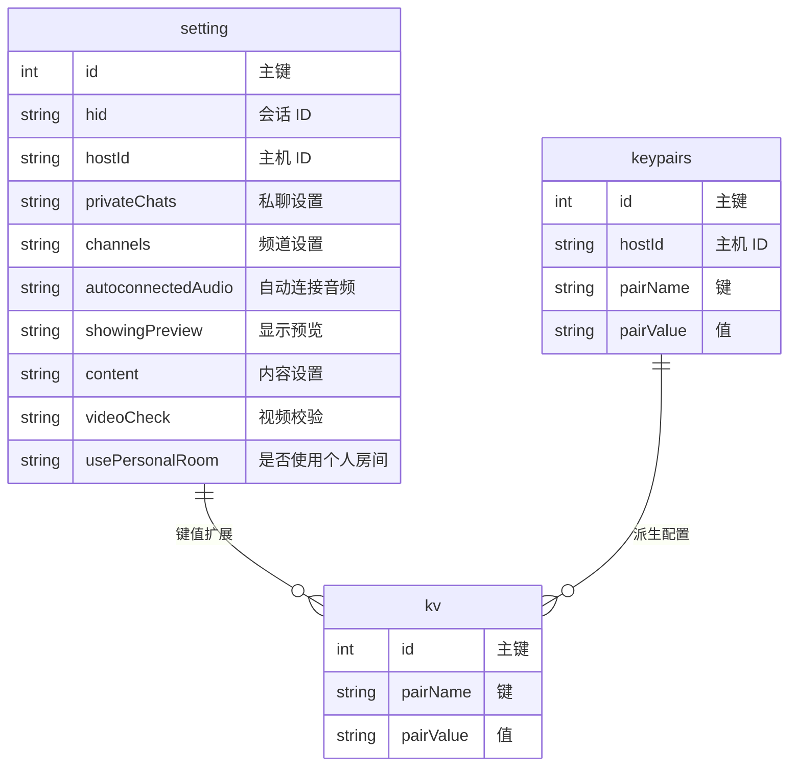

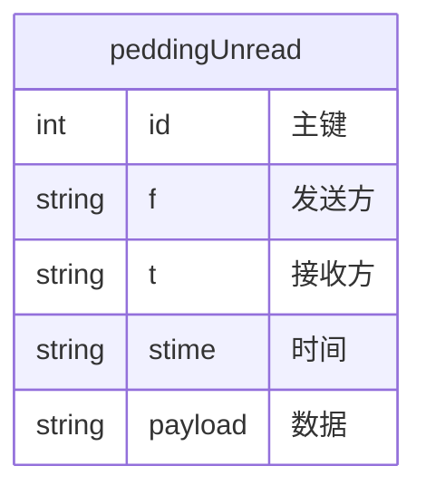
