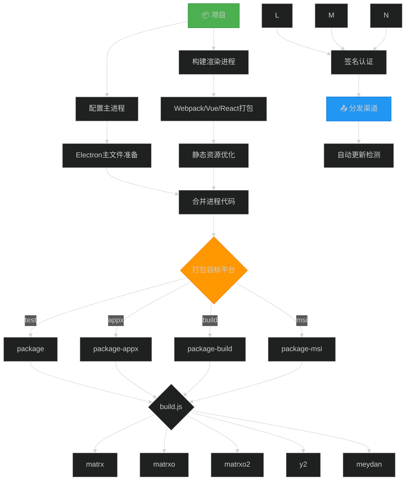
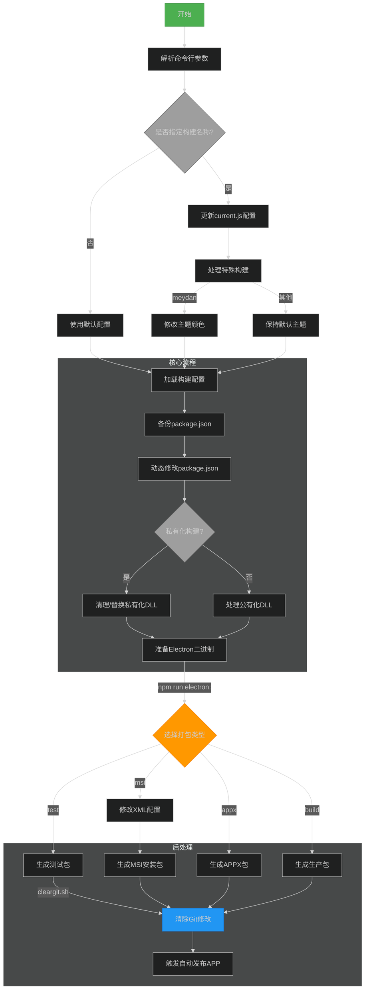

# 项目打包

> 开发模式

```
npm run dev
```

## 打包

### 测试版本

```
npm run package
npm run package matrxo
```

### 正式版本

> 快捷版本号

```
npm run change:version 1.15.0
```

> SDK 分支切换

```
npm run pull-sdk dev_x64_1.15.0
```

TeamViewer
账号：666816762
密码：matrx2022

todesk
账号：yongmao.tian
密码：eufaix4O

账号：434980607
密码：Matrx2022\*

打包机开机密码：pin:261982

> 登录海外 VPN：

188.116.29.146

> 项目地址：

```
D:/project/matrx_64
```

> 步骤

1. 修改打包配置 current.js
2. 版本号 public.js
3. open to terminate
4. git bash here

> 打包 Matrx 与 MatrxO

```
npm run package-build
npm run package-build MatrxO
```

弹窗证书校验，输入密码，文件夹 verify.txt 里面的密码 Nnx168_88

### msi 版本

```
npm run packgae-msi
```

15501293686
727213959@qq.com
Tym727213959

## 脚本

| 脚本命令                  | 功能描述                                            |
| ------------------------- | --------------------------------------------------- |
| `serve`                   | 启动 Vue 的开发服务器。                             |
| `build`                   | 构建项目，并生成构建报告。                          |
| `lint`                    | 运行 ESLint 代码检查工具。                          |
| `c`                       | 使用 git-cz 进行提交。                              |
| `debug`                   | 使用 Electron 运行 `config.js` 进行调试。           |
| `dev`                     | 设置最大堆内存为 10GB 并启动 Electron 的开发模式。  |
| `electron-rebuild`        | 重新构建 Electron 模块。                            |
| `electron:build`          | 构建 Electron 应用。                                |
| `electron:generate-icons` | 生成 Electron 应用的图标。                          |
| `electron:msi`            | 构建 MSI 安装包。                                   |
| `electron:release`        | 构建 Electron 应用的发布版本。                      |
| `electron:serve`          | 启动 Electron 应用的开发模式。                      |
| `electron:test`           | 构建 Electron 应用的测试版本。                      |
| `lint-staged`             | 对暂存区的代码运行代码检查工具。                    |
| `lint:fix`                | 自动修复代码中的 ESLint 错误。                      |
| `mock:ws`                 | 启动 WebSocket 模拟服务器。                         |
| `package`                 | 使用 `build.js` 构建项目的测试版本。                |
| `package-appx`            | 使用 `build.js` 构建 AppX 包。                      |
| `package-build`           | 使用 `build.js` 完成构建。                          |
| `package-msi`             | 使用 `build.js` 构建 MSI 包。                       |
| `package-all`             | 使用 `scripts/all.js` 构建所有目标。                |
| `test-all`                | 使用 `scripts/test_all.js` 运行所有测试。           |
| `patch`                   | 运行 `patch-package` 进行补丁更新。                 |
| `init`                    | 强制安装依赖包。                                    |
| `postinstall`             | 安装补丁包、Electron 依赖，并初始化 Husky。         |
| `postinstall-builder`     | 对 `app-builder-lib` 应用补丁。                     |
| `postinstall-element`     | 对 `element-ui` 应用补丁。                          |
| `postuninstall`           | 卸载 Electron 依赖。                                |
| `pull-sdk`                | 使用 `changeSubSdk.js` 拉取 SDK。                   |
| `pull-sdk-build`          | 使用 `changeSubSdk.js` 构建 SDK。                   |
| `rd`                      | 设置最大堆内存为 10GB，并启动 Electron 的 RD 模式。 |
| `rebuild`                 | 重建 Electron 环境，指定 Electron 版本 17.4.4。     |
| `replace-exe-icons`       | 替换可执行文件中的图标。                            |
| `replace-icons`           | 替换应用程序图标。                                  |
| `replace:dll`             | 替换 DLL 文件。                                     |
| `replace:dll:x86`         | 替换 x86 版本的 DLL 文件。                          |
| `sign-dll`                | 对 DLL 文件进行签名。                               |
| `sign-file`               | 对单个文件进行签名。                                |
| `start`                   | 同时运行 `rd` 和 `dev` 开发服务器。                 |
| `update:cst-sdk`          | 更新 CST SDK。                                      |
| `update:sdk`              | 更新 HWM SDK。                                      |
| `changeV8`                | 切换 V8 引擎版本。                                  |
| `icons:base`              | 复制基础图标。                                      |
| `icons:copy`              | 生成并复制应用图标。                                |
| `vmp:dll`                 | 对 DLL 文件进行虚拟化保护。                         |
| `change:version`          | 更新应用版本号。                                    |

```json
{
  "name": "Matrx",
  "version": "1.17.2",
  "private": true,
  "description": "Matrx",
  "author": "TSI Tech Pte. Ltd.",
  "scripts": {
    "serve": "vue-cli-service serve",
    "build": "vue-cli-service build --report",
    "lint": "vue-cli-service lint",
    "c": "git-cz",
    "debug": "electron ./config.js",
    "dev": "node --max-old-space-size=10240 node_modules/@vue/cli-service/bin/vue-cli-service.js electron:serve --mode development",
    "electron-rebuild": "electron-rebuild -f",
    "electron:build": "vue-cli-service electron:build",
    "electron:generate-icons": "electron-icon-builder --input=./public/icon.png --output=build --flatten",
    "electron:msi": "vue-cli-service electron:build",
    "electron:release": "vue-cli-service electron:build",
    "electron:serve": "vue-cli-service electron:serve",
    "electron:test": "vue-cli-service electron:build",
    "lint-staged": "lint-staged",
    "lint:fix": "eslint --fix --ext .js,.jsx,.ts,.tsx,.vue src/",
    "mock:ws": "node ./src/mock/wss/index.js",
    "package": "node ./build.js test",
    "package-appx": "node ./build.js appx",
    "package-build": "node ./build.js build",
    "package-msi": "node ./build.js msi",
    "package-all": "node ./scripts/all.js",
    "test-all": "node ./scripts/test_all.js",
    "patch": "patch-package",
    "init": "npm i --force",
    "postinstall": "patch-package && electron-builder install-app-deps && husky install",
    "postinstall-builder": "patch-package app-builder-lib",
    "postinstall-element": "patch-package element-ui",
    "postuninstall": "electron-builder install-app-deps",
    "pull-sdk": "node ./scripts/changeSubSdk.js",
    "pull-sdk-build": "node ./scripts/changeSubSdk.js build",
    "rd": "node --max-old-space-size=10240 node_modules/@vue/cli-service/bin/vue-cli-service.js electron:serve --mode rd",
    "rebuild": "npm rebuild --runtime=electron --target=17.4.4 --disturl=https://atom.io/download/atom-shell --abi=93",
    "replace-exe-icons": "node ./scripts/replace-exe-icons.js",
    "replace-icons": "node ./scripts/replace-icons.js",
    "replace:dll": "node ./scripts/replaceDll.js",
    "replace:dll:x86": "node ./scripts/replaceDll.js ia32",
    "sign-dll": "node ./nsis_build/sign_dll.js",
    "sign-file": "node ./nsis_build/sign_single.js",
    "start": "concurrently \"npm run rd\" \"npm run dev\"",
    "update:cst-sdk": "node ./scripts/update-cst-sdk.js",
    "update:sdk": "node ./scripts/update-hwm-sdk.js",
    "changeV8": "node ./scripts/changeV8.js",
    "icons:base": "node ./build_base/copyIcon.js copyBase",
    "icons:copy": "electron-icon-builder --input=./build_base/icon.png --output=dist_build --flatten && node ./build_base/copyIcon.js copyIcon",
    "vmp:dll": "node ./scripts/vmp_dll.js",
    "change:version": "node ./scripts/change-version.js"
  },
  "main": "background.js",
  "dependencies": {
    "@journeyapps/sqlcipher": "^5.3.1",
    "add-filename-increment": "^1.0.0",
    "aes-js": "^3.1.2",
    "anchorme": "^2.1.2",
    "axios": "^0.27.2",
    "base64-arraybuffer": "^0.2.0",
    "clipboard-files": "^1.0.4",
    "compressing": "^1.5.1",
    "core-js": "^2.6.11",
    "crypto-js": "^4.0.0",
    "electron-dl": "^3.0.1",
    "electron-log": "^4.4.8",
    "electron-store-atomically": "0.0.4",
    "electron-updater": "^5.2.1",
    "element-ui": "2.15.6",
    "eventemitter3": "^4.0.4",
    "ffi-napi": "2.4.7",
    "file-type": "^16.5.3",
    "getmac": "^5.20.0",
    "good-storage": "^1.1.1",
    "ics": "^2.29.0",
    "intersection-observer": "^0.10.0",
    "is-online": "^9.0.1",
    "jimp": "^0.16.1",
    "js-sha1": "^0.6.0",
    "js-sha256": "^0.9.0",
    "lodash": "^4.17.15",
    "log4js": "^6.6.1",
    "long": "^4.0.0",
    "mark.js": "^8.11.1",
    "merge-files": "^0.1.2",
    "mime": "^2.4.6",
    "mixpanel-browser": "^2.42.0",
    "moment": "^2.28.0",
    "moment-timezone": "^0.5.31",
    "node-fetch": "^2.6.6",
    "node-machine-id": "^1.1.12",
    "nprogress": "^0.2.0",
    "patch-package": "^6.2.2",
    "pretty-bytes": "^5.6.0",
    "qrcode": "^1.4.4",
    "qs": "^6.9.4",
    "ref-array-napi": "1.2.1",
    "ref-napi": "1.5.2",
    "ref-struct-napi": "^1.1.1",
    "sanitize-html": "^1.23.0",
    "screenshot-desktop": "^1.12.7",
    "simple-web-worker": "^1.2.0",
    "socket.io-client": "^2.3.0",
    "spark-md5": "^3.0.1",
    "systeminformation": "^5.12.6",
    "tippy.js": "^6.2.3",
    "uuid": "^8.0.0",
    "validator": "^13.7.0",
    "vue": "^2.6.10",
    "vue-analytics": "^5.22.1",
    "vue-i18n": "^8.17.4",
    "vue-infinite-scroll": "^2.0.2",
    "vue-router": "^3.0.3",
    "vue-virtual-scroll-list": "^2.3.2",
    "vue-virtual-scroller": "^1.0.10",
    "vuex": "^3.0.1"
  },
  "devDependencies": {
    "@babel/core": "^7.12.16",
    "@babel/plugin-proposal-nullish-coalescing-operator": "^7.14.2",
    "@babel/plugin-proposal-optional-chaining": "^7.14.2",
    "@babel/plugin-transform-modules-commonjs": "^7.17.9",
    "@commitlint/cli": "^17.0.3",
    "@commitlint/config-conventional": "^17.0.3",
    "@vue/cli-plugin-babel": "^3.12.0",
    "@vue/cli-service": "^3.12.0",
    "@vue/cli-shared-utils": "^4.3.1",
    "babel-eslint": "^10.0.1",
    "babel-plugin-component": "^1.1.1",
    "babel-plugin-transform-remove-console": "^6.9.4",
    "concurrently": "^7.3.0",
    "devtron": "^1.4.0",
    "electron": "^20.3.8",
    "electron-builder": "^23.6.0",
    "electron-debug": "^3.2.0",
    "electron-devtools-installer": "^3.0.0",
    "electron-download": "^4.1.1",
    "electron-icon-builder": "^1.0.2",
    "electron-rebuild": "^3.2.7",
    "eslint": "^5.16.0",
    "eslint-config-standard": "^16.0.3",
    "eslint-plugin-babel": "^5.3.1",
    "eslint-plugin-import": "^2.25.4",
    "eslint-plugin-node": "^11.1.0",
    "eslint-plugin-promise": "^6.0.0",
    "eslint-plugin-vue": "^5.0.0",
    "git-cz": "^4.9.0",
    "husky": "^8.0.1",
    "lint-staged": "^13.0.3",
    "node-abi": "^3.30.0",
    "postcss-rtl": "^1.7.3",
    "sass": "^1.32.13",
    "sass-loader": "^8.0.0",
    "svg": "^0.1.0",
    "svg-sprite-loader": "^6.0.11",
    "vue-cli-plugin-electron-builder": "^2.1.1",
    "vue-template-compiler": "^2.6.10"
  },
  "config": {
    "commitizen": {
      "path": "git-cz"
    }
  },
  "productName": "Matrx",
  "protocol": "matrxmeeting"
}
```

package
appx
build
msi




