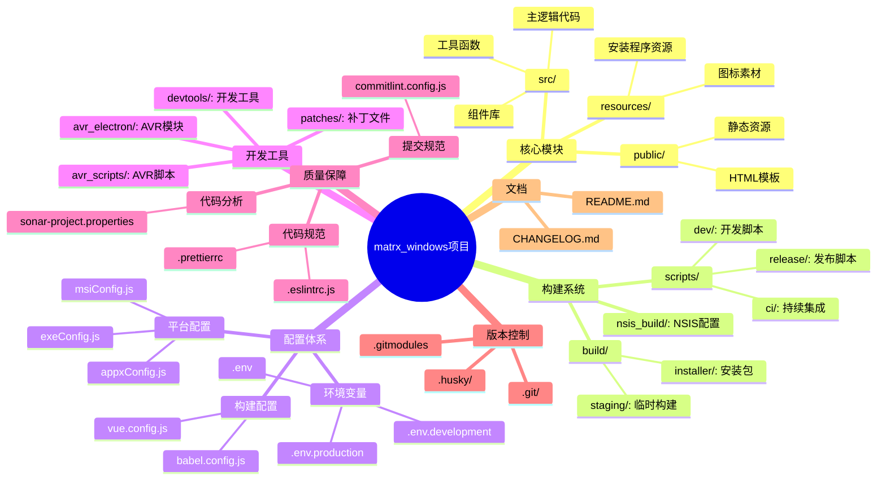
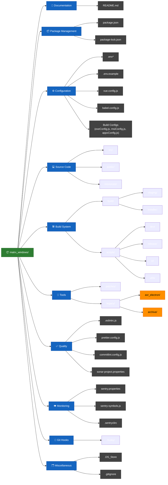
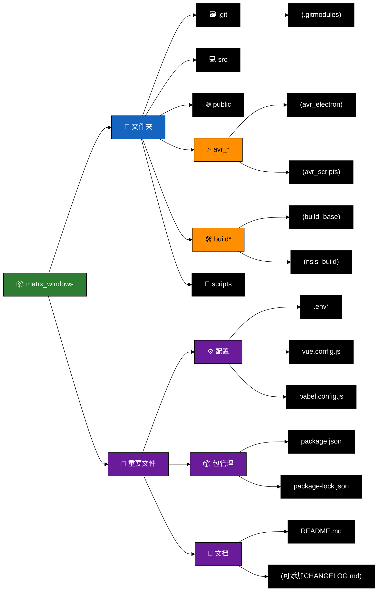
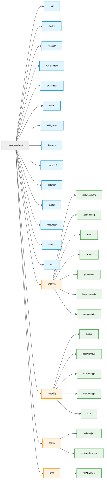
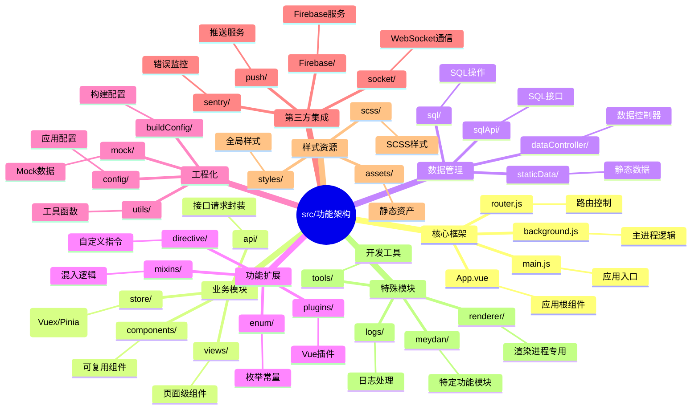

# 项目结构

我看到你贴出了一个项目的根目录结构，整体看是一个 **Electron + Vue** 项目，包含了构建、打包、CI/CD、代码质量检测等相关配置。
这个结构主要包含几大类内容：

### 1. **项目源码和资源**

- `src/` → 前端主代码（Vue/Electron 入口、业务逻辑）
- `public/` → 静态资源
- `resources/` → 额外资源（可能是图标、二进制文件）
- `avr_electron/` → 可能是 Electron 主进程/打包相关模块
- `avr_scripts/` → 自定义脚本
- `patches/` → 对依赖的补丁

### 2. **构建与打包**

- `build/`、`build_base/`、`nsis_build/` → 打包产物和安装包配置（Windows NSIS 安装器）
- `build.sh`、`build.js`、`build-matrxo.sh`、`pull-build.sh` → 构建脚本
- `appxConfig.js`、`exeConfig.js`、`msiConfig.js` → 不同安装包配置
- `bash.icon.*.sh` → 图标处理脚本
- `install.bat` → Windows 安装脚本

### 3. **配置文件**

- `.env`、`.env.development`、`.env.production` → 环境变量配置
- `.browserslistrc` → 浏览器兼容性配置
- `.eslintrc.js`、`.eslintignore` → ESLint 配置
- `prettier.config.js` → Prettier 配置
- `commitlint.config.js` → Commit 规范
- `postcss.config.js` → PostCSS 配置
- `vue.config.js` → Vue CLI 配置
- `babel.config.js` → Babel 配置
- `.editorconfig` → 编辑器代码风格配置
- `.sentryclirc`、`sentry.properties` → Sentry 错误上报配置
- `sonar-project.properties` → SonarQube 代码质量配置

### 4. **文档与元数据**

- `README.md` → 项目说明
- `package.json`、`package-lock.json` → NPM 依赖管理
- `.gitignore`、`.gitmodules` → Git 配置
- `.DS_Store` → macOS 系统文件（可忽略）

### 5. **辅助脚本**

- `cleargit.sh` → 清理 Git 仓库
- `pullmodules.sh` → 拉取子模块
- `upload-sourcemaps.js` → 上传 SourceMap（Sentry 用）
- `dev-init.bat` → 开发环境初始化
- `sonarqube.sh` / `.bat` → SonarQube 扫描

---

如果你需要的话，我可以帮你把这个目录结构用 **树形图** 或 **Mermaid** 画出来，方便文档化。
你要我帮你画出来吗？这样更直观。

```cmd
matrx_windows/
├── .git/                     # Git 版本控制目录
├── .husky/                   # Husky Git Hook 配置（提交前钩子）
├── .vscode/                  # VSCode 编辑器配置
├── avr_electron/             # Electron 主进程或相关模块代码
├── avr_scripts/              # 自定义脚本集合
├── build/                    # 构建产物目录
├── build_base/               # 构建基础模板/资源
├── devtools/                 # 开发调试工具或脚本
├── nsis_build/                # NSIS Windows 安装包构建文件
├── patches/                  # 对依赖包的补丁文件
├── public/                   # 静态资源（不参与 Webpack 编译）
├── resources/                # 额外资源（图标、二进制等）
├── scripts/                  # 辅助脚本目录
├── src/                      # 项目主源码（Vue + Electron 前端）
├── .browserslistrc            # 浏览器兼容性配置
├── .DS_Store                 # macOS 自动生成的文件（可忽略）
├── .editorconfig             # 编辑器统一代码风格配置
├── .env                      # 默认环境变量
├── .env.development          # 开发环境变量
├── .env.production           # 生产环境变量
├── .eslintignore             # ESLint 忽略文件列表
├── .eslintrc.js               # ESLint 规则配置
├── .gitignore                # Git 忽略文件规则
├── .gitmodules               # Git 子模块配置
├── .lintstagedrc             # lint-staged 配置（提交前代码检查）
├── .sentryclirc               # Sentry CLI 配置文件
├── appxConfig.js             # Windows APPX 打包配置
├── babel.config.js           # Babel 编译配置
├── bash.icon.matrx.sh        # 图标处理脚本（matrx）
├── bash.icon.matrxo.sh       # 图标处理脚本（matrxo）
├── bash.icon.matrxo2.sh      # 图标处理脚本（matrxo2）
├── bash.icon.r100.sh         # 图标处理脚本（r100）
├── bash.icon.y2.sh           # 图标处理脚本（y2）
├── body.json                 # 通用 JSON 数据（可能是接口请求/模板）
├── build-matrxo.sh           # 构建 matrxo 版本脚本
├── build.js                  # 构建逻辑 JS 脚本
├── build.sh                  # 构建 shell 脚本
├── cleargit.sh               # 清理 Git 仓库脚本
├── commitlint.config.js      # Commit message 校验规则
├── common.json               # 公共配置 JSON
├── config.js                 # 项目配置文件
├── copyright.js              # 版权信息处理脚本
├── dev-init.bat              # 开发环境初始化（Windows bat 脚本）
├── exeConfig.js              # Windows exe 打包配置
├── install.bat               # Windows 安装脚本
├── msiConfig.js              # Windows MSI 打包配置
├── package-lock.json         # NPM 锁定文件
├── package.json              # 项目依赖与脚本定义
├── postcss.config.js         # PostCSS 配置
├── prettier.config.js        # Prettier 代码格式化配置
├── pull-build.sh             # 拉取并构建脚本
├── pullmodules.sh            # 拉取 Git 子模块脚本
├── README.md                 # 项目说明文档
├── sentry-symbols.js         # Sentry SourceMap 上传脚本
├── sentry.properties         # Sentry 属性配置
├── sonar-project.properties  # SonarQube 代码质量分析配置
├── sonarqube.bat             # SonarQube 分析 Windows 脚本
├── sonarqube.sh              # SonarQube 分析 shell 脚本
├── upload-sourcemaps.js      # SourceMap 上传逻辑
├── vue.config.js             # Vue CLI 配置文件
```

```cmd
matrx_windows/
├── .git/                          # Git版本控制目录
├── .husky/                        # Git钩子配置
├── .vscode/                       # VSCode编辑器配置
├── avr_electron/                  # AVR电子相关模块
├── avr_scripts/                   # AVR脚本
├── build/                         # 构建输出目录
├── build_base/                    # 基础构建配置
├── devtools/                      # 开发工具
├── nsis_build/                    # NSIS安装包构建配置
├── patches/                       # 补丁文件
├── public/                        # 静态资源目录
├── resources/                     # 应用资源文件
├── scripts/                       # 项目脚本
├── src/                           # 源代码目录
│
├── 配置文件
│   ├── .browserslistrc            # 浏览器兼容配置
│   ├── .editorconfig              # 编辑器风格配置
│   ├── .env*                      # 环境变量配置（开发/生产）
│   ├── .eslint*                   # ESLint配置
│   ├── .gitmodules                # Git子模块配置
│   ├── babel.config.js            # Babel配置
│   ├── vue.config.js              # Vue CLI配置
│   └── ...（其他js/json配置文件）
│
├── 构建相关
│   ├── build.js                   # 主构建脚本
│   ├── *Config.js                 # 各平台构建配置（appx/exe/msi）
│   ├── *.sh                       # Shell构建脚本
│   └── copyright.js               # 版权信息
│
├── 包管理
│   ├── package.json
│   └── package-lock.json
│
└── 其他
    ├── README.md                  # 项目说明
    ├── .DS_Store                  # macOS目录元数据
    ├── cleargit.sh                # Git清理脚本
    └── ...（其他零散文件）
```





你可以直接把这段放进 Markdown 支持 Mermaid 的地方（比如 GitHub README +一些文档站点）。要不要我帮你把它做成一段增强版的 README 片段，带说明和使用方法？

以下是另一种风格的 Mermaid 项目结构图，采用**横向树状布局**并添加图标增强可读性：



### 版本特点：

1. **图标系统**：

   - 📦 项目根目录
   - 🗃️ 版本控制
   - ⚡ AVR 相关（突出硬件特性）
   - 🛠️ 构建工具组

2. **布局优化**：

   - 横向流动更适合宽屏显示
   - 相似功能目录聚合显示（如所有 avr*\*和 build*\*）

3. **交互提示**：

   - 括号标注可展开的子目录
   - 建议添加的文件（如 CHANGELOG）

4. **颜色方案**：
   - 深绿色根节点
   - 蓝色文件夹组
   - 紫色配置文件
   - 橙色特殊功能目录

如果需要进一步调整：

- 添加实际存在的子目录结构（如 src/下的详细内容）
- 修改图标集（可用表情符号或 Font Awesome）
- 增加构建流程箭头连线



```

```

## 概括

### .git

### .husky

### .vscode

### avr_electron

### avr_scripts

### build

### build_base

### devtools

### nsis_build

### patches

### public

### resources

### scripts

### src


