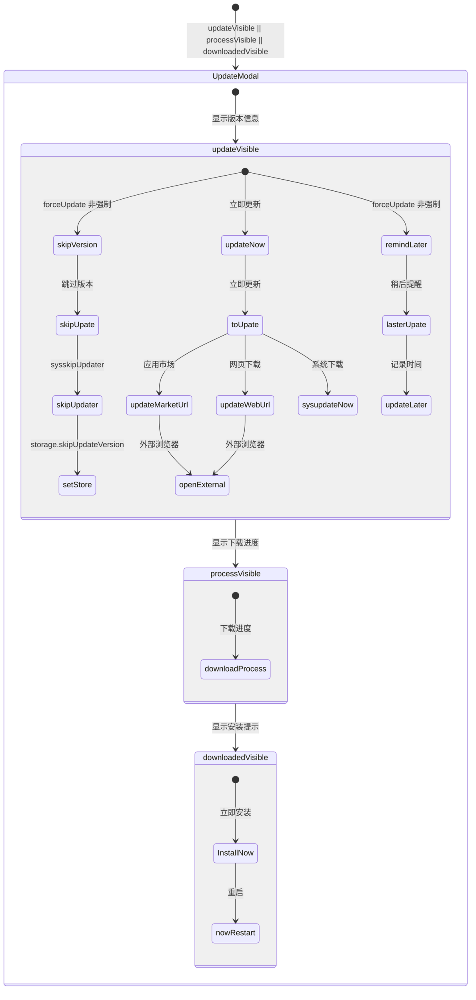
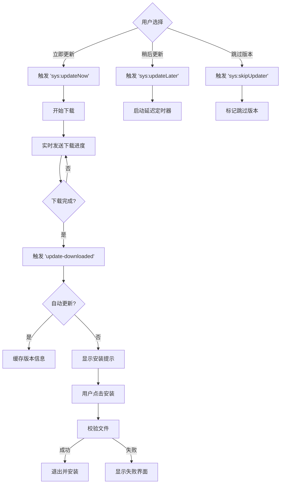
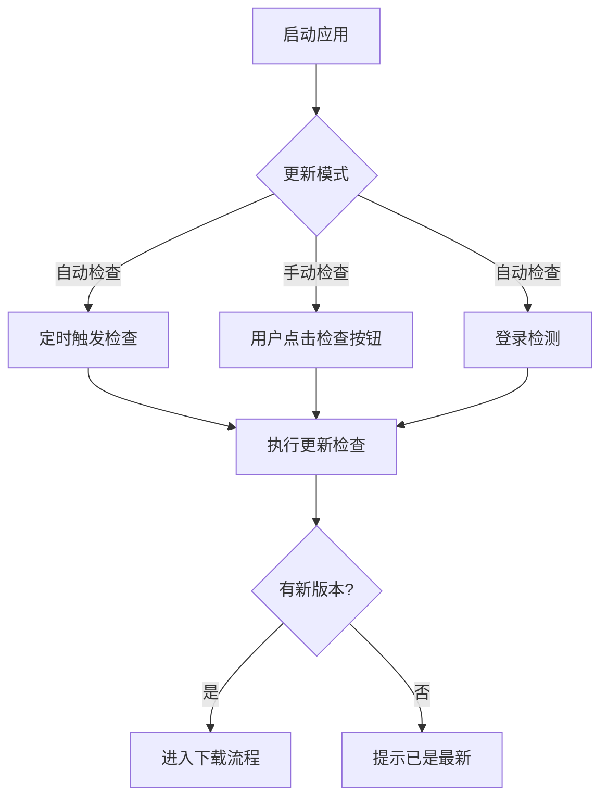
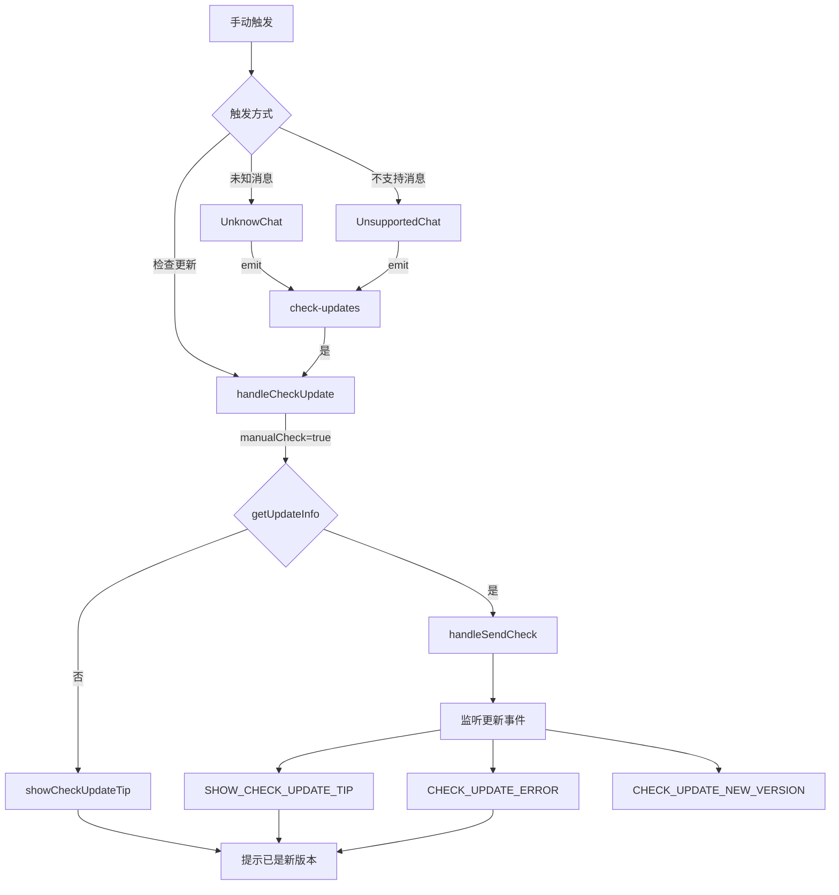
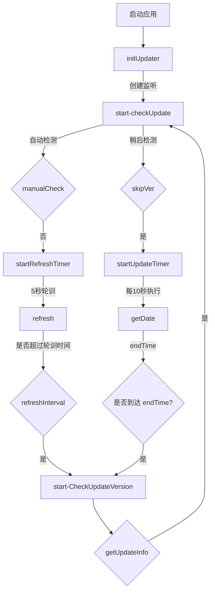
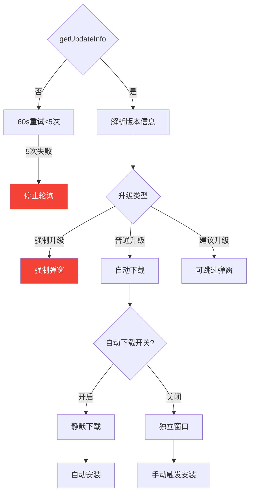
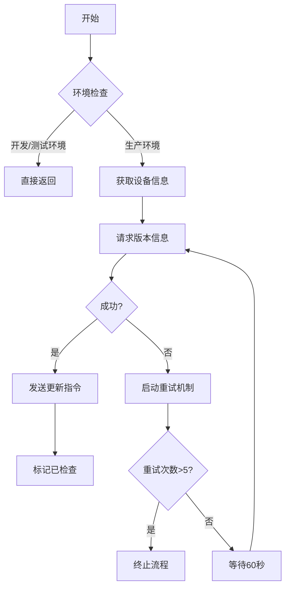

# 升级策略

## 升级窗口





## 触发机制



### 手动触发



### 自动检测



## 代码逻辑

### 状态管理

```javascript
/**
 * 应用版本更新状态管理模块
 * 负责管理更新对话框状态、下载进度和版本信息
 */
const state = {
  // 对话框可见性控制
  updateVisible: false, // 更新提示对话框可见性
  downloadedVisible: false, // 下载完成提示可见性
  processVisible: false, // 下载进度条可见性

  // 版本信息
  newVersion: "", // 新版本号 (如: "1.2.0")
  newVersionInfo: "", // 版本更新说明 (Markdown格式)

  // 下载进度控制
  downloadProcess: 0, // 下载进度百分比 (0-100)
  downloadSize: 0, // 已下载字节数
  fileSize: "", // 格式化后的文件大小 (如: "125MB")

  // 更新策略控制
  forceUpdate: false, // 是否强制更新
  canSkipUpdate: false, // 是否允许跳过此版本

  // 备用更新渠道
  updateMarketUrl: "", // 应用市场下载地址
  updateWebUrl: "", // 网页版下载地址

  // 设备信息
  device: {}, // 当前设备信息 (hid/型号等)
};

const mutations = {
  /**
   * 更新状态变更方法
   * @param {Object} state - 当前模块状态
   * @param {Object} payload - 新状态值 (支持部分更新)
   */
  CHANGE_UPDATER(state, payload) {
    state = Object.assign(state, payload);
  },
};

const actions = {
  /**
   * 提交状态变更的action
   * @param {Function} commit - Vuex commit方法
   * @param {Object} payload - 需要更新的状态字段
   */
  changeUpdater({ commit }, payload) {
    commit("CHANGE_UPDATER", payload);
  },
};

export default {
  // 启用命名空间，避免命名冲突
  namespaced: true,
  state,
  mutations,
  actions,
};
```



### deviceInfo.js



```javascript
/**
 * 获取设备更新信息并触发更新检查
 * @param {string} hid - 设备硬件ID
 * @param {boolean} manualCheck - 是否手动触发检查
 * @returns {Promise} 返回更新信息或空Promise
 */
export async function getUpdateInfo(hid, manualCheck) {
  // 1. 获取设备基础信息
  const info = await deviceInfo(hid);

  // 开发环境或测试环境不执行更新检查
  if (
    process.env.NODE_ENV === "development" ||
    process.env.npm_lifecycle_event === "electron:test"
  ) {
    return Promise.resolve();
  }

  // 2. 获取版本信息
  return getVersionInfo(info)
    .then((res) => {
      if (res) {
        // 3. 发送更新检查请求到主进程
        ipcRenderer.send("start-checkUpdate", {
          ...res, // 扩展运算符包含所有版本信息
          manualCheck,
          // 自动更新下载条件：设置开启且用户已登录
          autoUpdateDownload:
            store.state.setting.autoUpdateOpen &&
            store.state.userInfo.loginStatus === "LOGINFINISH",
        });

        // 4. 标记已检查状态
        sessionStorage.checkUpdateStatus = "checked";
        return res;
      }
    })
    .catch((err) => {
      console.error("[error]: ", "getVersionInfo err:", err);

      // 5. 错误重试机制
      let versionNum = 0;
      const versionTimer = setInterval(() => {
        if (versionNum > 5) {
          clearInterval(versionTimer);
          return;
        }
        versionNum++;

        getVersionInfo(info).then((res) => {
          clearInterval(versionTimer);
          if (res) {
            ipcRenderer.send("start-checkUpdate", {
              ...res,
              manualCheck,
              autoUpdateDownload:
                store.state.setting.autoUpdateOpen &&
                store.state.userInfo.loginStatus === "LOGINFINISH",
            });
            sessionStorage.checkUpdateStatus = "checked";
            return res;
          }
        });
      }, 60 * 1000); // 每分钟重试一次，最多5次
    });
}
```

```javascript
/**
 * 获取设备信息并构造上报数据
 * @param {string} hid - 设备唯一标识符
 * @returns {Promise<Object>} 包含完整设备信息的JSON对象
 */
export async function deviceInfo(hid) {
  // 基础设备信息采集
  const device = {
    platform: os.platform(), // 操作系统平台
    release: os.release(), // 操作系统版本
    hostname: os.hostname(), // 主机名
    arch: os.arch(), // 系统架构
  };
  const pf = os.platform(); // 获取平台类型

  // 标准化平台名称
  switch (pf) {
    case "darwin": // macOS系统
      device.platform = "osx";
      break;
    case "win32": // Windows系统
      device.platform = "win";
      break;
    // 其他平台保持原样
    default:
      break;
  }

  // CPU信息采集
  const cpus = os.cpus();
  if (cpus.length) {
    device.cpu = cpus[0].model; // 取第一个CPU的型号
  }

  // 网络类型检测
  try {
    device.networkType = await getNetInfo(); // 异步获取网络类型
  } catch (error) {
    console.error("[error]: ", "await getNetInfo()", error);
  }

  // 通过UserAgent精确识别Windows版本
  var userAgent = navigator.userAgent;
  if (userAgent.indexOf("Windows NT 5.0") != -1) {
    device.osVer = "2000";
  } else if (userAgent.indexOf("Windows NT 5.1") != -1) {
    device.osVer = "xp";
  } else if (userAgent.indexOf("Windows NT 5.2") != -1) {
    device.osVer = "2003";
  } else if (userAgent.indexOf("Windows NT 6.0") != -1) {
    device.osVer = "vista";
  } else if (
    userAgent.indexOf("Windows NT 6.1") != -1 ||
    userAgent.indexOf("Windows 7") != -1
  ) {
    device.osVer = "7";
  } else if (userAgent.indexOf("Windows NT 6.2") != -1) {
    device.osVer = "8";
  } else if (userAgent.indexOf("Windows NT 10.0") != -1) {
    device.osVer = "10";
  }

  // 语言和版本信息
  device.locaSyslLang = window.navigator.language; // 系统语言
  device.version = pkg.version; // 应用版本

  // DNS查询（仅首次执行）
  if (!reqDns) {
    await doDnsQuery();
    reqDns = true;
  }

  // 获取国家代码
  let res = await fetchCountryCode({
    pkg: device.version,
    loc: device.locaSyslLang,
    osVer: device.osVer,
    model: device.platform,
  }).catch((err) => {
    console.error("[error]: ", "fetchCountryCode=>err ", err);
  });

  // 存储国家代码
  if (res && res.countrycode) {
    device.countryCode = res.countrycode;
    appdataStorage.setItem("countrycode", res.countrycode);
  }

  // 从Vuex获取设备制造商信息
  let vendor = store.state.storage.win32SystemInfo;
  if (vendor) {
    device.vendor = vendor.Manufacturer; // 设备制造商
    device.deviceModel = vendor.Model; // 设备型号
  }

  // 提交设备信息到Vuex
  store.commit("updater/CHANGE_UPDATER", {
    device,
  });

  // 处理企业空间ID列表
  let spaceInfoList = store.state.spaceCollection.spaceInfoList;
  let spaceList = spaceInfoList.map((v) => v.id).join(",");
  // 默认空间ID（个人空间和默认空间）
  spaceList =
    spaceList ||
    [...new Set([defaultSpaceId(), personalSpaceId()])].join(",") ||
    "";

  // 构造最终上报数据
  const json = {
    appVer: device.version, // 应用版本
    deviceType: device.platform, // 设备类型
    osVer: device.osVer, // 操作系统版本
    vendor: device.vendor, // 设备制造商
    deviceModel: device.deviceModel, // 设备型号
    // 国家代码（私有化部署时使用固定值971）
    countryCode: store.state.config.currentConfig.privatization
      ? 971
      : device.countryCode,
    networkType: device.networkType, // 网络类型
    locaSyslLang: device.locaSyslLang, // 系统语言
    hid: hid || appdataStorage.hid, // 设备唯一ID
    enterpriseIds: spaceList, // 关联的企业空间ID
  };

  return json; // 返回完整设备信息
}
```

### updaterApi.js

```js
/**
 * 获取应用版本更新信息
 * @param {Object} postParm - 请求参数对象
 * @param {string} postParm.hid - 硬件设备ID(会自动映射为userId)
 * @returns {Promise} 返回包含版本信息的Promise对象
 *
 * @example
 * // 典型调用方式
 * getVersionInfo({ hid: 'DEVICE_123' })
 *   .then(updateInfo => console.log(updateInfo))
 *   .catch(err => console.error(err));
 */
export function getVersionInfo(postParm) {
  postParm.userId = postParm.hid;
  let postParmString = JSON.stringify(postParm);

  return commonUCRequest(
    {
      baseURL: getBaseSpaceUserURL(),
      url: `/configUpdate/v1/info`,
      method: "POST",
      data: postParmString,
      headers: {
        "Content-Type": "application/json",
        "C-Type": "windows",
      },
      params: {
        deviceType: "win",
        clienttype: "win",
      },
    },
    false
  );
}
```

### updater.js

```javascript
// 导入必要的模块和配置
import { skipUpdateExpireTime } from "../../config"; // 更新过期时间配置
import { getStore, setStore } from "./store"; // 持久化存储工具
import { autoUpdater } from "electron-updater"; // Electron自动更新模块
import { sendWinMsg } from "./mainWindow/index"; // 向主窗口发送消息的工具
import { getItem, removeItemList } from "@/main/forwardDB/appdataUtil"; // 数据库工具
import { trayExit } from "@/main/tray.js"; // 系统托盘管理
import { debug } from "../../config"; // 调试配置

// Electron和Node.js模块
const { ipcMain } = require("electron");
const fs = require("fs");
const path = require("path");
const { checkHash, openExternal, spawnThen } = require("./mainUtils");

// 导入日志工具
import log from "@/logs/devBackLog";

// 全局变量用于更新管理
let updateObj = null; // 主更新对象实例
let updateTimer = null; // 更新检查定时器
let endTime = null; // 更新检查结束时间
let initTime = 0; // 更新检查初始化时间
let refreshTimer = null; // 刷新定时器
let refreshInterval = skipUpdateExpireTime; // 刷新间隔

// 开发环境下设置自定义更新配置路径
if (process.env.NODE_ENV === "development") {
  autoUpdater.updateConfigPath = path.join(
    __filename,
    "../../dist_electron/win-unpacked/resources/app-update.yml"
  );
}

/**
 * 应用更新主类，处理应用程序更新逻辑
 */
export default class AppUpdater {
  constructor(data) {
    this.initData(data); // 初始化数据
    this.initEvent(); // 初始化事件监听
    this.autoUpdateDownloading = false; // 自动更新下载状态标志
  }

  /**
   * 初始化更新数据
   * @param {Object} data - 更新配置数据
   */
  initData(data) {
    // 解构传入的更新配置
    const {
      updateServer,
      updateMarketUrl,
      updateWebUrl,
      targetVersion,
      updatePath,
      reminderInterval,
      description,
      forceUpdate,
      canSkipUpdate,
      updateNow,
      manualCheck,
      autoUpdateDownload,
    } = data;

    this.manualCheck = manualCheck || false; // 是否为手动检查

    // 如果是手动检查且正在自动更新下载，则直接返回
    if (this.manualCheck && this.autoUpdateDownloading) {
      log.warn("手动检查更新时自动更新正在下载，直接返回");
      return;
    }

    // 设置更新路径和URL
    this.updatePath = updatePath || "";
    this.updateUrl = `${updateServer}${this.updatePath}`;
    this.updateNow = updateNow;
    this.forceUpdate = forceUpdate; // 是否强制更新
    this.canSkipUpdate = canSkipUpdate || false; // 是否可以跳过更新
    this.fileSize = 0; // 更新文件大小
    this.description = description; // 更新描述
    this.downloadSize = 0; // 已下载大小
    this.downloadPercent = 0; // 下载进度百分比
    this.downloadedPath = ""; // 下载文件路径
    this.cancellationToken = null; // 取消更新的令牌
    this.reminderInterval = reminderInterval || skipUpdateExpireTime; // 提醒间隔
    this.updateWebUrl = updateWebUrl; // 网页更新URL
    this.updateMarketUrl = updateMarketUrl; // 应用市场URL
    this.targetVersion = targetVersion; // 目标版本
    this.fileSha512 = null; // 文件SHA512哈希
    this.skipVer = false; // 是否跳过版本
    this.clickLater = false; // 用户是否点击"稍后"
    this.startUpdate = false; // 是否开始更新
    this.downloadNetError = false; // 网络错误标志
    this.continueUpdate = false; // 是否继续更新
    // 判断是否为自动更新下载
    this.autoUpdateDownload =
      (!this.manualCheck && !forceUpdate && autoUpdateDownload) || false;

    log.info("更新URL", this.updateUrl);
    log.info("网页更新URL", this.updateWebUrl);

    this.setUpdaterUrl(); // 设置更新器URL

    // 立即检查更新或显示检查提示
    if (this.updateNow) {
      this.checkUpdater();
    } else if (this.manualCheck) {
      ipcMain.emit("发送到当前窗口消息", {
        type: "显示检查更新提示",
        data: {},
      });
    }
  }

  /**
   * 为electron-updater设置更新URL
   */
  setUpdaterUrl() {
    try {
      if (!this.updateUrl) return;
      // 配置autoUpdater使用通用提供者
      autoUpdater.setFeedURL({
        provider: "generic", // 通用提供者
        channel: "alpha", // 渠道
        url: this.updateUrl, // 更新URL
      });
    } catch (err) {
      log.error("autoUpdater设置更新URL错误=>", err);
    }
  }

  /**
   * 检查错误是否为网络错误
   * @param {Object} errorObject - 要检查的错误对象
   * @returns {boolean} - 如果是网络错误返回true
   */
  isNetworkError(errorObject) {
    return (
      errorObject.message === "net::ERR_INTERNET_DISCONNECTED" ||
      errorObject.message === "net::ERR_PROXY_CONNECTION_FAILED" ||
      errorObject.message === "net::ERR_CONNECTION_RESET" ||
      errorObject.message === "net::ERR_CONNECTION_CLOSE" ||
      errorObject.message === "net::ERR_NAME_NOT_RESOLVED" ||
      errorObject.message === "net::ERR_CONNECTION_TIMED_OUT"
    );
  }

  /**
   * 初始化autoUpdater的事件监听器
   */
  async initEvent() {
    // 配置autoUpdater设置
    autoUpdater.logger = log;
    autoUpdater.autoDownload = false; // 禁用自动下载
    autoUpdater.allowDowngrade = false; // 禁止降级
    autoUpdater.autoInstallOnAppQuit = false; // 退出时不自动安装
    autoUpdater.forceDevUpdateConfig = true; // 强制开发更新配置

    // 如果启用了调试，允许降级
    if (debug) {
      const { enableDebugUpdater } = getStore("storage");
      if (enableDebugUpdater) {
        autoUpdater.allowDowngrade = true;
      }
    }

    // 错误事件处理
    autoUpdater.on("error", (err) => {
      console.error("autoUpdater错误=>", err);
      log.error("autoUpdater错误=>", err.message, err.code, err.errno);
      if (this.isNetworkError(err)) {
        this.downloadNetError = true;
        log.info("autoUpdater网络错误", this.continueUpdate);
        if (this.continueUpdate) {
          this.downloadNetError = false;
          this.continueUpdate = false;
          ipcMain.emit("系统:立即更新");
        }
      }
      ipcMain.emit("发送到当前窗口消息", {
        type: "检查更新错误",
        data: {},
      });
      this.autoUpdateDownloading = false;
    });

    // 初始化主事件处理器
    this.mainEvent();

    // 正在检查更新事件
    autoUpdater.on("checking-for-update", () => {
      log.debug("autoUpdater=>正在检查更新");
    });

    // 有可用更新事件
    autoUpdater.on("update-available", (info) => {
      log.debug("autoUpdater=>有可用更新", info, this.autoUpdateDownload);
      this.fileSize = info.files[0] ? info.files[0].size : 0;
      this.fileSha512 = info.sha512;

      // 处理自动更新下载
      if (this.autoUpdateDownload) {
        const startDownload = () => {
          setTimeout(() => {
            ipcMain.emit("系统:立即更新");
            this.autoUpdateDownloading = true;
          }, 2000);
        };
        try {
          // 检查是否已下载此版本
          getItem("已下载新版本").then(async (res) => {
            if (
              res &&
              res.fileSha512 === info.sha512 &&
              fs.existsSync(res.downloadedPath)
            ) {
              const check = await checkHash(res.downloadedPath, res.fileSha512);
              log.debug("已下载新版本检查", check);
              if (check) {
                this.downloadedPath = res.downloadedPath;
                sendWinMsg("发送到主窗口", "下载-新更新版本", res);
                return;
              }
            }
            startDownload();
          });
        } catch (e) {
          log.error("自动更新下载捕获错误", e);
        }
        return;
      }

      // 清除任何跳过更新的记录
      setStore("storage.skipUpdateVersion", "");
      setStore("storage.skipUpdateTime", "");

      // 通知UI有新版本
      this.startUpdate = false;
      ipcMain.emit("发送到当前窗口消息", {
        type: "检查更新有新版本",
        data: { manualCheck: this.manualCheck },
      });
      ipcMain.emit("发送到当前窗口消息", {
        type: "设置更新模态框",
        data: {
          updateVisible: true, // 显示更新对话框
          processVisible: false, // 隐藏进度条
          downloadedVisible: false, // 隐藏下载完成提示
          newVersion: info.version, // 新版本号
          newVersionInfo: this.description, // 更新描述
          forceUpdate: this.forceUpdate, // 是否强制更新
          fileSize: this.fileSize, // 文件大小
          canSkipUpdate: this.canSkipUpdate, // 是否可以跳过
          updateWebUrl: this.updateWebUrl, // 网页更新URL
          updateMarketUrl: this.updateMarketUrl, // 应用市场URL
        },
      });
    });

    // 没有可用更新事件
    autoUpdater.on("update-not-available", (info) => {
      log.debug("autoUpdater=>没有可用更新", info);
      ipcMain.emit("发送到当前窗口消息", {
        type: "显示检查更新提示",
        data: {},
      });
    });

    // 更新取消事件
    autoUpdater.on("update-cancelled", (info) => {
      log.debug("autoUpdater=>更新已取消", info);
    });

    // 下载进度事件
    autoUpdater.on("download-progress", (params) => {
      log.debug("autoUpdater=>下载进度", params);

      // 如果是自动更新且非手动检查，跳过进度更新
      if (
        this.autoUpdateDownload &&
        !this.manualCheck &&
        this.autoUpdateDownloading
      ) {
        return;
      }

      // 更新下载进度
      this.downloadNetError = false;
      this.continueUpdate = false;
      this.downloadSize = params.transferred;

      if (!this.cancellationToken || !this.startUpdate) return;
      const percent = parseFloat(params.percent.toFixed(2));
      if (this.downloadPercent <= percent) {
        this.downloadPercent = percent;
        ipcMain.emit("发送到当前窗口消息", {
          type: "设置更新模态框",
          data: {
            updateVisible: false, // 隐藏更新对话框
            processVisible: true, // 显示进度条
            downloadProcess: this.downloadPercent, // 下载进度
            downloadSize: this.downloadSize, // 已下载大小
            manualCheck: this.manualCheck, // 是否手动检查
            autoUpdateDownloading: this.autoUpdateDownloading, // 是否自动下载
          },
        });
      }
    });

    // 更新下载完成事件
    autoUpdater.on("update-downloaded", (e) => {
      log.debug("autoUpdater=>下载完成", e);

      // 重置下载状态
      this.downloadPercent = 0;
      this.downloadNetError = false;
      this.continueUpdate = false;
      this.downloadSize = e.files[0] ? e.files[0].size : 0;

      // 处理自动更新下载完成
      if (this.autoUpdateDownload) {
        sendWinMsg("发送到主窗口", "下载-新更新版本", {
          version: this.targetVersion, // 目标版本
          downloadSize: this.downloadSize, // 下载大小
          fileSha512: this.fileSha512, // 文件哈希
          downloadedPath: this.downloadedPath, // 下载路径
        });
        this.autoUpdateDownloading = false;
        ipcMain.emit("发送到当前窗口消息", {
          type: "设置更新模态框",
          data: {
            updateVisible: false, // 隐藏更新对话框
            downloadedVisible: false, // 隐藏下载完成提示
            processVisible: false, // 隐藏进度条
          },
        });
        return;
      }

      // 通知UI下载完成
      if (!this.cancellationToken || !this.startUpdate) return;
      ipcMain.emit("发送到当前窗口消息", {
        type: "设置更新模态框",
        data: {
          downloadProcess: 100, // 下载进度100%
          downloadSize: this.downloadSize, // 下载大小
        },
      });

      // 延迟显示下载完成通知
      const timer = setTimeout(() => {
        ipcMain.emit("发送到当前窗口消息", {
          type: "设置更新模态框",
          data: {
            updateVisible: false, // 隐藏更新对话框
            downloadedVisible: true, // 显示下载完成提示
            downloadProcess: 100, // 下载进度100%
          },
        });
        ipcMain.emit("发送到当前窗口消息", {
          type: "设置更新模态框",
          data: {
            processVisible: false, // 隐藏进度条
          },
        });
        clearTimeout(timer);
      }, 1000);
    });
  }

  /**
   * 检查更新
   */
  async checkUpdater() {
    try {
      // 如果不是手动检查且版本被跳过，则直接返回
      if (!this.manualCheck) {
        const isSkip = await this.checkSkip();
        log.debug("是否跳过", isSkip);
        if (isSkip) return;
      }

      // 处理应用市场URL更新
      if (this.updateMarketUrl) {
        ipcMain.emit("发送到当前窗口消息", {
          type: "检查更新有新版本",
          data: { manualCheck: this.manualCheck },
        });
        ipcMain.emit("发送到当前窗口消息", {
          type: "设置更新模态框",
          data: {
            updateVisible: true, // 显示更新对话框
            newVersion: this.targetVersion, // 新版本号
            newVersionInfo: this.description, // 更新描述
            forceUpdate: this.forceUpdate, // 是否强制更新
            canSkipUpdate: this.canSkipUpdate, // 是否可以跳过
            updateMarketUrl: this.updateMarketUrl, // 应用市场URL
            updateWebUrl: this.updateWebUrl, // 网页更新URL
          },
        });
        return;
      }

      // 发布版本不检查更新
      if (process.env.npm_lifecycle_event === "electron:release") {
        ipcMain.emit("发送到当前窗口消息", {
          type: "显示检查更新提示",
          data: {},
        });
        return;
      }

      // 处理网页URL更新
      if (this.updateWebUrl) {
        ipcMain.emit("发送到当前窗口消息", {
          type: "检查更新有新版本",
          data: { manualCheck: this.manualCheck },
        });
        ipcMain.emit("发送到当前窗口消息", {
          type: "设置更新模态框",
          data: {
            updateVisible: true, // 显示更新对话框
            newVersion: this.targetVersion, // 新版本号
            newVersionInfo: this.description, // 更新描述
            forceUpdate: this.forceUpdate, // 是否强制更新
            canSkipUpdate: this.canSkipUpdate, // 是否可以跳过
            updateWebUrl: this.updateWebUrl, // 网页更新URL
            updateMarketUrl: this.updateMarketUrl, // 应用市场URL
          },
        });
        return;
      }

      // 默认更新检查
      this.checkForUpdates();
    } catch (err) {
      log.error("autoUpdater检查更新错误=>", err.message);
    }
  }

  /**
   * 使用electron-updater检查更新
   */
  checkForUpdates() {
    autoUpdater
      .checkForUpdates()
      .then((checkResult) => {
        log.log("autoUpdater检查更新=>", checkResult);
        this.cancellationToken = checkResult.cancellationToken; // 获取取消令牌
        return checkResult;
      })
      .catch((err) => {
        log.error("autoUpdater检查更新错误=>", err);
      });
  }

  /**
   * 检查是否应该跳过此更新
   * @returns {boolean} - 如果应该跳过返回true
   */
  checkSkip() {
    try {
      // 从存储中获取跳过设置
      const { skipUpdateVersion, skipUpdateTime } = getStore("storage");
      log.debug(
        "跳过更新版本",
        skipUpdateVersion,
        "跳过更新时间",
        skipUpdateTime
      );

      let isExpire = false;
      try {
        // 检查跳过时间是否已过期
        if (skipUpdateTime) {
          endTime = Number(skipUpdateTime) + this.reminderInterval;
          log.debug("跳过时间:", endTime, Date.now() / 1000);
          isExpire = endTime <= Date.now() / 1000;
        }
      } catch (e) {
        log.debug("更新过期错误", e);
        isExpire = false;
      }

      log.debug("是否过期:", isExpire, this.targetVersion, skipUpdateVersion);

      // 如果版本匹配或时间未过期，则跳过
      if (
        this.targetVersion === skipUpdateVersion ||
        (!isExpire && skipUpdateTime)
      ) {
        if (this.skipVer) {
          startUpdateTimer(skipUpdateTime);
        }
        return true;
      } else {
        clearInterval(updateTimer);
        return false;
      }
    } catch (e) {
      log.error("检查跳过错误", e);
    }
  }

  /**
   * 下载更新
   */
  downloadUpdater() {
    try {
      autoUpdater
        .downloadUpdate(this.cancellationToken)
        .then((downloadPath) => {
          log.debug("autoUpdater下载更新=>", downloadPath);
          this.downloadedPath = downloadPath[0]; // 保存下载路径
          return downloadPath;
        })
        .catch((err) => {
          log.error(
            "autoUpdater下载更新错误=>",
            err,
            err.message,
            err.code,
            err.errno
          );
          if (this.isNetworkError(err)) {
            log.info("autoUpdater下载更新网络错误");
          }
        });
    } catch (err) {
      log.error("autoUpdater下载更新函数错误=>", err.message);
    }
  }

  /**
   * 处理更新失败
   */
  updateFail() {
    log.error("下载路径错误=>", this.downloadedPath);
    ipcMain.emit("发送到当前窗口消息", {
      type: "设置更新失败",
      data: {
        updateVisible: false, // 隐藏更新对话框
        processVisible: false, // 隐藏进度条
        downloadedVisible: false, // 隐藏下载完成提示
      },
    });
  }

  /**
   * 初始化主IPC事件处理器
   */
  mainEvent() {
    // 继续更新事件
    ipcMain.on("系统:继续更新", () => {
      log.info("继续更新 立即更新=>", this.downloadNetError);
      if (this.downloadNetError) {
        this.downloadNetError = false;
        this.continueUpdate = false;
        ipcMain.emit("系统:立即更新");
      } else {
        this.continueUpdate = true;
      }
    });

    // 取消下载事件
    ipcMain.on("系统:取消更新", (e, data) => {
      if (data) {
        this.manualCheck = false;
        return;
      }
      this.cancellationToken = null;
      this.downloadNetError = false;
      this.continueUpdate = false;
      clearInterval(updateTimer);
      clearInterval(refreshTimer);
      startRefreshTimer();
    });

    // 立即更新事件
    ipcMain.on("系统:立即更新", () => {
      this.downloadUpdater();
      this.startUpdate = true;
      clearInterval(updateTimer);
      clearInterval(refreshTimer);
    });

    // 稍后更新事件
    ipcMain.on("系统:稍后更新", (e, t) => {
      log.debug("稍后更新=>", t);
      this.clickLater = true;
      this.skipVer = false;
      this.startUpdate = false;
      startUpdateTimer(t);
    });

    // 跳过更新事件
    ipcMain.on("系统:跳过更新", () => {
      log.debug("跳过更新=>");
      this.skipVer = true;
      this.clickLater = false;
      this.startUpdate = false;
      startRefreshTimer();
    });

    // 立即重启事件
    ipcMain.on("系统:立即重启", async () => {
      log.debug("系统:立即重启 下载路径", this.downloadedPath);
      try {
        if (fs.existsSync(this.downloadedPath)) {
          const check = await checkHash(this.downloadedPath, this.fileSha512);
          log.debug("哈希检查", check);
          if (check) {
            ipcMain.emit("主窗口-关闭");
            this.openInstall(this.downloadedPath);
          } else {
            this.updateFail();
          }
        } else {
          this.updateFail();
        }
      } catch (err) {
        log.error("系统:立即重启 下载路径错误", err.message, err.stack);
      }
    });
  }

  /**
   * 打开安装程序
   * @param {string} url - 安装程序路径
   */
  openInstall(url) {
    try {
      log.log("打开安装 :", this.autoUpdateDownload);

      if (this.autoUpdateDownload) {
        // 自动更新下载处理
        trayExit(async function (res) {
          log.log("托盘退出 结果: ", res);
          if (!res) {
            await removeItemList(["downloadedNewVersion", "downloadedVersion"]);
            const args = ["--updated"]; // 更新参数
            args.push("--force-run"); // 强制运行参数
            await spawnThen(url, args)
              .then((e) => {
                console.log("打开外部程序 成功:");
                log.log("打开外部程序 spawnThen:");
              })
              .catch((e) => {
                console.error("打开外部程序 spawnThen 捕获错误:", e);
                log.error("打开外部程序 spawnThen 捕获错误:", e);
              });
          }
        });
      } else {
        // 普通更新处理
        openExternal(url).then(() => {
          log.log("shell 打开安装 成功", url);
        });
      }
    } catch (e) {
      log.error("shell 打开安装 错误", e);
      this.updateFail();
    }
  }
}

/**
 * 初始化更新器
 */
export function initUpdater() {
  setStore("storage.skipUpdateTime", ""); // 清除跳过更新时间

  // 开始检查更新事件
  ipcMain.on("开始-检查更新", async (e, res) => {
    try {
      log.info("获取版本信息 结果:", res);
      // updateType 更新类型:
      // 0: 不需要更新
      // 1: 强制更新
      // 2: 普通更新
      // 3: 建议更新
      if (res) {
        if (res.refreshInterval && typeof res.refreshInterval === "number") {
          refreshInterval = res.refreshInterval; // 设置刷新间隔
        }
        if (!res.manualCheck) {
          startRefreshTimer(); // 启动刷新定时器
        }

        if (!res.downLoadUrl && !res.updateWebUrl && !res.updateMarketUrl) {
          if (res.manualCheck) {
            ipcMain.emit("发送到当前窗口消息", {
              type: "显示检查更新提示",
              data: {},
            });
          }
          return;
        }
        const forceUpdate = res.updateType === 1; // 是否强制更新
        const canSkipUpdate = res.updateType === 3; // 是否可以跳过
        const updateNow =
          typeof res.updateType === "number" && res.updateType !== 0; // 是否立即更新

        const downloadUrl = getUploadPath(res.downLoadUrl); // 获取上传路径

        // 构建更新数据对象
        const updateData = {
          ...res,
          updateServer: downloadUrl,
          forceUpdate,
          canSkipUpdate,
          updateNow,
        };

        if (!updateObj) {
          updateObj = new AppUpdater(updateData); // 创建新更新器实例
        } else {
          updateObj.initData(updateData); // 重新初始化数据
        }
      }
    } catch (e) {
      console.error("开始-检查更新 错误", e);
      log.error("开始-检查更新 错误", e);
    }
  });
}

/**
 * 获取上传路径
 * @param {string} url - 原始URL
 * @returns {string} - 处理后的URL
 */
function getUploadPath(url) {
  if (!url) return "";
  var a = url.split("/");
  a.length = a.length - 1;
  return a.join("/");
}

/**
 * 检查日期是否到达执行时间
 */
function getDate() {
  // 时间到了执行事件
  if (Date.now() - endTime * 1000 >= 0) {
    if (updateObj) {
      ipcMain.emit("发送到当前窗口消息", {
        type: "开始-检查更新版本",
        data: {},
      });
    }
    clearInterval(updateTimer);
  }
}

/**
 * 启动更新定时器
 * @param {number} t - 时间戳
 */
function startUpdateTimer(t) {
  if (!updateObj) return;

  if (t) {
    endTime = Number(t) + updateObj.reminderInterval;
  }
  if (endTime) {
    clearInterval(updateTimer);
    clearInterval(refreshTimer);
    updateTimer = setInterval(getDate, 1000 * 10); // 每10秒检查一次
  }
}

/**
 * 刷新检查
 */
function refresh() {
  console.log("刷新: ", initTime);
  if ((Date.now() - initTime) / 1000 >= refreshInterval) {
    ipcMain.emit("发送到当前窗口消息", {
      type: "开始-检查更新版本",
      data: {},
    });
    log.log("刷新 检查更新版本", initTime);
    clearInterval(refreshTimer);
    refreshTimer = null;
  }
}

/**
 * 启动刷新定时器
 */
function startRefreshTimer() {
  try {
    initTime = Date.now(); // 设置初始化时间
    log.log("启动刷新定时器", initTime);

    if (initTime) {
      clearInterval(updateTimer);
      clearInterval(refreshTimer);
      refreshTimer = null;

      refreshTimer = setInterval(refresh, 1000 * 5); // 每5秒刷新一次
    }
  } catch (e) {
    log.error("启动刷新定时器 错误=>", e);
  }
}
```

### AppUpdaterClass
