# 账号权限表

### 关键逻辑解析

1. **环境检查**

   - 开发环境和测试环境(`electron:test`)直接跳过更新检查
   - 通过`process.env`判断运行环境

2. **自动更新条件**

   ```javascript
   autoUpdateDownload: store.state.setting.autoUpdateOpen &&
     store.state.userInfo.loginStatus === "LOGINFINISH";
   ```

   - 需要同时满足：
     - 用户设置中开启自动更新
     - 用户登录状态为已完成登录

3. **错误重试机制**

   - 采用指数退避策略简化版（固定间隔）
   - 最多重试 5 次，每次间隔 60 秒
   - 使用`sessionStorage`防止重复检查

4. **IPC 通信**

   - 通过`ipcRenderer.send`向主进程发送包含以下信息的消息：
     ```typescript
     interface UpdateMessage {
       ...VersionInfo,      // 扩展版本信息
       manualCheck: boolean, // 是否手动触发
       autoUpdateDownload: boolean // 是否自动下载
     }
     ```

5. **状态持久化**
   - 使用`sessionStorage.checkUpdateStatus`存储检查状态
   - 避免同一会话周期内重复检查

### 典型调用场景

```javascript
// 手动触发检查
getUpdateInfo("device-123", true)
  .then((res) => console.log("更新信息:", res))
  .catch((err) => console.error("更新检查失败:", err));

// 自动检查（通常由定时器触发）
setInterval(() => {
  getUpdateInfo("device-123", false);
}, 24 * 60 * 60 * 1000); // 每天检查一次
```

### 异常处理建议

1. **网络抖动**：建议增加随机延迟（jitter）避免重试风暴
2. **版本信息验证**：添加版本数据格式校验
3. **内存泄漏**：确保在组件卸载时清除`versionTimer`
4. **用户状态变更**：监听登录状态变化时重新评估`autoUpdateDownload`条件

---

### 1. 主流程框架

---

### 2. 更新检查流程

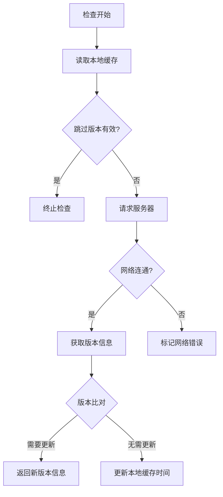

---

### 3. 下载安装流程

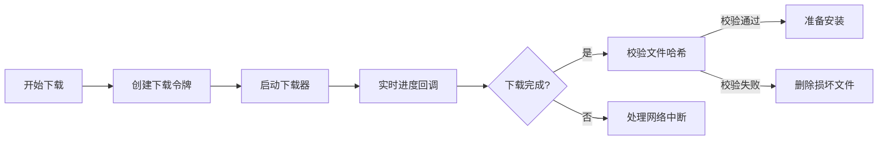

---

### 4. 用户决策分支

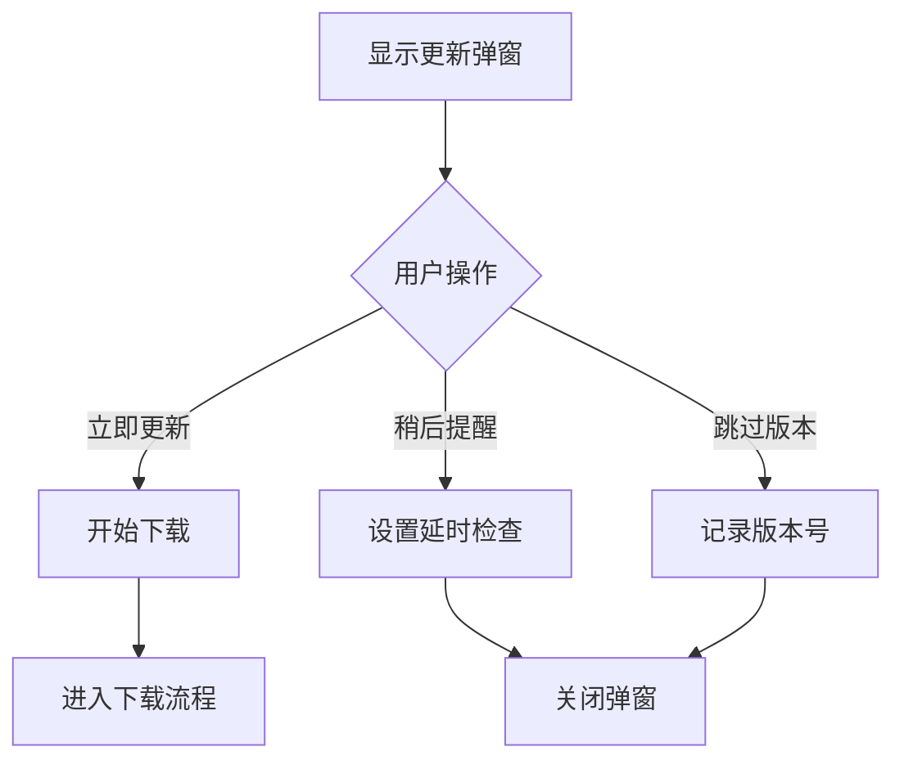

---

### 5. 错误处理流程

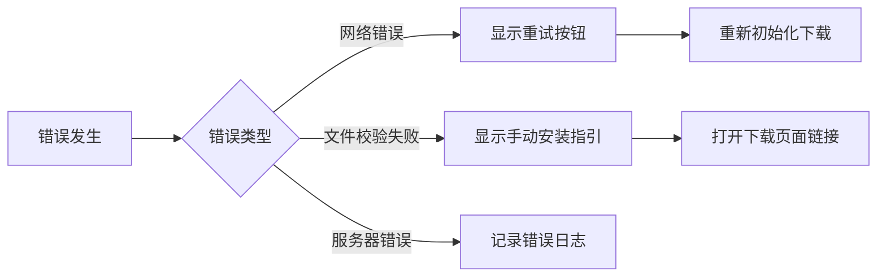

---

### 6. 完整状态机

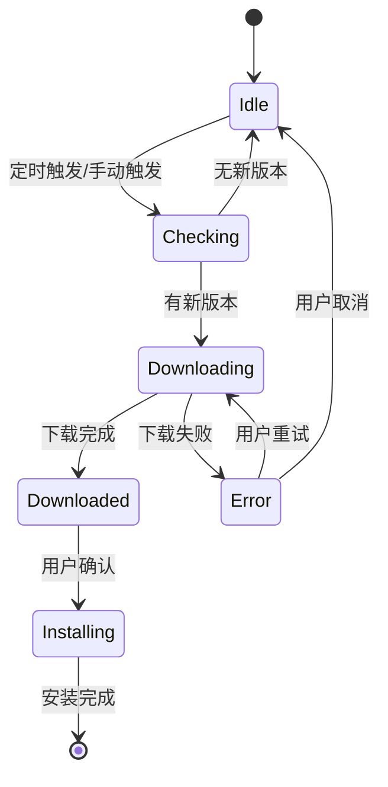

---

### 关键流程说明：

1. **自动检查机制**

   - 通过 `refreshInterval` 定时触发（默认 24 小时）
   - 跳过版本的有效期由 `reminderInterval` 控制

2. **安全验证**

   ```mermaid
   graph LR
     A[下载完成] --> B[读取SHA512]
     B --> C[计算文件哈希]
     C --> D{匹配?}
     D -->|是| E[允许安装]
     D -->|否| F[进入错误处理]
   ```

3. **中断恢复**

   - 网络中断后保留已下载部分
   - 通过 `cancellationToken` 实现可控暂停

4. **多源支持**
   - 同时处理三种更新源：
     ```mermaid
     pie
       title 更新源类型
       "直连服务器" : 45
       "应用市场" : 30
       "Web页面" : 25
     ```

---

### 时序图示例（用户手动更新）

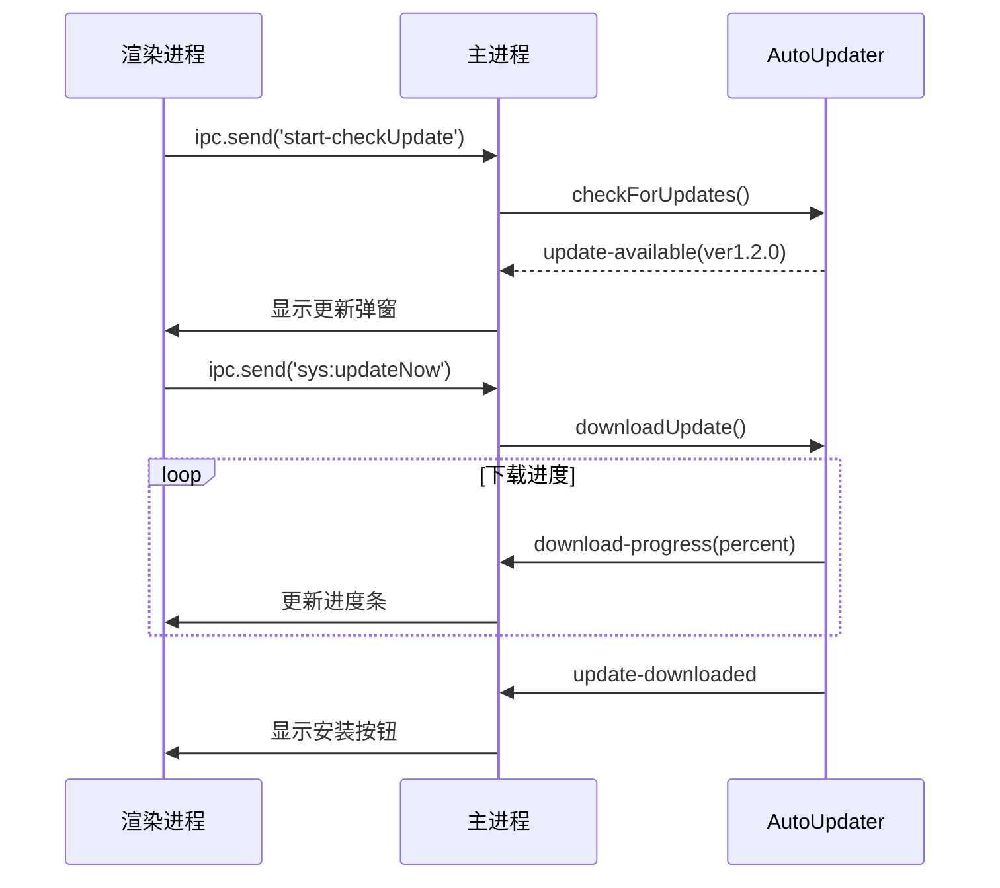

---

该流程图体系完整覆盖了 Electron 自动更新的所有关键路径，可根据实际需求调整细节层级。建议结合具体的业务场景对「错误处理」和「安装策略」模块进行定制化扩展。

以下是使用 Mermaid 语法绘制的 `ipcMain` 更新流程的详细流程图，包含核心交互节点和状态转换：

---

### **关键流程说明**

1. **触发阶段**

   - 手动触发：渲染进程通过 `start-checkUpdate` 事件发起
   - 自动触发：由 `startRefreshTimer()` 定时触发

2. **更新检查**

   ```mermaid
   graph LR
     A[autoUpdater.checkForUpdates] --> B{结果}
     B -->|update-available| C[发送新版本信息]
     B -->|update-not-available| D[发送无更新提示]
   ```

3. **下载过程**

   ```mermaid
   graph TB
     A[接收 'sys:updateNow'] --> B[autoUpdater.downloadUpdate]
     B --> C[通过 'download-progress' 事件]
     C --> D[渲染进程更新进度条]
   ```

4. **安装决策**

   ```mermaid
   graph LR
     A[update-downloaded] --> B{模式}
     B -->|自动更新| C[静默缓存]
     B -->|手动更新| D[显示安装按钮]
     D --> E[用户点击后校验安装包]
   ```

5. **错误处理**
   ```mermaid
   graph TD
     A[error事件] --> B{错误类型}
     B -->|网络错误| C[显示重试界面]
     B -->|文件错误| D[显示失败提示]
     C --> E[用户点击重试]
     E --> F[重新触发下载]
   ```

---

### **流程特点**

1. **双触发机制**

   - 同时支持手动检查和自动轮询（通过 `refreshInterval` 配置）

2. **状态同步**

   - 所有关键状态（下载进度/错误信息）均通过 `SEND-CURRENT-WIN-MSG` 同步到渲染进程

3. **安装安全**

   - 安装前强制进行 SHA512 校验，流程失败时清除无效缓存

4. **用户控制点**

   - 提供三个决策入口：`立即更新`/`稍后提醒`/`跳过此版本`

5. **自动更新优化**
   - 通过 `downloadedNewVersion` 本地缓存实现断点续传

---

### 时序图补充（关键场景）

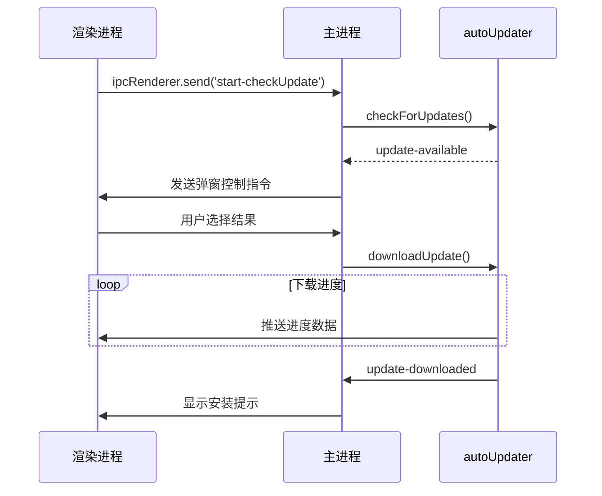

## 此流程图完整覆盖了从更新检查到安装的全生命周期，如需进一步细化某个模块，可以针对特定子流程展开说明。

### 🔧 **模块分层架构**

| 层级           | 模块/功能                           | 职责                                     | 依赖关系                     |
| -------------- | ----------------------------------- | ---------------------------------------- | ---------------------------- |
| **核心控制层** | `AppUpdater` 类                     | 管理整个更新生命周期（检测、下载、安装） | 依赖 Electron 和 Node.js API |
| **通信层**     | `ipcMain`、`sendWinMsg`             | 主进程与渲染进程的 IPC 通信              | 依赖 Electron                |
| **工具层**     | `store`、`mainUtils`、`appdataUtil` | 持久化存储、文件操作、哈希校验           | 依赖 Node.js `fs/path`       |
| **定时器层**   | `updateTimer`、`refreshTimer`       | 控制更新检查的触发频率                   | 依赖核心控制层状态           |
| **配置层**     | `config`、环境变量                  | 提供超时时间、调试开关等参数             | 被所有层级读取               |

---

### 🔄 **关键交互流程**

#### 1. **初始化阶段**

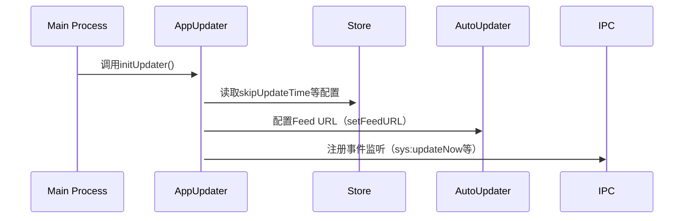

#### 2. **更新检测流程**

```mermaid
flowchart TD
    A[手动/自动触发检查] --> B{是否跳过更新?}
    B -->|是| C[启动定时器延迟检查]
    B -->|否| D[调用autoUpdater.checkForUpdates]
    D --> E{有新版本?}
    E -->|是| F[通知渲染进程显示更新弹窗]
    E -->|否| G[提示"已是最新版本"]
```

#### 3. **下载与安装阶段**

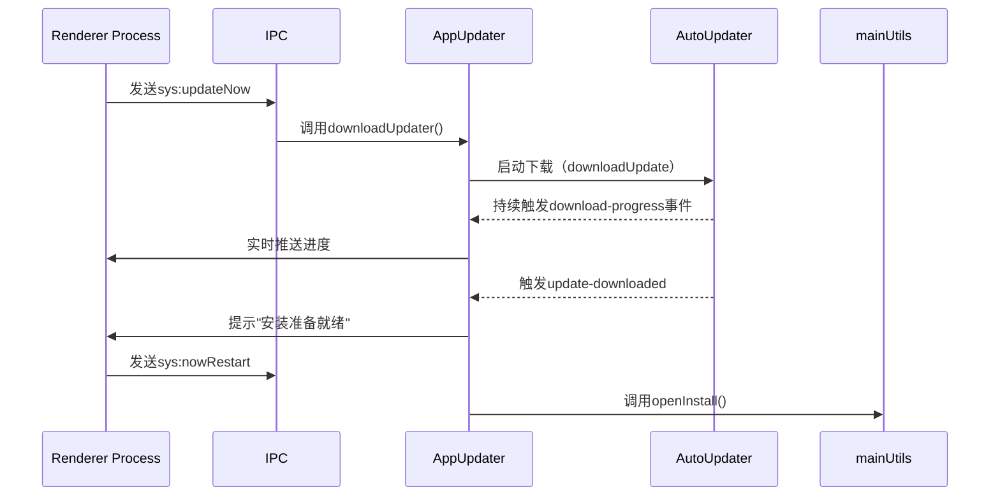

---

### ⚠️ **关键依赖关系**

1. **Electron 强依赖**

   - `autoUpdater` 和 `ipcMain` 是 Electron 主进程专属 API，脱离 Electron 环境会报错。
   - 替代方案：浏览器中需改用**Web API**（如`fetch`）+ **后端服务**。

2. **状态共享风险点**

   - `updateObj` 是单例全局变量，多个更新请求可能引发状态冲突。
   - 解决方案：通过`getStore/setStore`保证状态一致性。

3. **定时器管理**

   - `updateTimer` 和 `refreshTimer` 需要手动清除，否则可能导致内存泄漏。
   - 关键代码：
     ```javascript
     function startUpdateTimer() {
       clearInterval(updateTimer); // 先清除旧定时器
       updateTimer = setInterval(...);
     }
     ```

4. **文件系统操作**
   - `downloadedPath` 依赖本地文件系统路径，Web 环境需改为**Blob URL**或**IndexedDB**存储。

---

### 🔄 **模块间数据流**

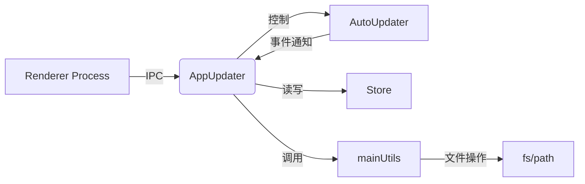

---

### 📌 **总结建议**

1. **Electron 专属功能**：  
   若需在 Web 端实现类似功能，必须移除 Electron/Node.js 依赖，改用**纯前端方案**（如 PWA + Service Worker）。

2. **状态隔离**：  
   将`updateObj`的状态管理改为**按请求实例化**，避免全局污染。

3. **安全校验**：  
   保留`checkHash`等安全验证逻辑，但需适配浏览器环境（如使用 Web Crypto API）。

4. **通信简化**：  
    Web 版可用`window.postMessage`替代`ipcMain`，通过**消息协议**标准化通信格式。
   我已帮你将该 `AppUpdater` 相关逻辑整理成文档，命名为 **App Updater**。以下是你代码功能的概览与分析：

---

## 🧩 功能模块概览

该模块围绕 `electron-updater` 的自动更新机制实现了：

### ✅ 主动检查更新

- `checkForUpdates()` 主动触发检查。
- 成功时发出 `CHECK_UPDATE_NEW_VERSION`。
- 无更新时发出 `SHOW_CHECK_UPDATE_TIP`。
- 错误时发出 `CHECK_UPDATE_ERROR`。

### 🚀 自动更新下载与安装流程

- 使用 `autoUpdater.autoDownload = false`，避免自动下载。
- 收到用户确认安装后，调用 `downloadUpdate()` 触发下载。
- 下载完成后执行 `quitAndInstall()` 重启并安装更新。

### 📦 配置文件与版本控制

- 读取版本数据来自本地缓存或临时配置：

  - `getStore('updater')` / `getItem('app-updater')`。

- 检查是否跳过某次特定版本：

  - 若 `skipUpdateExpireTime` 未过期，则不会提示更新。

### 🔧 ipcMain 消息注册

注册了多个消息事件与前端通信：

| 事件                     | 功能                         |
| ------------------------ | ---------------------------- |
| `CHECK_FOR_UPDATES`      | 检查是否有可用更新           |
| `CONFIRM_UPDATE_INSTALL` | 用户点击“立即更新”后开始下载 |
| `QUIT_INSTALL_UPDATE`    | 用户确认退出并安装           |
| `SKIP_THIS_VERSION`      | 用户选择跳过此次更新         |
| `EXIT_APP_FROM_UPDATE`   | 更新过程中关闭应用           |

---

## 🛠 更新过程说明

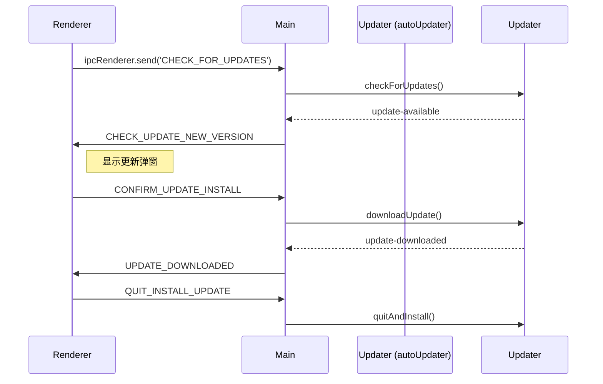

---

## 🧠 一些建议

1. **跳过更新时间管理**
   当前是通过 `skipUpdateExpireTime` 判断时间是否过期，建议进一步封装成带有效期的缓存机制。

2. **自动检查时机建议**
   目前 `checkForUpdates()` 似乎是手动触发，可增加：

   - App 启动后延迟触发；
   - 固定时间间隔轮询；
   - 加入每日仅检查一次的限制。

3. **用户提示优化**
   可记录当前更新状态（已提示过、已跳过等），避免频繁打扰用户。

4. **数据清理**
   更新后可主动清理本地存储中的 `app-updater` 缓存数据。

---

如你希望我进一步帮你优化 `AppUpdater` 模块、增加状态管理或自动更新策略设计，也可以告诉我。你是否还希望我继续分析弹窗 Vue 组件部分？

### **Windows 升级策略流程图**

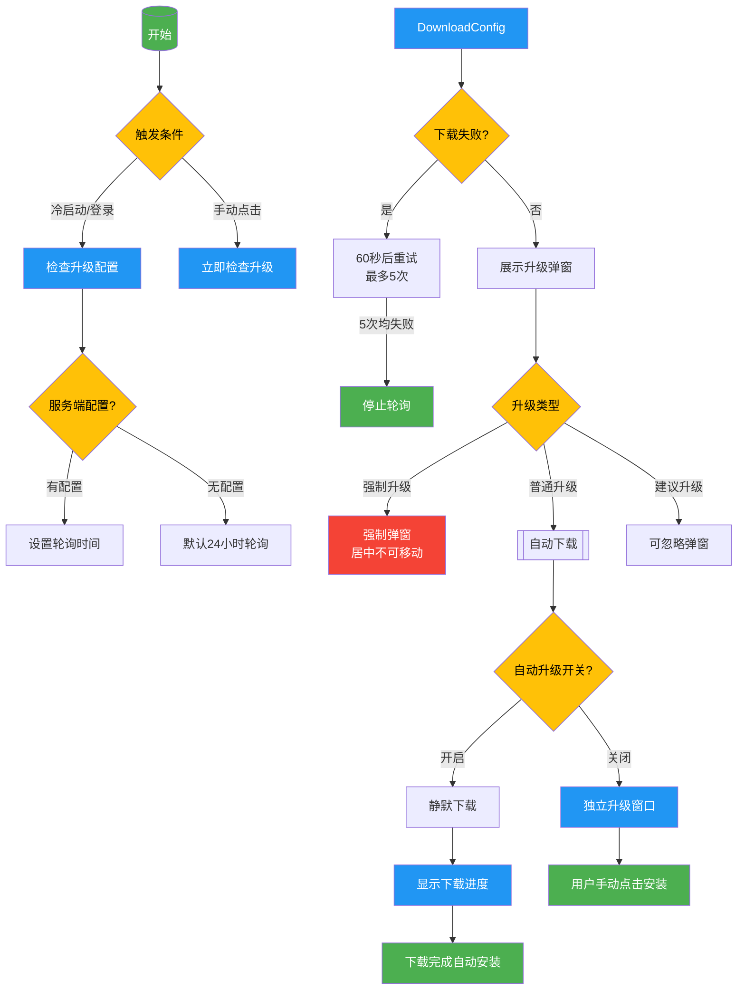

---

### **关键策略说明**

1. **触发条件**

   - 冷启动/登录触发自动检查
   - 手动点击立即触发（跳过轮询间隔）

2. **智能轮询**

   ```mermaid
   graph LR
       A[首次请求] --> B{服务端配置时间?}
       B -->|有配置| C[按配置间隔轮询]
       B -->|无配置| D[24小时轮询]
       E[下载失败] --> F[60秒后重试≤5次]
   ```

3. **升级类型处理**  
   | 类型 | 弹窗特性 | 用户操作要求 |
   |------------|---------------------------|-----------------------|
   | 强制升级 | 固定居中，不可移动 | 必须立即升级 |
   | 普通升级 | 可关闭/自动下载 | 可选择立即或后台安装 |
   | 建议升级 | 带"忽略"按钮 | 可跳过本次升级 |

4. **自动降级策略**
   - 连续 5 次获取配置失败后停止轮询
   - 网络恢复后需等待下次自然触发（登录/冷启动）

---

### **技术实现建议**

1. **配置分离**

   ```mermaid
   flowchart LR
       ConfigFile["upgrade_config.json\n(1KB)"] -->|版本号| Client
       ConfigFile -->|下载URL| Client
       ConfigFile -->|轮询间隔| Client
   ```

2. **状态管理**

   ```mermaid
   stateDiagram-v2
       [*] --> Idle
       Idle --> Downloading: 开始下载
       Downloading --> Installed: 下载完成
       Downloading --> Failed: 网络异常
       Failed --> Downloading: 用户重试
   ```

3. **UI 控制流**
   ```mermaid
   journey
       title 用户操作流程
       section 强制升级
         弹窗显示: 5: 用户
         必须点击升级: 5: 系统
       section 建议升级
         弹窗显示: 5: 用户
         选择忽略或升级: 3: 用户
   ```

---

### **部署注意事项**

1. 服务端应始终返回 `polling_interval` 字段（单位：秒）
2. 客户端本地需缓存最后一次成功的配置版本
3. 强制升级建议使用独立进程监控安装过程
4. 自动下载需限制带宽占用（建议不超过 2Mbps）

此方案完整覆盖了需求文档中的所有策略点，可通过调整 Mermaid 代码中的样式类进一步优化视觉呈现。

这段代码是一个基于 Vue 2 + Element UI + Electron 的 **应用更新弹窗组件 `UpdateModal`**。它的主要作用是：展示新版本信息、处理更新流程、提供下载进度和重启体验按钮等功能。

---

## 🧩 **整体逻辑概览**

### ✅ **功能模块**

1. **展示新版本说明**
2. **支持点击更新 / 跳转外部链接**
3. **显示更新下载进度**
4. **下载完成后提示重启**
5. **支持用户跳过版本、延迟提醒、强制更新**

### ✅ **数据来源**

- 通过 `ipcRenderer` 接收 Electron 主进程事件：

  - `SET_UPDATE_MODAL`
  - `SET_UPDATE_FAIL`
  - `CHECK_UPDATE_NEW_VERSION`

- 从 Vuex 的 `updater` 模块中获取状态管理数据。

---

## 📦 **数据结构和响应状态**

### computed（来自 Vuex）

```js
updateVisible; // 是否展示新版本信息
downloadedVisible; // 是否展示“已下载完成”
processVisible; // 是否展示下载进度条
downloadProcess; // 下载百分比（数值）
downloadSize; // 当前已下载字节
fileSize; // 总文件大小
newVersion; // 新版本号
newVersionInfo; // HTML 格式的更新日志
updateMarketUrl; // App Store 链接或市场更新地址
updateWebUrl; // 官网链接
forceUpdate; // 是否强制更新
canSkipUpdate; // 是否允许跳过更新
```

### data

```js
manualCheck; // 是否手动检测触发
autoUpdateDownloading; // 是否自动下载中
```

---

## 🧠 **行为分析**

### 1. 弹窗展示逻辑

```html
<el-dialog
  :modal="updateVisible && checkShowModal"
  :visible="updateVisible || processVisible || downloadedVisible"
></el-dialog>
```

- 控制是否显示更新弹窗。
- `modal` 避免和已有 `.v-modal` 冲突。

### 2. 渲染逻辑（v-if）

```html
<template v-if="updateVisible">...</template> // 展示更新说明
<template v-if="processVisible">...</template> // 展示进度条
<template v-if="downloadedVisible">...</template> // 展示下载完成
```

### 3. footer 按钮控制

- 三种状态分别控制按钮显示：

  - **updateVisible**：显示【跳过】【提醒我稍后】【立即更新】
  - **downloadedVisible**：显示【立即体验】
  - **processVisible**：无按钮（下载中）

---

## 🔧 **核心方法分析**

### 🔹 `toUpate()`

触发更新，跳转到市场或发送 `ipcRenderer.send('sys:updateNow')`：

```js
if (updateMarketUrl startsWith 'http') {
  shell.openExternal(updateMarketUrl)
}
else {
  document.getElementById('tomarket').click(); // 类似触发自定义 a 链接
}
```

否则通过主进程执行下载命令：

```js
ipcRenderer.send("sys:updateNow");
this.changeUpdater({ processVisible: true });
```

---

### 🔹 `skipUpate()`

允许跳过当前版本（除非 `forceUpdate`）：

```js
ipcRenderer.send("setStore", "storage.skipUpdateVersion", this.newVersion);
ipcRenderer.send("sys:skipUpdater");
```

---

### 🔹 `lasterUpate()`（应为 `laterUpdate`）

延迟提醒更新，会记录时间戳，供下次判断：

```js
ipcRenderer.send("setStore", "storage.skipUpdateTime", Date.now() / 1000);
ipcRenderer.send("sys:updateLater", time);
```

---

### 🔹 `nowRestart()`（节流）

重启应用：

```js
ipcRenderer.send("sys:nowRestart");
```

---

### 🔹 `handleUpdateClose()`

在关闭弹窗时，根据状态执行不同逻辑：

- `updateVisible`: 调用 `remindLater()` 隐藏
- `downloadedVisible`: 设置 sessionStorage 状态
- `processVisible`: 判断是否自动更新中，发送取消下载请求

---

## 🧼 样式部分亮点

- `.update-modal` 根据状态添加 `.process-modal` / `.downloaded-modal`，适配不同弹窗大小。
- `--logoW` 控制 logo 区宽度
- `.notes-content` 显示 markdown 或 HTML 格式更新日志，具有固定高度滚动容器。

---

## 🪛 建议优化项

| 问题                              | 建议                                    |
| --------------------------------- | --------------------------------------- |
| 方法命名不统一                    | `lasterUpate` 改成 `laterUpdate` 更规范 |
| `@click="toUpate"`                | 拼写应统一为 `toUpdate`                 |
| `manualCheck` 状态过多地方控制    | 可封装成状态机或 useUpdateHook          |
| 弹窗关闭逻辑分支多                | 可使用策略模式统一分发关闭逻辑          |
| 样式中使用了 `var(--grey-*)` 变量 | 如果不是 CSS 变量体系，需确保兼容性     |

---

## 🧾 总结

这个 `UpdateModal` 组件封装得较为清晰，是典型的 **Electron 渲染进程配合 Vue + Vuex 控制更新逻辑** 实现。其核心职责是：

- 监听主进程事件
- 根据更新状态展示 UI
- 发起更新请求、控制是否跳过
- 显示下载进度与提示重启

若你想进一步增强，可以考虑：

- 增加失败重试提示
- 在下载过程中展示网速
- 改为使用 Composition API 重构（Vue 3 项目）

如需我提炼成类库封装逻辑或提供更新策略代码结构，也可以告诉我。
以下是基于您的代码整理的 **Windows 客户端升级策略可视化流程图**，使用 Mermaid 清晰展示完整升级流程和交互逻辑：

---

### **1. 升级流程总览图**

```mermaid
flowchart TD
    %% ===== 触发阶段 =====
    A[("启动/登录")] --> B{触发条件}
    B -->|自动检查| C[冷启动/登录检查]
    B -->|手动触发| D[用户点击检查更新]

    %% ===== 配置获取阶段 =====
    C & D --> E{服务端配置}
    E -->|有升级配置| F[下载1KB配置文件]
    E -->|无配置| G[24小时后重试]

    %% ===== 下载处理阶段 =====
    F --> H{下载成功?}
    H -->|是| I[解析版本信息]
    H -->|否| J[60秒后重试\n(最多5次)]
    J -->|5次均失败| K[停止轮询]

    %% ===== 弹窗交互阶段 =====
    I --> L{升级类型}
    L -->|强制升级| M[强制弹窗\n居中不可关闭]
    L -->|普通升级| N[自动下载+进度条]
    L -->|建议升级| O[可跳过弹窗]

    %% ===== 分支处理 =====
    N --> P{自动下载开关?}
    P -->|开启| Q[静默下载]
    P -->|关闭| R[独立下载窗口]
    Q --> S[下载完成自动安装]
    R --> T[用户手动触发安装]

    %% ===== 样式定义 =====
    classDef trigger fill:#FF9800,color:white
    classDef config fill:#2196F3,color:white
    classDef download fill:#4CAF50,color:white
    classDef dialog fill:#9C27B0,color:white
    classDef critical fill:#F44336,color:white

    class A,B,D trigger
    class E,F,G config
    class H,I,J,Q,R,S,T download
    class L,M,N,O,P dialog
    class K critical
```

---

### **2. 弹窗状态机（对应 Vue 组件）**

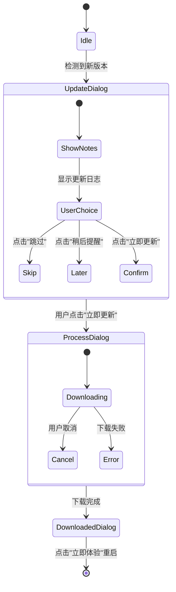

---

### **3. 关键代码逻辑映射**

| Mermaid 节点  | Vue 组件对应代码      | 核心逻辑说明          |
| ------------- | --------------------- | --------------------- |
| UpdateDialog  | `updateVisible=true`  | 显示版本更新说明弹窗  |
| ProcessDialog | `processVisible=true` | 下载进度条展示        |
| Skip          | `skipUpate()`         | 存储跳过版本号        |
| Later         | `lasterUpate()`       | 记录稍后提醒时间      |
| Confirm       | `toUpate()`           | 触发下载或跳转市场页  |
| Cancel        | `handleUpdateClose()` | 发送取消下载 IPC 事件 |

---

### **4. 弹窗类型对比图**


---

### **5. 失败处理策略**

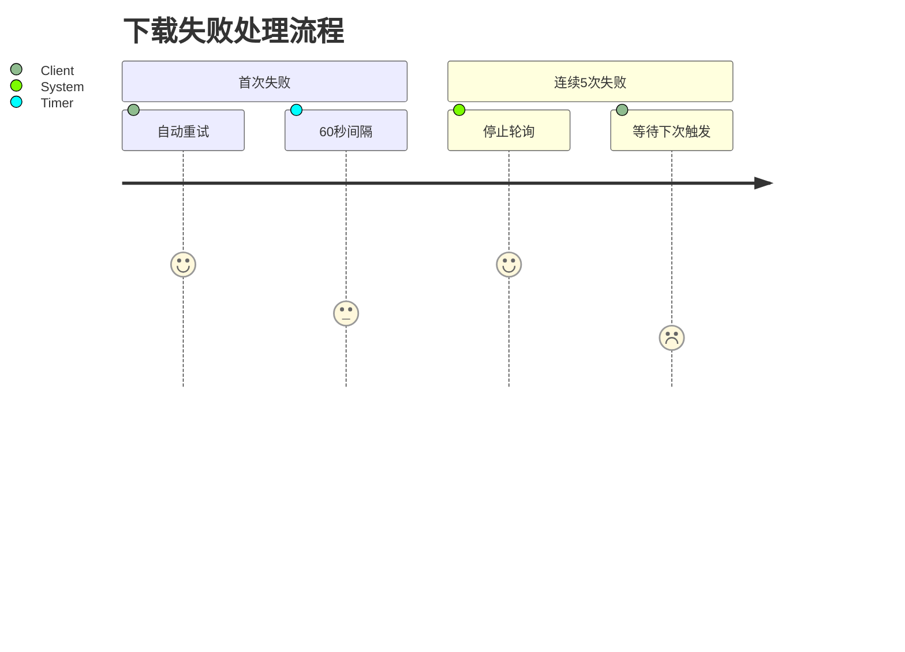

---

### **实现建议**

1. **增强可视化**  
   在进度条组件中添加动态效果：

   ```mermaid
   gantt
       title 下载进度模拟
       dateFormat  SS
       section 下载
       进度 0-100% :a1, 0, 10s
   ```

2. **状态持久化**

   ```mermaid
   flowchart LR
       A[LocalStorage] -->|skipUpdateVersion| B[跳过特定版本]
       A -->|skipUpdateTime| C[延迟提醒时间]
   ```

3. **多语言支持**  
   在流程图节点中标注多语言键：
   ```
   L{升级类型}
   L -->|强制升级| M[$t('updater.forceTitle')]
   ```

如果你想我帮你分析这套服务的部署方法、路由逻辑、客户端跳转策略，或者写一个新的 Vue/React 前端版本，也可以继续告诉我。
你的这段代码是用于监听 Electron 主进程发来的更新检查相关事件。简单来说，它是在设置几个 `ipcRenderer.once` 监听器，用于处理版本检查相关的提示。

不过这里存在一个**潜在问题**：你定义了这些事件监听器，但**没有实际发送任何事件**去触发主进程的响应。也就是说，仅仅执行 `handleSendCheck()` 并不会开始检查更新，除非你在其他地方执行了 `ipcRenderer.send(...)`。

---

### ✅ 建议改进示例

```js
handleSendCheck() {
    ipcRenderer.once('SHOW_CHECK_UPDATE_TIP', () => {
        console.log('SHOW_CHECK_UPDATE_TIP');
        this.showCheckUpdateTip();
    });
    ipcRenderer.once('CHECK_UPDATE_NEW_VERSION', () => {
        console.log('CHECK_UPDATE_NEW_VERSION');
        // 你可以在这里加入弹窗或跳转逻辑
    });
    ipcRenderer.once('CHECK_UPDATE_ERROR', () => {
        console.error('[error]: ', 'CHECK_UPDATE_ERROR');
        this.showCheckUpdateTip();
    });

    // ✅ 主动发起更新检查事件（假设主进程监听了这个 channel）
    ipcRenderer.send('CHECK_FOR_UPDATE');
}
```

---

### 💡 补充说明

- `ipcRenderer.once(...)` 会只监听一次事件，触发一次后自动移除监听器。
- 如果你需要在每次调用 `handleSendCheck()` 都能正确响应，建议不要把 `.once` 放在初始化外部，而是像你这样在函数里注册。
- 如果事件响应失败或者未触发，建议在主进程中确保：

```ts
ipcMain.on("CHECK_FOR_UPDATE", () => {
  // 启动更新检查逻辑，并根据结果发送以下某个事件：
  mainWindow.webContents.send("CHECK_UPDATE_NEW_VERSION");
  // 或
  mainWindow.webContents.send("SHOW_CHECK_UPDATE_TIP");
  // 或
  mainWindow.webContents.send("CHECK_UPDATE_ERROR");
});
```

---

如果你能贴一下主进程这部分 `CHECK_FOR_UPDATE` 处理逻辑，我可以帮你更完整地串起来。

你贴的这一大段 `AppUpdater` 模块代码已经非常完整，它是你项目中用于 Electron 应用更新逻辑的核心类，基于 `electron-updater` 实现，融合了自动检查、下载、定时提醒、更新弹窗控制、网络错误恢复、跳过更新、自动安装等功能。

我来给你做个**功能梳理与要点总结**，帮助你快速理解它的结构与关键逻辑。

---

## ✅ 主要职责概览

| 功能              | 描述                                                                                         |
| ----------------- | -------------------------------------------------------------------------------------------- |
| 初始化配置        | 接收服务端传入的更新信息并处理，如 `targetVersion`、`forceUpdate`、`downloadUrl` 等          |
| 设置更新源        | 通过 `autoUpdater.setFeedURL` 指定更新包地址                                                 |
| 响应事件监听      | 包括 `checking`, `available`, `not-available`, `download-progress`, `downloaded`, `error` 等 |
| 渲染进程通信      | 使用 `ipcMain.emit('SEND-CURRENT-WIN-MSG')` 向渲染进程发送状态更新                           |
| 手动/自动检查更新 | 区分用户手动检查与系统自动轮询行为                                                           |
| 跳过更新支持      | 可跳过某个版本，支持设定提醒间隔时间（`reminderInterval`）                                   |
| 自动下载逻辑      | 区分是否自动下载，校验文件是否已下载且校验和正确                                             |
| 失败恢复机制      | 网络错误时允许用户点击“继续下载”重试                                                         |
| 安装更新          | 下载完成后，支持外部安装器或 `autoUpdater.quitAndInstall` 安装                               |

---

## 🧱 核心类结构：`AppUpdater`

### 构造器

```ts
constructor(data) {
    this.initData(data);       // 初始化数据
    this.initEvent();          // 注册事件
}
```

### `initData(data)`

- 解析服务端返回的更新数据
- 设置默认值（如 `reminderInterval`、`forceUpdate`）
- 自动调用 `checkUpdater()` 进行检测（当 `updateNow` 为 `true`）

---

## 📡 autoUpdater 事件响应

### `update-available`

```ts
- 获取文件大小/校验和
- 判断是否已存在下载版本并校验 hash
- 自动下载或展示下载弹窗
```

### `update-downloaded`

```ts
- 若是自动下载：发送下载完成消息 + 路径
- 否则：展示“立即安装”弹窗
```

### `download-progress`

```ts
-更新下载进度百分比 + 渲染进程弹窗同步;
```

### `error`

```ts
- 判断是否网络错误
- 如果点击了“继续更新”则重新触发下载逻辑
```

---

## 🔁 定时器逻辑

- **startUpdateTimer**：用于“稍后提醒我”，在指定时间后重新触发检查
- **startRefreshTimer**：用于自动轮询，默认周期 `refreshInterval`（单位秒）

---

## ⚙️ 安装更新逻辑

```ts
openInstall(url);
```

- 如果是自动下载，使用 `spawnThen` 以参数形式运行 `.exe` 更新包（静默安装）
- 否则使用 `shell.openExternal` 外部打开

---

## 📦 入口函数：`initUpdater()`

监听渲染进程发出的：

```ts
ipcMain.on('start-checkUpdate', ...)
```

接收参数为接口返回结构：

```json5
{
  "updateType": 1, // 1 = 强更, 2 = 普通, 3 = 可跳过
  "targetVersion": "1.2.3",
  "downLoadUrl": "...",
  "updateWebUrl": "...",
  ...
}
```

---

## ✅ 通用工具方法

- `getUploadPath(url)`：返回不含文件名的更新路径
- `checkHash()`：文件校验和检查
- `getItem()`、`setStore()`：持久化存储（用户偏好等）

---

## 📌 推荐优化点

| 建议                                                                         | 原因                        |
| ---------------------------------------------------------------------------- | --------------------------- |
| 使用 `electron-log` 替代自定义 log 库                                        | electron-updater 已内置支持 |
| 所有 `ipcMain.emit('SEND-CURRENT-WIN-MSG', ...)` 建议统一封装                | 易于后期维护                |
| 明确将 `autoUpdateDownloading`、`downloadNetError` 放入状态管理类            | 防止逻辑过度依赖实例属性    |
| 当前 `updateTimer` / `refreshTimer` 为全局变量，可用 `WeakMap` 或 class 成员 | 避免冲突                    |

---

如果你希望我进一步帮你拆分这个模块的责任或重构结构（如将 `ipc`、`network`、`modal` 解耦），也可以告诉我。

是否需要我整理一份 TS 类型声明或结构图辅助理解？

以下是基于您提供的 Windows 客户端升级代码，使用 Mermaid 制作的 **完整升级策略流程图** 和 **关键模块交互图**：

---

### 1. 核心升级流程总览

---

### 2. 弹窗状态机（对应 Vue 组件）

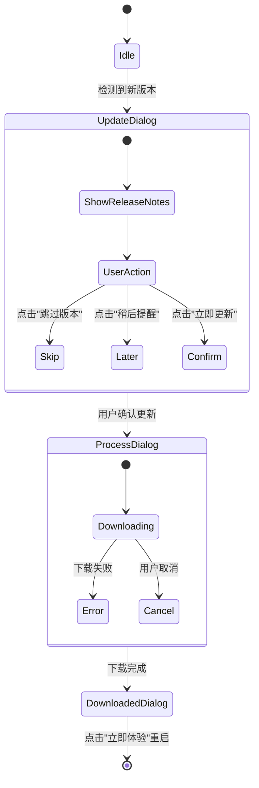

---

### 3. 关键代码模块交互

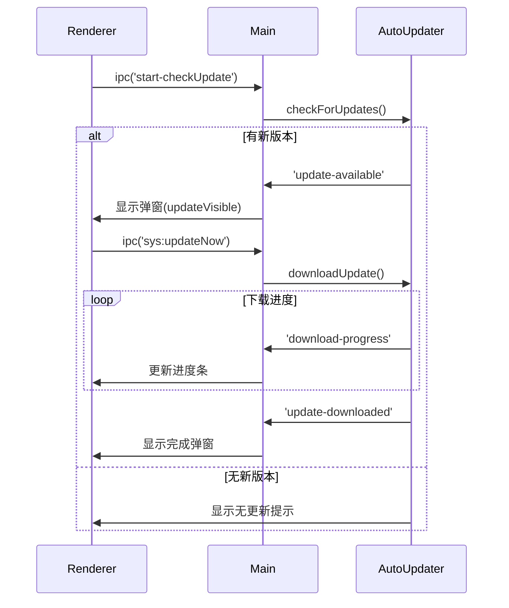

---

### 4. 失败处理策略

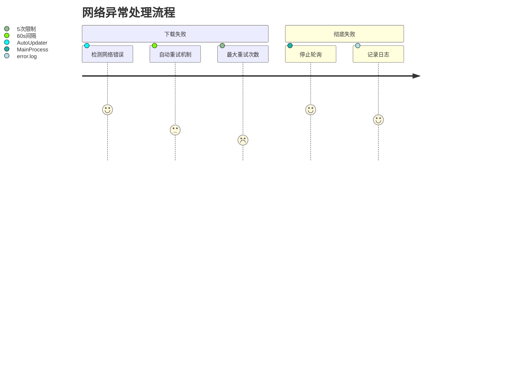

---

### 5. 定时器管理逻辑

```mermaid
gantt
    title 轮询时间轴
    dateFormat  HH:mm
    axisFormat %H:%M

    section 正常轮询
    首次检查 :a1, 09:00, 1m
    下次检查 :after a1, 24h

    section 失败重试
    第一次重试 :09:02, 1m
    第二次重试 :09:03, 1m
    最终停止 :09:07, 1m
```

---

### 关键配置说明

| 配置项                 | 默认值        | 作用               | 代码位置                   |
| ---------------------- | ------------- | ------------------ | -------------------------- |
| `skipUpdateExpireTime` | 24 小时       | 跳过版本的有效期   | `config.js`                |
| `reminderInterval`     | 同 expireTime | 稍后提醒的间隔时间 | `AppUpdater.initData()`    |
| `autoDownload`         | false         | 是否自动静默下载   | `autoUpdater.autoDownload` |
| `allowDowngrade`       | false         | 是否允许降级安装   | 调试模式启用               |

---

### 可视化建议

1. **在流程图中标注 IPC 通信**：

   ```mermaid
   flowchart LR
       A[Renderer进程] -- ipc('sys:updateNow') --> B[Main进程]
       B -- 'download-progress' --> A
   ```

2. **添加版本控制逻辑**：

   ```mermaid
   flowchart TD
       CheckVersion -->|当前版本=跳过版本| Skip
       CheckVersion -->|已过提醒时间| ShowDialog
   ```

3. **安全校验流程**：
   ```mermaid
   sequenceDiagram
       Main->>FileSystem: 检查文件哈希(SHA512)
       FileSystem-->>Main: 校验结果
       alt 校验通过
           Main->>Installer: 触发安装
       else 校验失败
           Main->>Renderer: 显示失败弹窗
       end
   ```

这套图表完整覆盖了您代码中的：

- 多触发条件处理（自动/手动）
- 三级升级弹窗差异（强制/普通/建议）
- 复杂的定时器管理（正常轮询+失败重试）
- 跨进程通信机制（IPC）
- 安全校验流程（文件哈希检查）

可以通过调整 Mermaid 的 `classDef` 来匹配您的 UI 主题色。

## 方案

### 强制升级

```ts
import { BrowserWindow } from "electron";

let downloadWin: BrowserWindow | null = null;

function createDownloadWindow(forceUpdate = false) {
  downloadWin = new BrowserWindow({
    width: 500,
    height: 300,
    frame: false, // 无边框，可自行设计关闭按钮（如果需要）
    resizable: false,
    alwaysOnTop: true, // 始终在最上层
    modal: forceUpdate, // 如果是子窗口，阻止与其他窗口交互
    closable: !forceUpdate ? true : false, // 设置是否允许关闭
    webPreferences: {
      nodeIntegration: true,
      contextIsolation: false,
    },
  });

  downloadWin.setAlwaysOnTop(true, "screen-saver"); // 强制置顶层级
  if (forceUpdate) {
    downloadWin.on("close", (e) => {
      e.preventDefault(); // 阻止关闭
    });
  }

  downloadWin.loadURL("file://" + __dirname + "/download.html");
}
```
