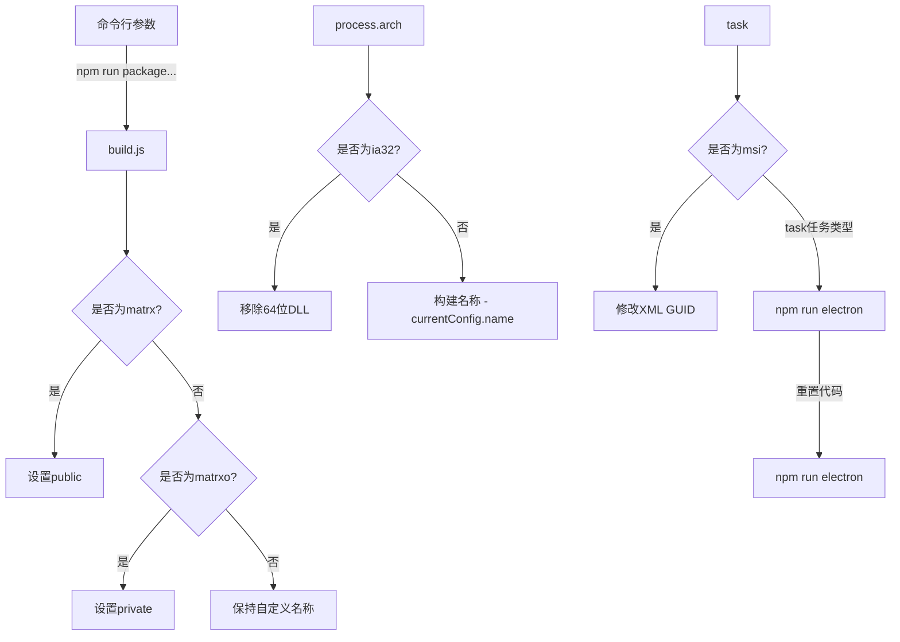
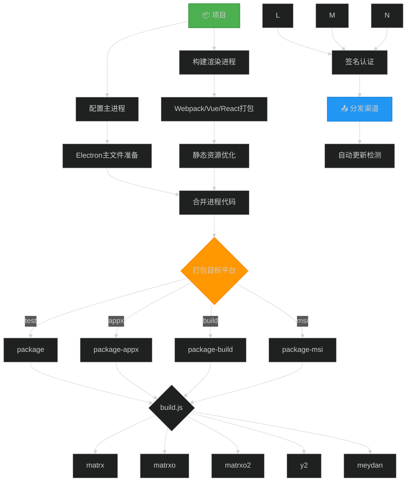
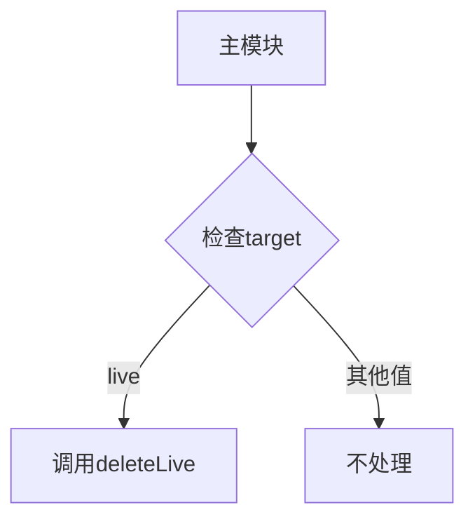
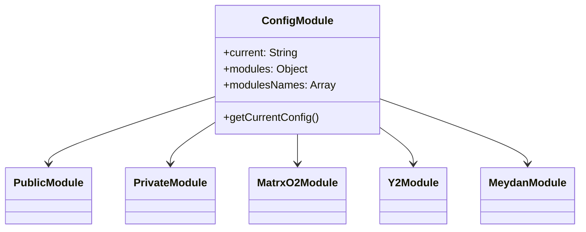

# 多版本打包

### 环境列表

| 环境    | 名称 |
| ------- | ---- |
| matrx   |      |
| matrxo  |      |
| matrxo2 |      |
| y2      |      |
| meydan  |      |

### 包类型

| 环境 | 名称                  |
| ---- | --------------------- |
| test | npm run package       |
| appx | npm run package-appx  |
| io   | npm run package-build |
| msi  | npm run package-msi   |

### 打包原理

由于需要打包不通类型的包，涉及修改本地配置，需要修改不通的 DLL 等信息。





### 典型配置示例

```bash
# 公共版测试构建
   npm run package -- matrx debug  # 公共版测试包+调试模式

# 私有版MSI安装包构建
   npm run package-build-live y2   # 中东客户(y2)直播专用生产包

# 特殊主题版调试构建
   npm run package-msi matrxo      # 私有化MSI安装包

      npm run package-all             # 一键构建所有版本

```

以下是整理后的 **npm scripts 打包命令配置表**，包含所有命令的功能说明和参数解析：

---

### **Electron 打包命令配置表**

| npm script 名称        | 实际执行命令                          | 构建类型 | 目标环境 | 特殊参数        | 功能描述                                                 |
| ---------------------- | ------------------------------------- | -------- | -------- | --------------- | -------------------------------------------------------- |
| **package**            | `node ./build.js test`                | `test`   | 测试环境 | -               | 标准测试包构建，会执行`postchange:version`版本更新后触发 |
| **package-appx**       | `node ./build.js appx`                | `appx`   | 生产环境 | -               | 生成 Windows APPX 应用包                                 |
| **package-build**      | `node ./build.js build`               | `build`  | 生产环境 | -               | 标准生产环境构建（生成 exe）                             |
| **package-msi**        | `node ./build.js msi`                 | `msi`    | 生产环境 | -               | 生成 MSI 安装包                                          |
| **package-live**       | `node ./build.js test --target=live`  | `test`   | 直播环境 | `--target=live` | 针对直播环境的测试包构建                                 |
| **package-appx-live**  | `node ./build.js appx --target=live`  | `appx`   | 直播环境 | `--target=live` | 生成直播环境专用的 APPX 包                               |
| **package-build-live** | `node ./build.js build --target=live` | `build`  | 直播环境 | `--target=live` | 直播环境的生产包构建                                     |
| **package-msi-live**   | `node ./build.js msi --target=live`   | `msi`    | 直播环境 | `--target=live` | 生成直播环境专用的 MSI 安装包                            |
| **package-all**        | `node ./scripts/all.js`               | 多目标   | 混合环境 | -               | 一键构建所有平台和环境的包（可能包含并行构建逻辑）       |

---

### **关键参数说明**

| 参数            | 作用范围            | 示例值   | 功能影响                                            |
| --------------- | ------------------- | -------- | --------------------------------------------------- |
| `--target=live` | 所有`-live`后缀命令 | `live`   | 激活直播专用配置（可能影响编码器、服务器地址等）    |
| `buildName`     | 通过命令行动态传入  | `matrxo` | 决定生成私有化版本（如`matrxo`会触发`private`模式） |
| `debug`         | 手动添加到命令末尾  | `debug`  | 启用详细调试日志输出（需代码支持）                  |

### **使用场景示例**

1. **开发测试**

   ```bash

   ```

2. **生产发布**

   ```bash

   ```

3. **直播环境部署**

   ```bash

   ```

4. **全平台构建**

   ```bash

   ```

---

### **注意事项**

1. 所有`-live`命令需要后端支持直播环境配置
2. `package`命令会先执行`postchange:version`（版本号更新）
3. 私有化构建（如`matrxo`）会自动触发 DLL 清理和重命名逻辑
4. 实际输出路径格式：`dist_electron/{name}-win-{version}.{ext}`

如果需要添加新的构建变体（如 Linux 版），建议按相同模式扩展`build.js`和 package.json 脚本。

<!-- import Cta from '../\_fragments/cta.mdx';

<Cta /> -->

## 代码解读

### build.js

```javascript
const path = require("path");
const fs = require("fs");
const os = require("os");
const fse = require("fs-extra");
const execute = require("./scripts/execute.js"); // 执行命令行脚本的工具
const moduleExists = require("./scripts/module_controller/index.js"); // 模块存在性检查
const { exec } = require("child_process"); // 子进程执行

// 从配置文件中获取模块名称列表
const { modulesNames } = require("./src/buildConfig/index");

// 获取命令行参数
const argvs = process.argv.slice(2);
const task = argvs[0]; // 构建任务类型（test/msi/build/appx）
const buildName = argvs[1]; // 构建名称（matrx/matrxo等）
const debug = argvs[2]; // 调试模式标志

// 打印输入参数
console.log(`task`, task);
console.log(`buildName`, modulesNames);
console.log(`buildName`, buildName);

// 加载当前构建配置
const ref = require("./src/buildConfig/current.js");

// 根据构建名称更新当前配置
if (buildName && buildName.toLowerCase() === "matrx") {
  ref.current = "public"; // 设置为公共版本
  fs.writeFileSync(
    "./src/buildConfig/current.js",
    "module.exports = " + JSON.stringify(ref, " ", "\t")
  );
} else if (buildName && buildName.toLowerCase() === "matrxo") {
  ref.current = "private"; // 设置为私有版本
  fs.writeFileSync(
    "./src/buildConfig/current.js",
    "module.exports =" + JSON.stringify(ref, " ", "\t")
  );
} else if (modulesNames.includes(buildName) && ref.current !== buildName) {
  ref.current = buildName.toLowerCase(); // 设置为指定构建名称
  fs.writeFileSync(
    "./src/buildConfig/current.js",
    "module.exports =" + JSON.stringify(ref, " ", "\t")
  );
}

// 特殊构建名称'meydan'的主题切换
if (buildName && buildName.toLowerCase() === "meydan") {
  // 修改主题颜色文件
  fs.readFile("./src/styles/element-variables.scss", "utf8", (err, data) => {
    if (err) throw err;
    // 将蓝色主题(#275edb)替换为金色主题(#c2a15b)
    const newData = data.replace(/#275edb;/g, "#c2a15b;");
    fs.writeFile(
      "./src/styles/element-variables.scss",
      newData,
      "utf8",
      (err) => {
        if (err) throw err;
        console.log("主题颜色已更新为金色风格");
      }
    );
  });
}

// 调试模式设置
if (debug === "debug") {
  const c = require("./config.js");
  c.debug = true; // 启用调试模式
  fs.writeFileSync(
    "./config.js",
    "module.exports =" + JSON.stringify(c, " ", "\t")
  );
}

// 加载各种配置
const currentConfig = require("./src/buildConfig/currentConfig");
const appxConfig = require("./appxConfig");
const exeConfig = require("./exeConfig");
const msiConfig = require("./msiConfig");

console.log(
  `build.js [INFO] running task "${task}"`,
  `version:${currentConfig.name} ${currentConfig.version}`
);

// 检查模块存在性
const args = require("minimist")(process.argv.slice(2));
moduleExists(args.target || "all");

// 主构建函数
start();

async function start() {
  console.time("build-time:"); // 开始计时

  // 如果存在build.log文件，启动测试程序
  if (fs.existsSync("./build.log")) {
    exec(
      `${path.join(
        os.homedir(),
        "AppData/Local/Matrx-Beta-test/Matrx-Beta.exe"
      )}`
    );
  }

  // 备份并修改package.json
  let pkg = require("./package.json");
  let isPrivated = currentConfig.privatization;
  fse.copyFileSync("./package.json", "./package.backup.json");

  // 更新package.json中的关键信息
  pkg.name = currentConfig.name;
  pkg.version = currentConfig.version;
  pkg.description = currentConfig.description;
  pkg.productName = currentConfig.productName;
  pkg.protocol = currentConfig.protocol;
  pkg.author = currentConfig.author;

  let newPkg = JSON.stringify(pkg, " ", "\t");
  let name = pkg.name;
  let productName = pkg.productName;

  fs.writeFileSync("./package.json", newPkg);

  // 资源路径设置
  let resources = path.join(__dirname, "./resources/");
  let pub = path.join(__dirname, "./public");

  // 替换图标
  execute("npm run replace-icons");
  execute("npm run replace-exe-icons");

  let lib = path.join(pub, "./sdk/lib");

  // 处理DLL文件（私有化/公有化不同处理）
  if (isPrivated) {
    // 私有化构建：清空lib目录
    fse.emptyDirSync(lib);
    console.log("\x1B[36m%s\x1B[0m", "正在拷贝私有化库文件... ", lib);
  } else {
    // 公有化构建：处理32位系统下的64位DLL
    if (process.arch === "ia32") {
      let files = fs.readdirSync(lib);
      const del64Dll = ["MatrxMeeting.exe", "libcrypto-1_1-x64_openssl.dll"];

      // 移除64位专用的DLL文件
      files.forEach(function (file) {
        if (del64Dll.indexOf(file) >= 0) {
          fse.removeSync(path.join(lib, file));
        }
      });

      // 拷贝硬件SDK和库文件
      await fse.copy(path.join(resources, process.arch, "./hwmsdk"), lib, {
        overwrite: true,
      });
      await fse.copy(path.join(resources, process.arch, "./lib"), lib, {
        overwrite: true,
      });
    }
  }

  // 根据任务类型选择配置
  let buildConf = exeConfig; // 默认使用exe配置

  if (task == "msi") {
    buildConf = msiConfig; // MSI安装包配置
    // 根据产品名称修改XML GUID
    if (productName === "Matrx") {
      await changeXml(productName, "b0e85c82-5a1a-5b95-9a41-d66296636128");
    } else if (productName === "MatrxO") {
      await changeXml(productName, "03d30b90-7bc0-5b2d-bdc3-6349cc251eb7");
    } else if (productName === "MatrxO2") {
      await changeXml(productName, "24eca05e-2f00-5cf3-801e-a5c158091d0f");
    }
  } else if (task == "appx") {
    buildConf = appxConfig; // APPX包配置
  }

  // 处理Electron二进制文件
  if (
    buildConf.electronDist &&
    buildConf.electronDist.indexOf("avr_electron") !== -1
  ) {
    // 使用自定义Electron构建
    await fse.copy(
      path.join("./resources/", process.arch, "build-lib"),
      buildConf.electronDist
    );
  } else {
    // 使用标准Electron
    await fse.copy(path.dirname(require("electron")), buildConf.electronDist);
  }

  // 非Matrx标准版的重命名处理
  if (name !== "Matrx") {
    await changeNsi(name); // 修改NSIS安装脚本

    // 重命名Meeting.exe和Agent.dll
    const sdkpath = path.join(pub, "./sdk/cst_lib/sdk", "MatrxMeeting.exe");
    const agentPath = path.join(pub, "./sdk/cst_lib/sdk", "MatrxAgent.dll");

    if (fs.existsSync(sdkpath)) {
      fs.renameSync(
        sdkpath,
        path.join(pub, "./sdk/cst_lib/sdk", `${name}Meeting.exe`)
      );
    } else {
      throw Error(sdkpath + " 未找到");
    }
    if (fs.existsSync(agentPath)) {
      fs.renameSync(
        agentPath,
        path.join(pub, "./sdk/cst_lib/sdk", `${name}Agent.dll`)
      );
    } else {
      throw Error(agentPath + " 未找到");
    }
  }

  // 删除README.md文件
  const mdpath = path.join(pub, "./sdk/cst_lib/README.md");
  if (fs.existsSync(mdpath)) {
    fs.unlinkSync(mdpath);
  }

  let ext = "exe"; // 默认输出扩展名

  // 根据任务类型执行不同构建命令
  switch (task) {
    case "test": {
      execute("npm run electron:test"); // 测试构建
      break;
    }
    case "msi": {
      ext = "msi"; // MSI安装包
      execute("npm run electron:msi");
      break;
    }
    case "build": {
      execute("npm run electron:build"); // 生产构建
      break;
    }
    case "appx": {
      ext = "appx"; // APPX包
      execute("npm run electron:release");
      break;
    }
    default: {
      throw new TypeError(`未知任务类型 "${task}"`);
    }
  }

  console.log(
    `任务 ${task} 完成`,
    `版本:${currentConfig.name} ${currentConfig.version}`
  );

  // 恢复Git修改
  console.log(`恢复构建过程中的文件修改`);
  execute("git clean -df");
  execute("git checkout .");
  execute('git submodule foreach "git clean -df"');
  execute('git submodule foreach "git checkout ."');

  console.timeEnd("build-time:"); // 结束计时

  // 自动测试触发
  if (fs.existsSync("./build.log")) {
    let exePath = path.join(
      __dirname,
      `dist_electron/${currentConfig.name.toLowerCase()}-win-${
        currentConfig.version
      }.${ext}`
    );
    console.log("输出文件路径:", exePath);

    // 对于exe文件，尝试触发alpha.yml测试
    if (ext === "exe") {
      let ymlPath = path.join(__dirname, "dist_electron/alpha.yml");
      console.log("YML文件路径:", ymlPath);

      if (fs.existsSync(ymlPath)) {
        execute(
          `${path.join(
            os.homedir(),
            "AppData/Local/Matrx-Beta-test/Matrx-Beta.exe"
          )} matrxmeeting://www.matrxbeta.io?sendurl=${ymlPath}`
        );
      }
    }

    // 触发构建产物的自动测试
    if (fs.existsSync(exePath)) {
      execute(
        `${path.join(
          os.homedir(),
          "AppData/Local/Matrx-Beta-test/Matrx-Beta.exe"
        )} matrxmeeting://www.matrxbeta.io?sendurl=${exePath}`
      );
    }
  }
}

// 修改NSIS安装脚本中的进程名称
async function changeNsi(name) {
  let nsiPath = path.join(__dirname, "./nsis_build/installer.nsi");

  let info = fs.readFileSync(nsiPath, "utf8");

  // 替换进程名称
  info = info.replace(
    /CHILD_PROCESS_NAME_1 "MatrxMeeting.exe"/,
    `CHILD_PROCESS_NAME_1 "${name}Meeting.exe"`
  );
  if (name !== "Qubit") {
    info = info.replace(
      /CHILD_PROCESS_NAME_2 "MatrxMeeting.exe"/,
      `CHILD_PROCESS_NAME_2 "${name}123Meeting.exe"`
    );
  }

  const fileContent = Buffer.from(info);
  await fse.outputFile(nsiPath, fileContent);
}

// 修改MSI安装包的XML模板
async function changeXml(name, str) {
  const nameLower = name.toLowerCase();
  let xmlPath = path.join(
    __dirname,
    "./node_modules/app-builder-lib/templates/msi/template.xml"
  );

  let info = fs.readFileSync(xmlPath, "utf8");
  let resOld = info.match(/Programs\\+[a-zA-Z0-9-]+.lnk/);

  const oldName = resOld[0].replace("Programs\\", "").replace(".lnk", "");
  console.log("原始名称: ", oldName);

  // 名称替换函数
  const f = function ($1) {
    return /[A-Z]/.test($1) ? name : nameLower;
  };
  let replaceReg = new RegExp("(" + oldName + ")", "ig");

  // 替换Uninstall路径和GUID
  info = info.replace(/Uninstall\\+[a-zA-Z0-9-]+/g, `Uninstall\\${str}`);
  info = info.replace(/Uninstall\\{+[a-zA-Z0-9-]+}/gi, `Uninstall\\{${str}}`);
  info = info.replace(replaceReg, f);

  const fileContent = Buffer.from(info);
  await fse.outputFile(xmlPath, fileContent);
}
```

### execute.js

```javascript
// 引入Node.js的子进程模块的execSync方法，用于同步执行shell命令
const { execSync } = require("child_process");

/**
 * 封装执行shell命令的函数
 * @param {string} command - 需要执行的shell命令字符串
 * @param {boolean} [exit=true] - 命令执行失败时是否退出进程，默认为true
 * @returns {Buffer|string} - 返回命令执行结果（Buffer或字符串）
 *
 * 功能说明：
 * 1. 提供同步执行shell命令的能力
 * 2. 自动打印执行的命令内容
 * 3. 错误处理机制（可配置是否退出进程）
 */
module.exports = function (command, exit = true) {
  // 打印正在执行的命令（调试用）
  // eslint-disable-next-line no-console
  console.log(`executing command: ${command}`);

  try {
    // 同步执行命令配置：
    // stdio配置说明：
    // - 'ignore'：忽略子进程的stdin
    // - process.stdout：将子进程的stdout输出到父进程的stdout
    // - process.stderr：将子进程的stderr输出到父进程的stderr
    return execSync(command, {
      stdio: ["ignore", process.stdout, process.stderr],
    });
  } catch (error) {
    // 错误处理逻辑
    console.log("execute error", error);

    // 根据exit参数决定是否退出进程
    if (exit) {
      process.exit(1); // 非0退出码表示错误退出
    }

    // 如果exit为false，则会将错误抛出给调用者处理
  }
};
```

### module_controller



```javascript
// 引入处理直播相关文件删除的模块
const deleteLive = require("./live.js");

/**
 * 根据目标环境删除特定文件的模块
 * @param {string} target - 目标环境标识
 * @returns {void}
 *
 * 功能说明：
 * 1. 根据传入的目标环境参数执行对应的清理操作
 * 2. 当前只实现针对'live'直播环境的处理
 * 3. 提供调试日志输出
 */
module.exports = function (target) {
  // 打印当前正在处理的目标环境（调试用）
  console.log("deleteFile", target);

  // 检查是否为直播环境
  if (target === "live") {
    // 调用直播环境专用的删除方法
    deleteLive();
  }

  // 可以在这里扩展其他环境的处理逻辑
  // else if(target === 'test') { ... }
};
```

### buildConfig



```javascript
// 引入当前环境配置（包含current属性，指示当前使用的模块）
const ref = require("./current");

// 定义所有可用环境模块
const modules = {
  public: require("./public"), // 公共版配置
  private: require("./private"), // 私有版配置
  matrxo2: require("./matrxo2"), // MatrxO2版配置
  y2: require("./y2"), // Y2客户版配置
  meydan: require("./meydan"), // 中东版配置
};

// 生成模块名称列表（小写形式）
let modulesNames = [];
for (const key in modules) {
  const element = modules[key];
  modulesNames.push(element.name.toLowerCase());
}

/**
 * 获取当前环境的完整配置
 * @returns {Object} 包含当前模块名称和配置的对象
 *
 * 返回结构示例：
 * {
 *   module: 'public',
 *   name: 'Matrx',
 *   version: '1.0.0',
 *   ...其他配置项
 * }
 */
function getCurrentConfig() {
  // 根据ref.current获取当前激活的模块配置
  const cur = modules[ref.current];
  return {
    module: ref.current, // 当前模块名称
    ...cur, // 展开模块的所有配置项
  };
}

// 模块导出内容
module.exports = {
  current: ref.current, // 当前激活的模块名称
  getCurrentConfig, // 配置获取函数
  modules, // 全部模块配置字典
  modulesNames, // 所有模块名称数组（小写）
};
```
