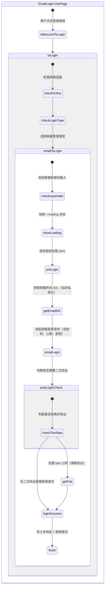
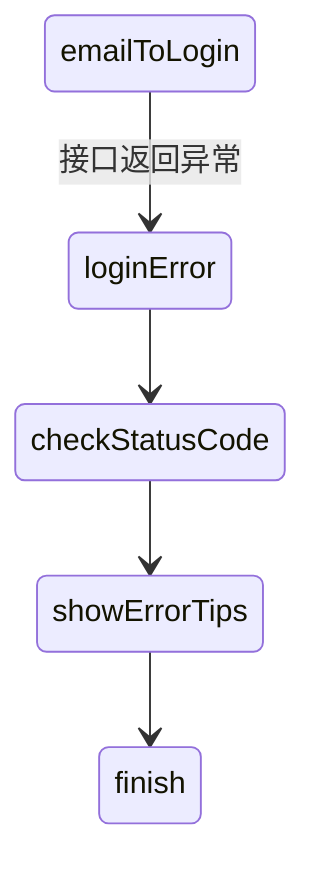

# 邮箱登录





## 📧 邮箱登录逻辑（Email + 密码）

### 1. 页面绑定组件

通过 `<email-login />` 自定义组件传入绑定数据：

```vue
<email-login
  :emailAddress.sync="emailAddress"
  :loginLock="loginLock"
  :password.sync="password"
  @update:emailAddress="emailAddress = $event"
  @update:password="password = $event"
  @login="debounceToLogin"
/>
```

### 2. 登录入口方法

#### ✅ debounceToLogin()

用于防抖，实际调用主函数 `toLogin()`：

```ts
debounceToLogin() {
  this.toLogin();
}
```

#### ✅ toLogin()

根据登录类型分发不同登录方式（手机号 / 邮箱）：

```ts
async toLogin() {
  if (!navigator.onLine) {
    this.$message({
      message: this.$t('user_login.check_connection'),
      type: 'warning'
    });
    return;
  }

  sessionStorage.startLoginTime = performance.now();
  devLog.warn('init [startLoginTime]', sessionStorage.startLoginTime);

  if (this.loginType == 'phone' && !this.verifyCode) {
    await this.phoneToLogin();
  } else if (this.loginType == 'phone' && this.verifyCode) {
    await this.phoneVerifyToLogin();
  } else if (this.loginType == 'email') {
    await this.emailToLogin();
  }
}
```

---

### 3. 核心逻辑：emailToLogin()

发起邮箱 + 密码登录流程，支持 DH/E2EE：

```ts
async emailToLogin() {
  if (this.emailAddress && this.password && !this.loginLock) {
    try {
      this.$store.state.uiControl.emailLoginLock = this.showLockLoading();
      appdataStorage.setItem('user_type', 'matrx');

      const { alice, keys, keysResult } = await preLogin(this.emailAddress);

      if (!this.isPrivated) {
        await getEmailIDC(this.emailAddress);
      }

      const rs = await emialLogin({
        pwd: dataUtil.parsePassword(this.password, dataUtil.councilAccountFormate(this.emailAddress)),
        email: dataUtil.councilAccountFormate(this.emailAddress),
        pub: safeBase64Conver(alice.pub).replace(/-/g, '+').replace(/_/g, '/'),
        e2eedid: 2,
        key: JSON.stringify(keys)
      });

      await this.postLogin({ rs, alice, keysResult }, this.emailAddress);
      ipcRenderer.send('MATRX_SIGNIN');
    } catch (error) {
      this.handleEmailLoginError(error);
      this.continueSSologin();
    }
  }
}
```

---

### 4. 辅助函数说明

#### 🛠 preLogin(email)

> 执行预登录，生成密钥对、公钥、注册 ID 等

```ts
export async function preLogin(e2ekey, accountType) {
  await checkDns();
  await checkDiskSpace();
  const alice = await sendSdk('Util-SDK-Method', 1);
  const account = accountType === 'phone' ? e2ekey : dataUtil.councilAccountFormate(e2ekey);
  const keysResult = await sendSdk('E2EE-Help-Method', 1, account);

  const keys = {
    registrationId: keysResult.registrationId,
    identityKey: safeBase64Conver(keysResult.identityKey.pub),
    signedPrekey: {
      keyId: keysResult.signedPrekey.keyId,
      publicKey: safeBase64Conver(keysResult.signedPrekey.keyPair.pub),
      signature: safeBase64Conver(keysResult.signedPrekey.signature),
    },
    preKeys: keysResult.prekeys.map(p => ({
      keyId: p.keyId,
      publicKey: safeBase64Conver(p.keyPair.pub)
    }))
  };

  return { alice, keys, keysResult };
}
```

#### 🛠 getEmailIDC(email)

> 查询邮箱所在 IDC 区域，支持分布式部署

```ts
export async function getEmailIDC(emailAddress) {
  const idcInfo = await fetchIdc(dataUtil.councilAccountFormate(emailAddress));
  const baseUCPath = idcInfo.baseURI;
  if (baseUCPath?.includes('matrx.')) {
    clearIdcUrl();
    appdataStorage.setItem('xx_baseUCPath', baseUCPath);
    appdataStorage.setItem('xx_preSpace', 'UAE-971-1000000');
  }
}
```

---

### 5. 登录完成：postLogin()

> 处理登录返回信息，完成用户态写入、页面跳转

```ts
async postLogin({ rs, alice, keysResult }, accout, accountType) {
  if (rs.hid) appdataStorage.setItem('hid', rs.hid);
  let bob_pub = rs.pub;

  if (rs.two_step_type?.length > 0) {
    this.closeLockLoading();
    const r = await this.getPub(rs.verify_token, rs.two_step_type, rs.phone);
    rs.pub = bob_pub = r.pub;
    this.$store.state.uiControl.emailLoginLock = this.showLockLoading();
  }

  if (!bob_pub) {
    this.closeLockLoading();
    this.$store.state.uiControl.isSignin = false;
    this.$message({
      type: 'error',
      message: this.$t('user_login.network_error')
    });
    return;
  }

  return postLogin(
    { rs, alice, keysResult },
    {
      accout,
      accountType,
      keepLogin: this.keepLogin,
      phoneNum: this.phoneNum,
      countryCode: this.countryCode
    }
  );
}
```

---

### 6. 二次验证（Two-Factor）

当接口返回 two\_step\_type，进入验证流程：

```ts
getPub(verify, methods, phone = '') {
  this.twoFactorPhone = phone;
  this.showTwoFactor = true;
  this.twoFactorMethods = methods;
  this.twoFactorVerify = verify;
  this.$nextTick(() => {
    this.$refs?.twofactor?.$refs?.inputCode?.handleFocusFisrtInput();
  });
  return new Promise(resolve => {
    this.towFActorHook = resolve;
  });
}
```

---

### ✅ 错误处理方法

```ts
handleEmailLoginError(error) {
  const status = error?.responseHeader?.status;
  switch (status) {
    case 621:
    case 670:
      error.responseHeader.msg = this.$t('user_login.incorrect_email_password');
      break;
    case 501:
      error.responseHeader.msg = this.$t('user_login.email_invalid');
      break;
    case 702:
      error.responseHeader.msg = this.$t('user_login.RID_MISMATCH');
      break;
    case 703:
      error.responseHeader.msg = this.$t('user_login.NO_USER');
      break;
  }
  this.loginError(error);
}
```

---

这部分可以作为《📧 邮箱登录逻辑》子章节并列于 SSO 登录部分，是否需要我帮你一起整合为 Docusaurus 的多页结构（或 Tab 结构）？也可以合并 Markdown/HTML 脚本生成统一开发文档。是否需要我继续补充手机号登录流程？

下面是根据你提供的登录相关函数名整理的表格，涵盖 **函数名称** 和 **用途说明**：

| 函数名               | 用途说明                                                                     |
| -------------------- | ---------------------------------------------------------------------------- |
| `debounceToLogin`    | 登录防抖封装，用于防止按钮连点时重复调用 `toLogin`，提高稳定性和用户体验。   |
| `toLogin`            | 通用入口登录函数，可能用于默认账户密码登录，实际调用 `emailToLogin` 或其他。 |
| `phoneToLogin`       | 使用手机号 + 密码登录流程，含预登录、E2EE 密钥准备、发送加密登录数据等。     |
| `phoneVerifyToLogin` | 使用手机号 + 验证码（短信验证码）进行登录，用于验证码登录流程。              |
| `emailToLogin`       | 使用邮箱 + 密码登录流程，结构类似 `phoneToLogin`，但账户类型为 email。       |
| `ssoToLogin`         | 使用 SSO（单点登录）进行授权登录，可能走 OAuth / 内网跳转等企业账号登录。    |

### 📌 函数之间的关系梳理

- `debounceToLogin` 是 `toLogin` 的防抖版本
- `toLogin` 是统一调度入口，根据用户选择调用具体实现：

  - `emailToLogin`（邮箱密码）
  - `phoneToLogin`（手机号密码）
  - `phoneVerifyToLogin`（验证码登录）
  - `ssoToLogin`（SSO 单点登录）

    如果你想进一步补充函数内部逻辑或调用关系图，我可以帮你生成一份。需要吗？
