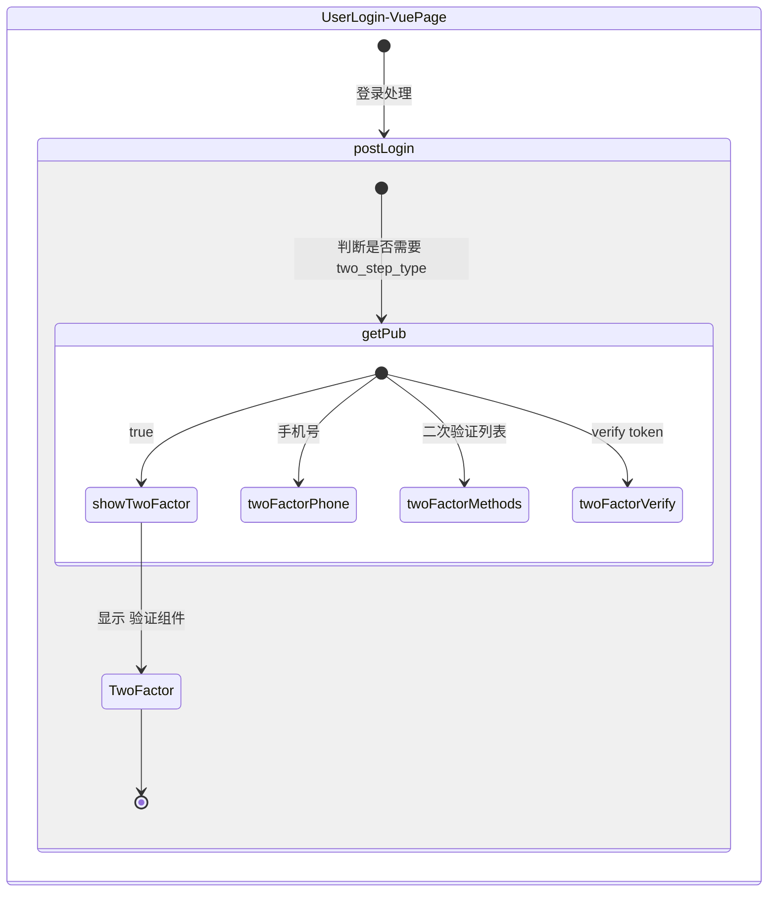
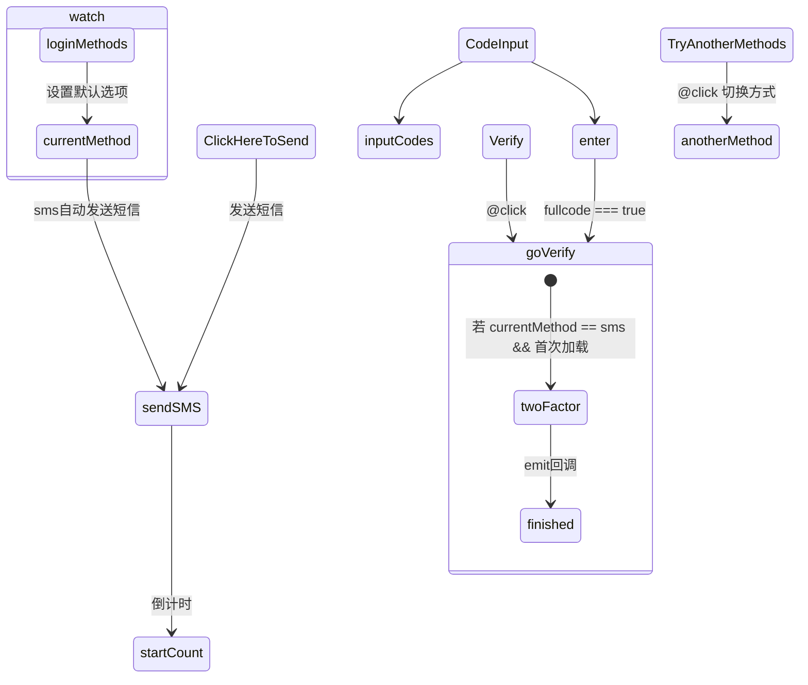

# 二次验证

```mermaid
stateDiagram-v2
    state UserLogin-VuePage {
        [*] --> postLogin: 登录处理
        state postLogin {
            [*] --> getPub: 判断是否需要 two_step_type
            state getPub {
                [*] --> showTwoFactor: true
                [*] --> twoFactorPhone: 手机号
                [*] --> twoFactorMethods: 二次验证列表
                [*] --> twoFactorVerify: verify token
                showTwoFactor --> TwoFactor: 显示 <two-factor> 验证组件
            }
           TwoFactor --> [*]
        }
    }
```

```mermaid
stateDiagram-v2
state watch {
        loginMethods --> currentMethod : 设置默认选项
    }
    ClickHereToSend --> sendSMS : 发送短信
    currentMethod --> sendSMS : sms自动发送短信
    sendSMS --> startCount : 倒计时
    CodeInput --> inputCodes
    CodeInput --> enter
    TryAnotherMethods --> anotherMethod : @click 切换方式
    enter --> goVerify : fullcode === true
    Verify --> goVerify : @click
    state goVerify {
     [*] -->   twoFactor : 若 currentMethod == sms && 首次加载
    twoFactor --> finished : emit回调
    }

```
