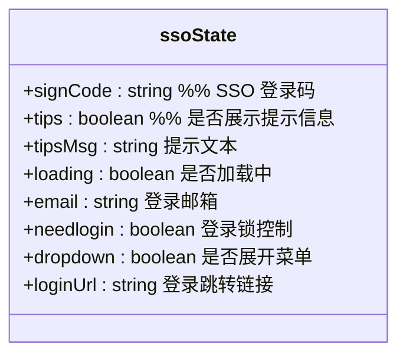
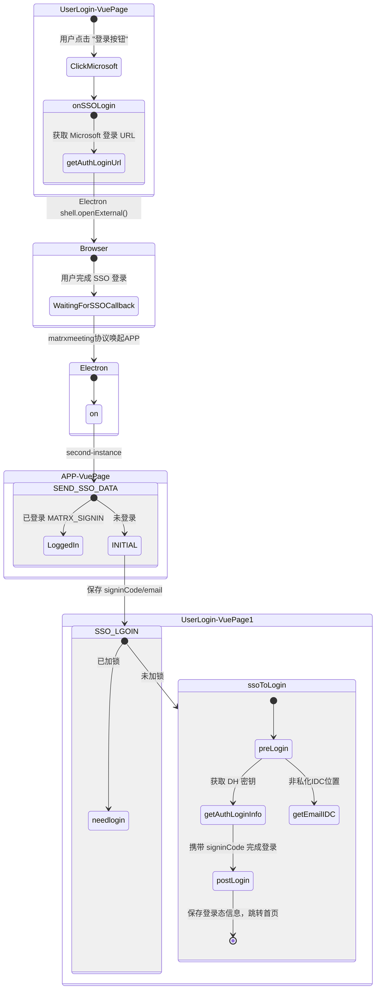

# 单点登录





## 📦 辅助函数

> SSO 模块

```
<!-- 第三方登录模块：微软 SSO featureConf.hideSsoLogin 全局配置是否展示-->
<div class="other-login" v-if="!featureConf.hideSsoLogin">
  <el-divider class="divider">{{ $t('user_login.Or') }}</el-divider>

  <div class="microsoft">
    <button class="microsoft-btn" :class="{disabled: loginLock}">
      <!-- 点击主按钮触发 SSO 登录 -->
      <p class="microsoft-btn-main" @click="onSSOLogin(0)">
        
        {{ $t('user_login.SigninwithMicrosoft') }}
      </p>

      <!-- 分割线 + 下拉按钮 -->
      <el-divider direction="vertical"></el-divider>
      <div
        tabindex="0"
        @blur="onDropdownBlur"
        hidefocus="true"
        :class="['microsoft-btn-arrow', { up: ssoState.dropdown }]"
        @click="onDropdownFocus"
      >
        
      </div>
    </button>

    <!-- 点击“切换账户”时触发 type=1 的 SSO 登录 -->
    <p v-show="ssoState.dropdown" @click="onSSOLogin(1)" class="microsoft-btn-other">
      {{ $t('user_login.ChangeMicrosoftAccount') }}
    </p>
  </div>
</div>
```

### onSSOLogin

🚀 触发 SSO 登录：核心方法 `onSSOLogin(type)`

```js
async onSSOLogin(type) {
    this.ssoState.tips = false;
    let urlLogin;

    // 延迟一秒后显示加载动画
    const timer = setTimeout(() => {
        urlLogin = showLockLoadingImmediately(0);
    }, 1000);

    // 清空上次登录的 IDC 配置路径
    clearIdcUrl();

    try {
        // 如果未获取过登录 URL，发请求获取 Microsoft SSO 登录跳转地址
        this.ssoState.loginUrl = this.ssoState.loginUrl || (
            await getAuthLoginUrl({
                type: 2, // 第三方登录类型（2 = Microsoft）
                authFlag: 1,
                loginAuth: {
                    clienttype: 'windows' // 声明为 Windows 客户端
                }
            })
        );

        // 如果是切换账号，清理之前的登录 cookie（例如 electron session 清理）
        if (type === 1) {
            ipcRenderer.send('CLEAR_COOKIE');
        }

        // 调用主进程打开登录窗口（此处默认打开的是 Electron 中的 webview/BrowserWindow）
        ipcRenderer.send('OPEN_SSO_WIN', { url: this.ssoState.loginUrl });
    } catch (err) {
        console.error('[error]: onSSOLogin 异常', err);
        this.$message({
            type: 'error',
            message: this.$t('user_login.check_connection')
        });
    } finally {
        clearTimeout(timer);
        closeLoading(urlLogin);
    }
}
```

### getAuthLoginUrl

获取微软 SSO 登录地址

```js
export async function getAuthLoginUrl(data) {
  return commonUCRequest({
    baseURL: getUCBaseURL(), // 获取 UCenter 基础 URL
    url: `/mssu/thirdLogin/getAuthLoginUrl`, // 获取第三方登录 URL 的接口
    method: "POST",
    data: JSON.stringify(data),
  });
}
```

### clearIdcUrl

清理本地存储中的 IDC 路径

```js
export function clearIdcUrl() {
  appdataStorage.removeItem("xx_preSpace");
  appdataStorage.removeItem("xx_baseUCPath");
  appdataStorage.removeItem("xx_baseUserIdcPath");
  appdataStorage.removeItem("xx_crystalSslPath");
}
```

### showLockLoadingImmediately

显示全屏 Loading 状态

```js
export function showLockLoadingImmediately() {
  return Loading.service({
    lock: true,
    spinner: "el-icon-loading-custom",
    background: "rgba(0, 0, 0, 0.7)",
  });
}
```

### SEND_SSO_DATA

✅ `ipcRenderer.on('SEND_SSO_DATA')`：主进程传入协议 URL 数据

```ts
ipcRenderer.on("SEND_SSO_DATA", (event, data) => {
  // 获取当前登录状态（默认为 INITIAL）
  const loginStatus = appdataStorage.getItem("loginStatus") || "INITIAL";

  // 将协议地址转为 URL 实例对象，方便解析 query 参数
  const parsedUrl = new URL(data);
  const signinCode = parsedUrl.searchParams.get("signinCode");
  const email = parsedUrl.searchParams.get("email");

  // 如果当前是首次启动未登录状态
  if (loginStatus === "INITIAL") {
    // 向前端发起事件通知，传递 signinCode 和 email 参数
    Bus.$emit("SSO_LGOIN", {
      signinCode,
      email,
    });
  } else {
    // 已登录状态则发送主进程事件（用于自动进入 App 或切换窗口）
    ipcRenderer.send("MATRX_SIGNIN");
  }
});
```

---

### SSO_LGOIN

✅ `Bus.$on('SSO_LGOIN')`：监听上面的登录触发

```ts
Bus.$on("SSO_LGOIN", (data) => {
  // 保存参数到当前组件/模块状态
  this.ssoState.signCode = data.signinCode;
  this.ssoState.email = data.email;
  this.ssoState.loading = true;

  // 如果未加锁，允许发起登录流程
  if (!this.loginLock) {
    // 通知主进程关闭唤起用的临时窗口（可选）
    ipcRenderer.send("CLOSE_SSO_WIN");
    // 启动登录逻辑
    this.ssoToLogin();
		this.loginLock = true;
  } else {
    // 已加锁，说明已有登录流程在进行，标记一下，等待后续处理
    this.ssoState.needlogin = true;
  }
});
```

---

### ssoToLogin

✅ `ssoToLogin()`：发起实际登录的函数

```ts
async ssoToLogin() {
    console.log('[sso login]');

    // 当前 loading 中且没有锁的情况才进入
    if (this.ssoState.loading && !this.loginLock) {
        try {
            // 标记锁定（可防止重复登录）
            this.$store.state.uiControl.emailLoginLock = this.showLockLoading();
            appdataStorage.setItem('user_type', 'ad');

            // 设置 rid，用于登录请求追踪
            let rid = new Date() - 0;
            appdataStorage.setItem('c_rid', rid);

            // 调用预登录接口，返回 DH 公钥等密钥协商相关信息
            const { alice, keys, keysResult } = await preLogin(this.ssoState.email);

            // 如果是公有化部署（非私有），请求 IDC 接口确认邮箱在哪个区域
            if (!this.isPrivated) {
                await getEmailIDC(this.ssoState.email);
            }

            // 发起 SSO 登录请求，参数包括 signinCode 和 DH 公钥等内容
            const rs = await getAuthLoginInfo({
                signinCode: this.ssoState.signCode,
                loginAuth: {
                    rid,
                    clienttype: 'windows',
                    pattern: 'windows',
                    serverVersion: '1.0',
                    osver: this.$store.state.userInfo.clientver,
                    pub: safeBase64Conver(alice.pub).replace(/-/g, '+').replace(/_/g, '/'), // DH公钥 base64
                    key: JSON.stringify(keys),  // 加密 key 传输
                    e2eedid: 2  // E2EE 标识
                }
            });

            // 登录成功后，处理用户态、写入缓存、跳转页面等
            await this.postLogin({ rs, alice, keysResult }, this.ssoState.email);

        } catch (error) {
            // 如果是 Microsoft 登录限制，显示对应提示
            if (error?.responseHeader?.status === 30008) {
                this.ssoState.tipsMsg = error.responseHeader?.msg || this.$t('user_login.SigninwithMicrosoftTips');
                this.ssoState.tips = true;
            } else {
                // 其他登录错误统一处理
                this.loginError(error);
            }
        } finally {
            // 无论成功失败都释放 loading、锁状态
            this.ssoState.needlogin = false;
            this.ssoState.loading = false;
            // this.loginLock = false; // 建议释放锁：this.loginLock = false;
        }
    }
}
```
