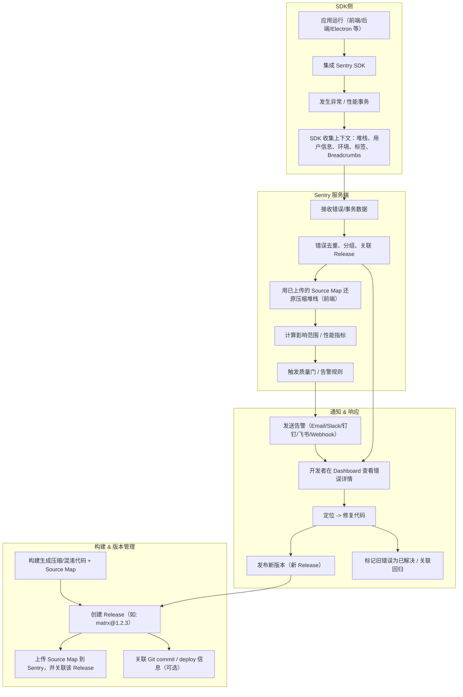

# Sentry

下面是一个 **Sentry 工作原理** 的流程图（用 Mermaid 语法），涵盖错误采集、Source Map 还原、版本关联、告警到修复的完整链路：



### 说明关键节点

1. **SDK 集成（B）**：在应用中接入 Sentry SDK，自动捕捉未处理异常、手动上报事件、性能事务等。
2. **异常/性能发生（C）**：运行时错误、慢请求、页面卡顿等被捕获。
3. **上下文采集（D）**：包括堆栈、浏览器/平台信息、用户 ID、Breadcrumbs（行为轨迹）等附带信息。
4. **构建阶段（E\~G）**：

   - 生成混淆的前端代码和对应 Source Map。
   - 创建 release（版本标识，例如 `matrx@1.2.3`）。
   - 把 Source Map 上传并关联到这个 release，使得后续接收到的压缩堆栈可以还原。

5. **错误接收与处理（I\~M）**：

   - 服务端接收 SDK 发来的错误/事务数据。
   - 去重分组，关联到特定 release。
   - 用已上传的 Source Map 还原堆栈（前端代码情况）。
   - 评估影响用户数、频次等，判断是否触达告警条件。

6. **告警与响应（N\~R）**：

   - 达到阈值触发通知。
   - 开发者在 Sentry Dashboard 查看完整上下文、源码位置、回溯链路。
   - 修复后发布新版本（新 release），旧错误标记为已解决，后续如果复现可检测回归。

你想要我把这个做成 PNG/SVG 形式可嵌入文档的图，还是需要一个更简化版给某个非技术观众解释？

Sentry 是一个**应用监控与错误跟踪平台**，主要用于 **实时捕获、上报和分析应用运行时的异常、性能问题和崩溃**。
它的目标是让开发者可以**第一时间发现问题、定位原因，并追踪影响范围**。

---

## **核心用途**

1. **错误监控（Error Monitoring）**

   - 自动捕获运行时异常（JavaScript、Python、Java、Go、Rust 等多种语言）
   - 上报到 Sentry 后端，集中管理、去重、分组
   - 记录完整的错误堆栈（Stack Trace），方便快速定位到具体代码行

2. **性能监控（Performance Monitoring）**

   - 监控 API 请求延迟、页面加载时间、事务耗时等
   - 分析性能瓶颈（如慢查询、阻塞渲染）

3. **版本关联（Release Tracking）**

   - 错误会关联到具体的版本（Release）
   - 支持查看这个版本新增了哪些错误、旧错误是否被修复

4. **Source Map 支持**

   - 对前端应用（JS、Vue、React 等），Sentry 可以通过上传 **Source Map** 将压缩混淆后的代码堆栈还原成源码堆栈，方便调试
     （比如你贴的 `upload-sourcemaps.js` 脚本就是干这个的）

5. **告警通知**

   - 错误出现时，可以通过邮件、Slack、飞书、钉钉、Webhook 等方式即时通知团队

---

## **典型工作流程**

1. **接入 SDK**

   - 前端（Vue、React、Electron）、后端（Node.js、Java、Python）等都可以接入 Sentry 的 SDK
   - 例如 Vue：

     ```js
     import * as Sentry from "@sentry/vue";
     Sentry.init({
       app,
       dsn: "https://<public_key>@sentry.io/<project_id>",
       tracesSampleRate: 1.0,
     });
     ```

2. **运行时捕获异常**

   - 代码报错（未捕获的异常、Promise 未处理、接口请求失败等）
   - SDK 自动收集错误信息（堆栈、用户环境、请求参数）

3. **上传到 Sentry 服务端**

   - 错误数据会被发送到你的 Sentry 服务器（SaaS 或自建）

4. **还原调试**

   - 如果是前端压缩代码，Sentry 会用 Source Map 还原堆栈
   - 你可以在后台直接看到对应的源码位置

5. **定位修复**

   - 根据错误详情、影响用户数、环境（浏览器/系统版本）快速定位问题
   - 修复后发布新版本，并在 Sentry 中关闭或标记已解决

---

## **在你项目里的作用**

结合你贴的 `upload-sourcemaps.js` 来看：

- 你的 **Electron + Vue** 应用在构建时会生成压缩混淆后的 JS
- 你们会在构建完成后执行 `upload-sourcemaps.js`，把当前版本的 source map 上传到 Sentry
- 用户使用软件时，如果发生前端报错，Sentry 会收到压缩后的堆栈
- Sentry 利用上传的 source map，把混淆堆栈还原成可读的源码位置
- 这样开发团队就能**精确地看到哪一行源码出错**，而不是一堆不可读的 `app.js:1:145732` 位置

---

如果你需要的话，我可以帮你画一张 **Sentry 工作原理流程图**，让整个错误采集 → 上传 → 还原 → 修复的过程更直观。
要帮你画吗？这样你一眼就能看懂整个链路。

这是一个用于把前端的 source map 上传到 Sentry 的脚本。下面是逐行解释、发现的问题与改进建议，以及一个更健壮/安全的改写版本。

---

## 原始脚本作用概览

```js
let SentryCli;
try {
  SentryCli = require("@sentry/cli");
} catch (e) {
  console.error("ERROR: Missing required packages, please run:");
  console.error("npm install --save-dev @sentry/cli");
  process.exit(1);
}
const sentryCli = new SentryCli("./sentry.properties");
const { version } = require("./package.json");
async function main() {
  await sentryCli.execute(
    [
      "releases",
      "files",
      "matrx@" + version,
      "upload-sourcemaps",
      "--url-prefix",
      "http://tym369.top/source-map/js",
      "./dist_electron/bundled/js",
      "--rewrite",
    ],
    true
  );
}
main().catch((e) => console.error(e));
```

### 解释

- 通过 `require('@sentry/cli')` 尝试加载官方的 Sentry CLI 库，缺失时提示安装并退出。
- 用本地的 `sentry.properties` 配置实例化 `SentryCli`（其中通常包含 auth token、organization/project 等配置）。
- 从 `package.json` 读取当前版本号，构造 release 名为 `matrx@<version>`。
- 调用 Sentry CLI 上传 source map 文件：

  - 目标 release：`matrx@<version>`
  - 上传目录：`./dist_electron/bundled/js`
  - 设置在 Sentry 中 source map 对应的请求前缀为 `http://tym369.top/source-map/js`（`--url-prefix`）
  - `--rewrite` 让 CLI 尝试重写已存在的 source maps 以匹配当前构建

---

## 潜在问题与改进建议

1. **敏感信息（token）管理**
   如果 `sentry.properties` 内嵌了 auth token，容易泄漏。建议改用环境变量注入（例如 CI 通过 `SENTRY_AUTH_TOKEN`），并避免将完整 token 提交到仓库。

2. **Release 名称固定字符串拼接**
   直接用 `'matrx@' + version` 是可用的，但可以明确规范化或允许从外部覆盖（比如通过环境变量或 CLI 传入）。

3. **出错时没有退出码**
   `main().catch(e => console.error(e));` 仅打印错误但不会显式退出非零。CI 场景下应 `process.exit(1)`。

4. **缺乏重试/容错**
   上传失败（网络抖动、Sentry 临时出错）场景没有重试策略。

5. **硬编码的 URL 前缀**
   `--url-prefix` 可能在不同部署/环境下需要调整，建议参数化。

6. **可观测性/日志更清晰**
   没有输出当前正在操作的 release、路径、成功/失败状态的友好日志。

---

## 推荐的改写（更安全、可配置、带基本失败处理）

```js
#!/usr/bin/env node

const path = require("path");
const { version } = require("./package.json");

let SentryCli;
try {
  SentryCli = require("@sentry/cli");
} catch (e) {
  console.error(
    'ERROR: Missing required package "@sentry/cli". Please install it:'
  );
  console.error("  npm install --save-dev @sentry/cli");
  process.exit(1);
}

// 允许通过环境变量覆盖这些值
const releaseName = process.env.SENTRY_RELEASE || `matrx@${version}`;
const urlPrefix =
  process.env.SENTRY_URL_PREFIX || "http://tym369.top/source-map/js";
const sourceDir =
  process.env.SENTRY_SOURCEMAP_DIR || "./dist_electron/bundled/js";

// Sentry CLI 可以从环境变量 (e.g., SENTRY_AUTH_TOKEN) 或 sentry.properties 获取配置
const sentryCli = new SentryCli({
  // 如果你仍想用 properties 文件，可传路径字符串：
  // configFile: './sentry.properties'
  // 这里留空让它默认读取环境变量 / 约定位置
});

async function uploadSourceMaps(attempt = 1) {
  console.log(`→ 上传 source maps 到 Sentry release "${releaseName}"`);
  console.log(`  来源目录: ${sourceDir}`);
  console.log(`  URL 前缀: ${urlPrefix}`);
  try {
    await sentryCli.execute(
      [
        "releases",
        "files",
        releaseName,
        "upload-sourcemaps",
        "--url-prefix",
        urlPrefix,
        sourceDir,
        "--rewrite",
      ],
      true
    );
    console.log("✅ 上传成功");
  } catch (err) {
    console.error(`❌ 上传失败（尝试 ${attempt}）：`, err.message || err);
    if (attempt < 3) {
      console.log("⏳ 1 秒后重试...");
      await new Promise((res) => setTimeout(res, 1000));
      return uploadSourceMaps(attempt + 1);
    } else {
      console.error("🚨 达到最大重试次数，退出失败");
      process.exit(1);
    }
  }
}

(async () => {
  try {
    await uploadSourceMaps();
  } catch (e) {
    console.error("未捕获的错误:", e);
    process.exit(1);
  }
})();
```

### 说明改动点

- **参数化**：`SENTRY_RELEASE` / `SENTRY_URL_PREFIX` / `SENTRY_SOURCEMAP_DIR` 可以通过环境变量覆盖，便于在不同环境（测试/预发/正式）复用。
- **安全**：默认依赖环境变量 `SENTRY_AUTH_TOKEN` 传 token，而不是在文件里明文写。你可以在 CI 中做：

  ```sh
  export SENTRY_AUTH_TOKEN=***secret***
  export SENTRY_URL_PREFIX="https://static.mydomain.com/js"
  node upload-sourcemaps.js
  ```

- **重试机制**：最多 3 次上传失败后才退出。
- **失败退出码**：失败时显式 `process.exit(1)` 让 CI 失败。
- **清晰日志**：打印上下文信息方便排查。

---

## 额外建议

- 上传前可以先创建 release 并设置 commit / deploy 信息，示例：

  ```sh
  sentry-cli releases new "$RELEASE"
  sentry-cli releases set-commits --auto "$RELEASE"
  sentry-cli releases finalize "$RELEASE"
  ```

- 如果你用的是 CI（比如 GitHub Actions / Jenkins / 自建），把这整个流程挂在构建成功后的步骤里，并把 release 关联到对应的 Git SHA 或 environment。

---

你要我帮你把这个脚本整合进你现有的 CI（比如加进 `sonarqube.sh` 旁的 pipeline 里）、写一个配套的 shell wrapper，还是做一版可复用的 npm script 版本？
