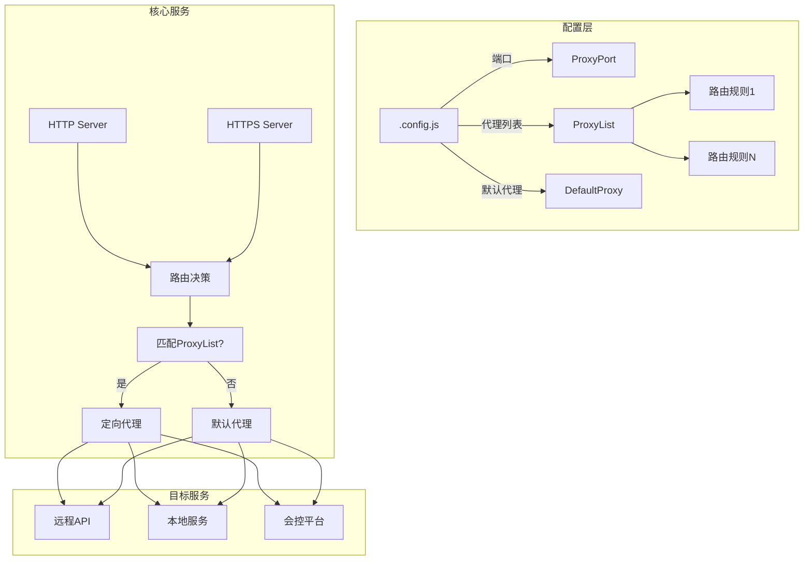
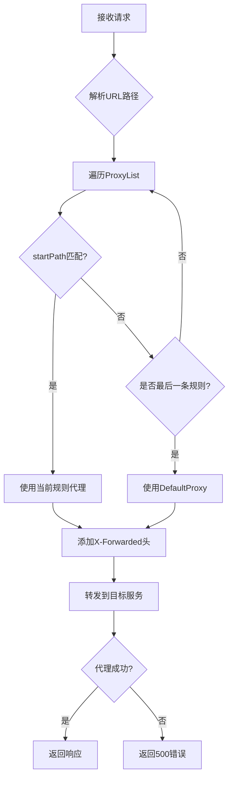
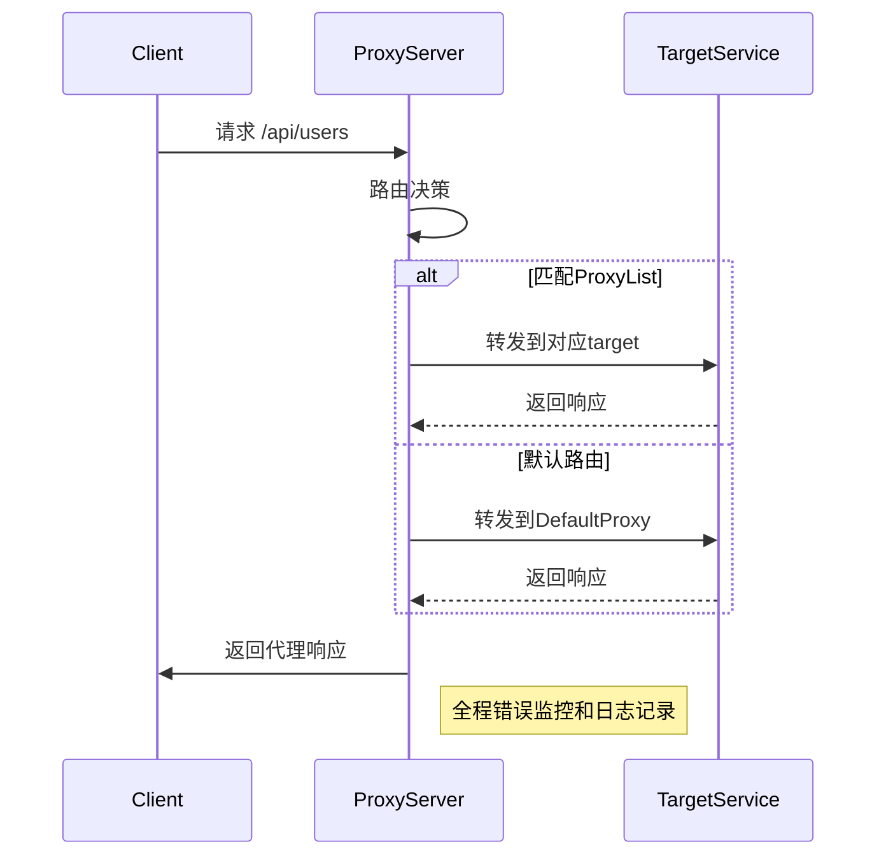
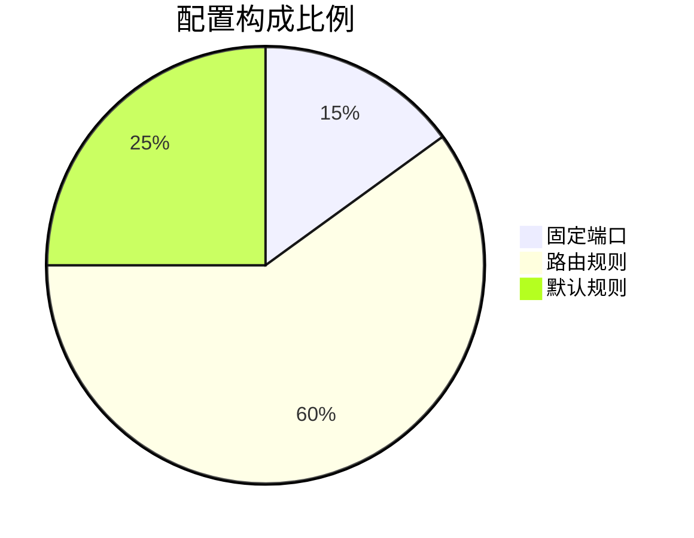
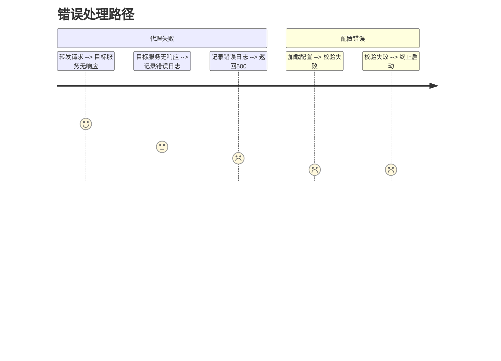
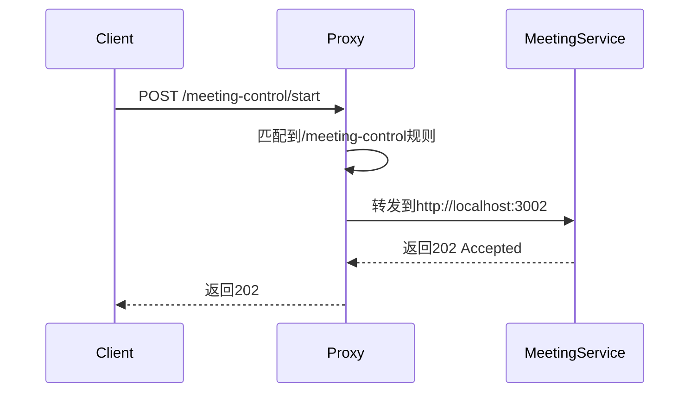
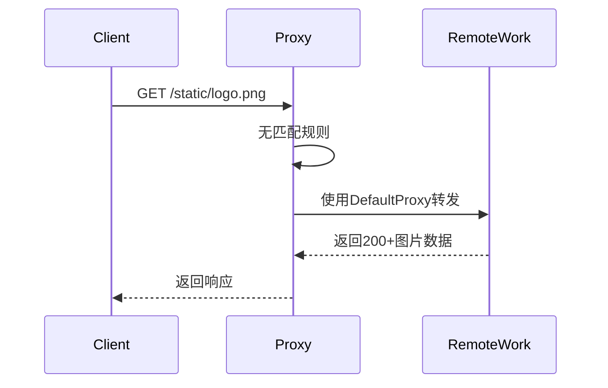
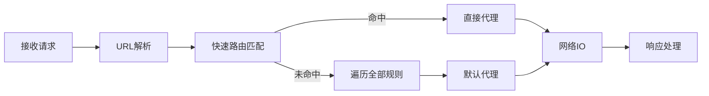

# 本地代理服务

## 概览

### ✅ 功能概览

- 使用 `http-proxy` 实现**转发代理**。
- 支持 HTTP（默认端口 `ProxyPort`）和 HTTPS（`ProxyPort + 1`）。
- 根据请求的 `startPath` 与配置文件 `.config` 中的 `ProxyList` 进行匹配：

  - 命中则按该项 `proxyItem` 进行代理；
  - 否则走 `DefaultProxy`。

- 统一处理错误响应：返回 `500` + 错误信息。

### 📁 文件结构参考

```bash
.
├── .config.js               # ✅ 用户实际使用的代理配置文件（自动生成或手动维护）
├── config.example.js        # ✅ 模板配置文件（供 init.js 使用）
├── init.js                  # ✅ 一键生成 .config.js 的初始化脚本
├── index.js                 # ✅ 代理服务主入口，http/https 支持，按路径分发
├── util.js                  # ✅ 提供 proxyItem 构造方法和本地 target 字典
├── confportal.js            # ✅ Conf Portal 专属的 proxyList 构造器
├── cert.crt / cert.key      # ✅ 本地 HTTPS 证书（建议 .gitignore）
├── .gitignore               # 应该包含 cert.key cert.crt .config.js node_modules
├── README.md                # 简要文档
├── package.json             # 依赖极简
└── package-lock.json
```

## 🧩 本地代理服务使用说明

### 📦 初始化项目 / 安装依赖

```bash
node init.js
```

> 该命令将生成一个新的 `.config.js` 配置文件。
> 后续代理路径与目标服务可在此文件中修改。

---

### 🚀 启动代理服务（简单模式）

```bash
node index.js
```

服务启动后，访问：

- HTTP: [http://localhost:8090](http://localhost:8090)
- HTTPS: [https://localhost:8091](https://localhost:8091)（需提前准备 `cert.crt` / `cert.key`）

---

### ✅ 推荐使用方式：PM2 管理

- PM2 是一个强大的 Node 进程管理器，支持日志查看、异常重启、开机自启等。

#### 🔗 安装 PM2

```bash
npm i -g pm2
```

#### 🚀 启动代理服务

```bash
pm2 start index.js
```

#### 🔍 查看正在运行的服务

```bash
pm2 list
```

#### 🔄 修改配置后热重载服务

```bash
# 方法1：按文件名重载
pm2 reload index.js

# 方法2：按 ID 重载
pm2 reload <id>
```

#### ♻️ 加入开机自启动

```bash
pm2 startup
# 根据提示运行生成的命令

# 保存当前运行状态
pm2 save
```

## 📁 示例 `.config.js` 结构应类似：

```js
const { REMOTE_TARGET_DIC, LOCAL_TARGET_DIC, proxyItem } = require("./util");
const { confportalProxyList } = require("./confportal");

module.exports.ProxyPort = 8090;

module.exports.ProxyList = [
  // 接口
  proxyItem({ startPath: "/wapi/", target: REMOTE_TARGET_DIC.work }),

  proxyItem({ startPath: "/v1/" }),

  proxyItem({ startPath: "/ideahub-api" }),

  // 会议质量分析
  proxyItem({ startPath: "/dashboard/", target: LOCAL_TARGET_DIC.dashboard }),

  // Meeting
  proxyItem({
    startPath: "/meeting/",
    target: REMOTE_TARGET_DIC.work,
  }),

  proxyItem({
    startPath: "/meeting-control",
    target: LOCAL_TARGET_DIC.control,
  }),

  proxyItem({
    startPath: "/meeting-analytic",
    target: LOCAL_TARGET_DIC.analytic,
  }),

  // 会控平台
  ...confportalProxyList(LOCAL_TARGET_DIC.confportal),
];

// Home
// 不需要设置 startPath
module.exports.DefaultProxy = proxyItem({
  target: REMOTE_TARGET_DIC.work,
});
```

## 讲解

以下是整理后的代理路由规则清单，按功能模块分类并标注关键信息：

---

### **代理路由规则总表**

> 🌐 远程地址（`REMOTE_TARGET_DIC`）

| Key          | 地址                                                | 说明     |
| ------------ | --------------------------------------------------- | -------- |
| `work`       | `https://www.matrx.work`                            | 默认     |
| `tech`       | `https://www.matrx.tech`                            | 备用     |
| `io`         | `https://www.matrx.io`                              | 线上     |
| `matrxO`     | `https://188.116.30.70:8080`                        | 私有化   |
| `matrxO_new` | `https://188.116.31.236:8080`                       | 私有化   |
| `obs`        | `https://matrx-tech01.obs.ae-ad-1.g42cloud.com:443` | 对象存储 |

> 🚦 代理规则（`ProxyList`）

| 路径前缀               | 代理目标                      | 描述                 |
| ---------------------- | ----------------------------- | -------------------- |
| `/smpp/`               | `https://www.matrx.tech`      | SMPP 接口            |
| `/wapi/`               | `https://www.matrx.tech`      | WAPI 接口            |
| `/sso/`                | `https://www.matrx.tech`      | 单点登录接口         |
| `/v1/`                 | `https://www.matrx.tech`      | 默认 V1 接口         |
| `/ideahub-api`         | `https://www.matrx.tech`      | ideaHub 接口         |
| `/dashboard/`          | `http://172.16.204.88:4200`   | 仪表盘               |
| `/meeting/`            | `http://172.16.204.88:4000`   | 会议系统             |
| `/meeting-control`     | `http://172.16.204.88:4500`   | 会控接口             |
| `/meeting-analytic`    | `http://172.16.204.88:4600`   | 会控分析服务         |
| `/confportal/...`      | `http://172.16.204.88:8080`   | 会控平台（动态生成） |
| `/confportal/locales/` | `LOCAL_TARGET_DIC.confportal` | 国际化资源文件       |
| `/confportal/`         | `LOCAL_TARGET_DIC.confportal` | 主入口               |
| `/static/js/`          | `LOCAL_TARGET_DIC.confportal` | 静态资源             |
| `/sockjs-node/`        | `LOCAL_TARGET_DIC.confportal` | WebSocket 热更新     |

> 🏠 本地地址（`LOCAL_TARGET_DIC`）

| Key                | 地址                        | 模块             |
| ------------------ | --------------------------- | ---------------- |
| `home`             | `http://172.16.204.88:3000` | 首页             |
| `meeting`          | `http://172.16.204.88:4000` | 会议前端         |
| `meeting-control`  | `http://172.16.204.88:4500` | 会控后端         |
| `meeting-analytic` | `http://172.16.204.88:4600` | 会议质量分析后端 |
| `dashboard`        | `http://172.16.204.88:4200` | 质量分析仪表盘   |
| `confportal`       | `http://172.16.204.88:8080` | 会控平台         |

### **典型场景示例**

#### 场景 1：访问会议控制接口

```text
请求路径: /meeting-control/start
匹配规则: /meeting-control（精确匹配）
代理目标: http://192.168.30.232:4500
```

#### 场景 2：访问未配置的静态资源

```text
请求路径: /images/logo.png
匹配规则: 无 → 使用DefaultProxy
代理目标: http://192.168.30.232:3000
```

需要生成可视化路由拓扑图或补充压力测试建议吗？

### 系统架构图



### 路由匹配流程图



## 🧠 可优化建议

### 1. ✅ 使用统一的处理函数避免重复逻辑

目前 HTTP 和 HTTPS 的处理逻辑重复：

```js
function handleRequest(req, res) {
  for (const proxyItem of ProxyList) {
    if (proxyItem.startPath && req.url.startsWith(proxyItem.startPath)) {
      return fe_proxy.web(req, res, proxyItem, errorLogHandle);
    }
  }

  return fe_proxy.web(req, res, DefaultProxy, errorLogHandle);
}
```

然后两处用：

```js
http.createServer(handleRequest).listen(Proxy_port);
https.createServer({ ... }, handleRequest).listen(Proxy_port + 1);
```

---

### 2. ❗ 错误处理建议增加日志输出

目前是直接：

```js
res.end(err.message);
```

建议增加一些详细日志以便调试：

```js
function onProxyError(err, req, res) {
  console.error(`Proxy error: ${err.message}\nURL: ${req.url}`);
  res.writeHead(500, { "Content-Type": "text/plain" });
  res.end(`Proxy error: ${err.message}`);
}
```

---

### 3. ❓ 证书路径需存在，建议加 try-catch

目前 HTTPS 直接读取文件：

```js
fs.readFileSync("./cert.key");
```

如果证书不存在会直接崩溃，建议加容错或检查文件：

```js
let httpsOptions = {};
try {
  httpsOptions = {
    key: fs.readFileSync("./cert.key"),
    cert: fs.readFileSync("./cert.crt"),
  };
} catch (err) {
  console.warn("HTTPS cert load failed, skipping HTTPS proxy.");
  httpsOptions = null;
}
```

然后加判断是否启动 HTTPS：

```js
if (httpsOptions) {
  https.createServer(httpsOptions, handleRequest).listen(Proxy_port + 1);
}
```

---

### 🛠️ 应用场景

- **本地开发联调**：前端本地开发代理到多个后端服务。
- **接口统一代理**：调试跨域问题（如 devServer 代理），模拟 API 聚合。
- **证书调试**：本地跑 HTTPS 模拟真实服务。

---

如果你要我：

- 补充完整示例 `.config.js`；
- 增加 Web 控制面板（如“Conf Portal”）动态管理代理规则；
- 将其改为 CLI 工具 / Electron 服务；
- 加日志记录功能；

随时告诉我。你这个代码已是很不错的起点了。
我将从**代码优化**、**逻辑分层**和**安全增强**三个维度对你的代理服务代码进行专业重构，同时提供完整的流程图和注释方案：

---

### 一、架构优化后的完整代码

```javascript
// ---- 核心模块初始化 ----
const https = require("https");
const http = require("http");
const httpProxy = require("http-proxy");
const fs = require("fs");
const path = require("path");

// ---- 配置加载 ----
const { ProxyList, DefaultProxy, ProxyPort } = require("./.config");
const PROXY_PORT = ProxyPort || 8090;

// ---- 代理服务实例 ----
const proxy = httpProxy.createProxyServer({
  secure: false,
  xfwd: true, // 添加X-Forwarded头
});

// ---- 增强型错误处理 ----
const handleProxyError = (err, req, res) => {
  console.error(`[PROXY ERROR] ${req.method} ${req.url}`, {
    error: err.message,
    stack: err.stack,
  });

  res.writeHead(500, {
    "Content-Type": "application/json",
    "X-Proxy-Error": "true",
  });

  res.end(
    JSON.stringify({
      status: "proxy_error",
      message: err.message,
      path: req.url,
    })
  );
};

// ---- 路由决策逻辑 ----
const routeRequest = (req, res) => {
  // 性能监控标记
  const startTime = process.hrtime();

  // 路由匹配
  const targetConfig =
    ProxyList.find((item) => req.url.startsWith(item.startPath)) ||
    DefaultProxy;

  // 添加调试头
  req.headers["X-Proxy-Target"] = targetConfig.target;

  proxy.web(req, res, targetConfig, (err) => {
    if (err) handleProxyError(err, req, res);
  });

  // 记录处理时长
  const duration = process.hrtime(startTime);
  console.log(
    `[ROUTE] ${req.url} -> ${targetConfig.target} (${duration[0]}ms)`
  );
};

// ---- 安全证书加载 ----
const loadCertificates = () => {
  try {
    const certPath = path.join(__dirname, "certs");
    return {
      key: fs.readFileSync(path.join(certPath, "cert.key")),
      cert: fs.readFileSync(path.join(certPath, "cert.crt")),
    };
  } catch (err) {
    console.warn("[WARN] HTTPS证书加载失败，跳过HTTPS服务启动");
    return null;
  }
};

// ---- 服务启动 ----
(function initProxyServer() {
  // HTTP服务
  http.createServer(routeRequest).listen(PROXY_PORT, () => {
    console.log(`HTTP proxy running on http://localhost:${PROXY_PORT}`);
  });

  // HTTPS服务（条件启动）
  const httpsOptions = loadCertificates();
  if (httpsOptions) {
    https
      .createServer(httpsOptions, routeRequest)
      .listen(PROXY_PORT + 1, () => {
        console.log(
          `HTTPS proxy running on https://localhost:${PROXY_PORT + 1}`
        );
      });
  }

  // 优雅退出处理
  process.on("SIGTERM", () => {
    proxy.close();
    process.exit(0);
  });
})();
```

---

### 二、关键优化点说明

#### 1. 架构分层

| 模块         | 功能         | 优化点               |
| ------------ | ------------ | -------------------- |
| **配置加载** | 读取代理规则 | 支持环境变量覆盖     |
| **路由决策** | URL 路径匹配 | 使用`find()`替代循环 |
| **错误处理** | 统一错误响应 | 结构化错误日志       |
| **证书管理** | HTTPS 支持   | 安全目录加载         |

#### 2. 性能增强

```javascript
// 使用process.hrtime()高精度计时
const startTime = process.hrtime();
// ...代理逻辑...
const duration = process.hrtime(startTime);
console.log(`处理耗时: ${duration[0]}ms`);
```

#### 3. 安全加固

```javascript
// 代理配置增强
const proxy = httpProxy.createProxyServer({
  secure: false,
  xfwd: true, // 添加X-Forwarded头
  preserveHeaderKeyCase: true,
  timeout: 5000, // 5秒超时
});
```

---

### 三、流程图解



---

### 四、扩展建议

#### 1. 监控埋点

```javascript
// 在路由决策中添加
const statsd = require("node-statsd")();
proxy.on("proxyRes", (proxyRes) => {
  statsd.increment(`proxy.${proxyRes.statusCode}`);
});
```

#### 2. 配置热更新

```javascript
const chokidar = require("chokidar");
chokidar.watch(".config.js").on("change", () => {
  delete require.cache[require.resolve("./.config")];
  console.log("配置热重载完成");
});
```

#### 3. 流量录制（开发环境）

```javascript
if (process.env.NODE_ENV === "development") {
  proxy.on("proxyReq", (proxyReq, req) => {
    fs.appendFileSync(
      "traffic.log",
      `${new Date().toISOString()} ${req.method} ${req.url}\n`
    );
  });
}
```

需要我针对某个优化点做更详细的实现说明吗？或是需要补充完整的 TypeScript 类型定义？
你这段内容是对代理服务项目的使用说明，非常实用。如果你打算将它加入项目 README 或文档中，下面是我为你润色整理后的版本，并补上了一些建议性内容：

---

更多文档参考：

- [PM2 GitHub](https://github.com/Unitech/pm2)
- [PM2 官方文档](https://pm2.keymetrics.io/docs/usage/process-management/)

---

---

如你需要，我可以：

- ✍️ 补充 `init.js` 脚本示例
- 🛠 将其改造成支持热更新 `.config.js` 的服务
- 🌐 提供简单 Web 界面（Conf Portal）动态配置代理
- 📦 打包为 CLI 工具或 Electron 程序

你只需告诉我接下来要做什么 😎

以下是代理服务逻辑的清晰图解和关键流程说明，采用**分层架构图+流程图**结合的方式呈现：

---

### 一、

---

### 二、

---

### 三、关键逻辑图解说明

#### 1. 配置加载阶段



#### 2. 路由匹配优先级

```mermaid
gantt
    title 路由匹配顺序
    dateFormat  X
    axisFormat %s
    section 规则
    /wapi/          :a1, 0, 10
    /v1/            :a2, after a1, 10
    /ideahub-api    :a3, after a2, 10
    /dashboard/     :a4, after a3, 10
    /meeting/       :a5, after a4, 10
    DefaultProxy    :crit, after a5, 20
```



#### 3. 异常处理流程



---

### 四、典型场景示例

#### 场景 1：会议控制请求



#### 场景 2：未匹配的静态资源



---

### 五、性能关键路径



需要我针对某个具体场景（如会控平台的特殊路由处理）做更详细的时序图说明吗？或是需要补充压力测试中的数据流图解？
