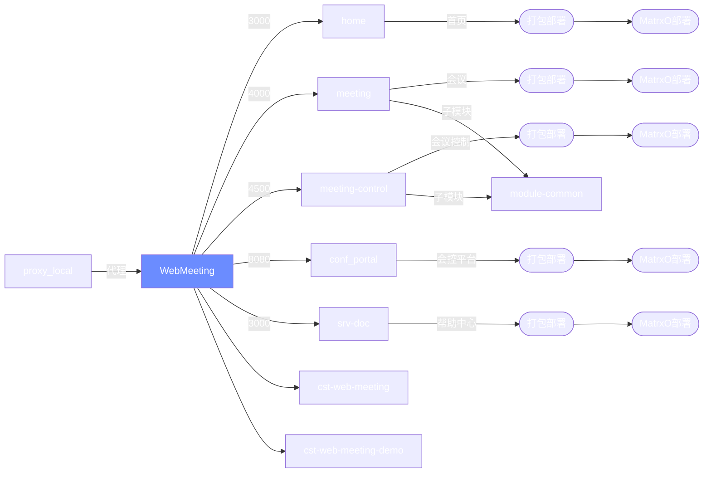
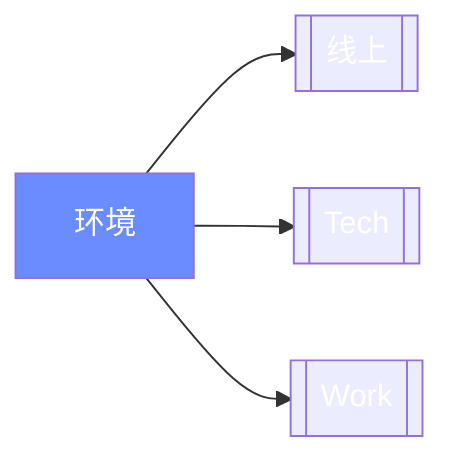

# WebMeeting

```mermaid
flowchart LR
    %% 定义所有节点（带样式和超链接）
    P[proxy_local] -->|代理| W
    W[WebMeeting]:::root -->|3000| H[home]
    W -->|4000| M[meeting]
    W -->|4500| C[meeting-control]
    W -->|8080| G[conf_portal]
    W -->|3000| S[srv-doc]
    W --> Z[cst-web-meeting]
    W --> ZD[cst-web-meeting-demo]

    %% 添加部署节点
    H -->|首页| H_deploy([打包部署])
    M -->|会议| M_deploy([打包部署])
    C -->|会议控制| C_deploy([打包部署])
    G -->|会控平台| G_deploy([打包部署])
    S -->|帮助中心| S_deploy([打包部署])

    M -->|子模块| E[module-common]
    C -->|子模块| E[module-common]

    H_deploy --> H_deploys([MatrxO部署])
    M_deploy --> M_deploys([MatrxO部署])
    C_deploy --> C_deploys([MatrxO部署])
    G_deploy --> G_deploys([MatrxO部署])
    S_deploy --> S_deploys([MatrxO部署])

    %% 定义样式类
    classDef root fill:#6b8cff,color:white
    classDef deploy fill:#ff6b6b,color:white,stroke-dasharray: 5 5

    %% 绑定所有超链接
    click W "https://gitlab.corp.matrx.team/web/"
    click H "https://gitlab.corp.matrx.team/web/home"
    click M "https://gitlab.corp.matrx.team/web/meeting"
    click C "https://gitlab.corp.matrx.team/web/meeting-control"
    click G "https://gitlab.corp.matrx.team/web/conf_portal"
    click P "https://gitlab.corp.matrx.team/web/proxy_local"
    click E "https://gitlab.corp.matrx.team/web/module-common"
    click S "https://gitlab.corp.matrx.team/conference/srv-doc"
    click Z "https://gitlab.corp.matrx.team/crystal/cst-web-meeting"
    click ZD "https://gitlab.corp.matrx.team/crystal/cst-web-meeting-demo"
    click H_deploy "https://talos.marchbu.com/devcenter/runtime/myapp/info/35953dd0-1670-41c2-b5a2-e7cc138a1456" "环境部署"
    click M_deploy "https://talos.marchbu.com/devcenter/runtime/myapp/info/260c6d3b-df73-4162-bb82-55c234a01444" "环境部署"
    click C_deploy "https://talos.marchbu.com/devcenter/runtime/myapp/info/7f00eb55-23e5-4987-a817-909d3b59bb2e" "环境部署"
    click G_deploy "https://talos.marchbu.com/devcenter/runtime/myapp/info/7f00eb55-23e5-4987-a817-909d3b59bb2e" "环境部署"
    click S_deploy "https://talos.marchbu.com/devcenter/runtime/myapp/info/7f00eb55-23e5-4987-a817-909d3b59bb2e" "环境部署"
    click H_deploys "1" "环境部署"
    click M_deploys "https://talos.marchbu.com/devcenter/runtime/myapp/info/c57bffe6-7c83-4159-af42-1435d9d64cee" "环境部署"
    click C_deploys "1" "环境部署"
    click G_deploys "1" "环境部署"
    click S_deploys "1" "环境部署"
```

```mermaid
flowchart LR
    %% 定义所有节点（带样式和超链接）
    W[环境]:::root --> I[[线上]]
    W --> M[[Tech]]
    W --> C[[Work]]

    %% 定义样式类
    classDef root fill:#6b8cff,color:white
    classDef deploy fill:#ff6b6b,color:white,stroke-dasharray: 5 5

    %% 绑定所有超链接
    click I "https://www.matrx.io/"
    click M "https://www.matrx.tech/"
    click C "https://www.matrx.work/"
```
