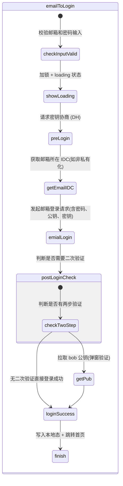
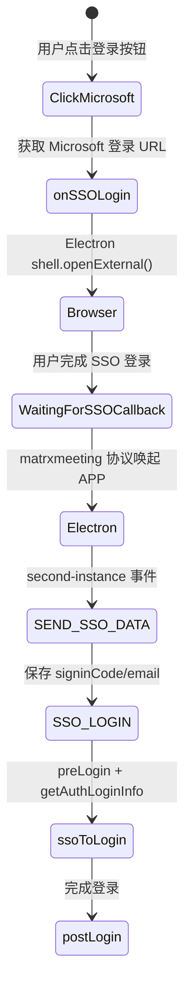
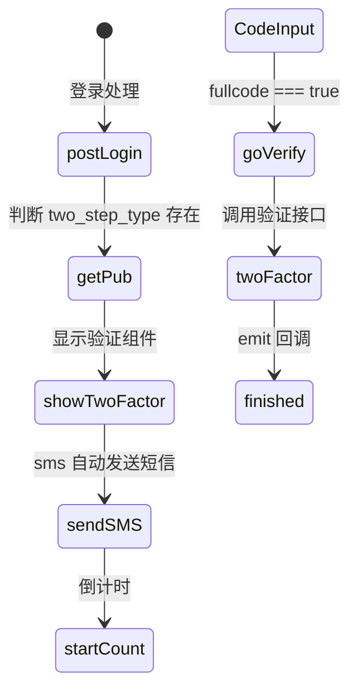

# 登录系统

> 项目支持多种登录方式,本文档详细说明各登录流程的实现。

## 登录方式总览

| 函数名 | 账号 | 用途说明 |
|--------|------|----------|
| `emailToLogin` | 邮箱 + 密码 | 含预登录、E2EE 密钥准备、发送加密登录数据 |
| `phoneToLogin` | 手机号 + 密码 | 含预登录、E2EE 密钥准备、发送加密登录数据 |
| `phoneVerifyToLogin` | 手机号 + 验证码 | 验证码登录流程 |
| `ssoToLogin` | SSO(单点登录) | OAuth / 内网跳转等企业账号登录 |
| `ldapToLogin` | 专属账号 + 密码 | 适用于私有化部署或企业集成环境 |
| `QRToLogin` | 二维码 | 扫码登录 |
| `debounceToLogin` | - | 登录防抖封装,防止按钮连点重复调用 |

## 通用登录流程

```
用户点击登录按钮
       ↓
检查网络连接(navigator.onLine)
       ↓
记录登录起始时间(sessionStorage.startLoginTime)
       ↓
判断登录类型 loginType
       ↓
 ┌───────────────┬────────────────┬────────────────┐
 ↓               ↓                ↓
phone && 无验证码   phone && 有验证码      email
 ↓               ↓                ↓
phoneToLogin()   phoneVerifyToLogin()   emailToLogin()
```

## postLogin 成功登录处理

| 参数 | 类型 | 描述 |
|------|------|------|
| `rs` | object | 登录信息 |
| `alice` | object | 客户端 E2EE 公钥对象(含 priv、pub) |
| `keysResult` | object | Signal 风格的密钥结构 |
| `extraParams` | object | 附加信息,如账号类型、手机号、国家码等 |

```
1. 保存 hid 到 appdataStorage
2. 提取服务端公钥 bob_pub(来自 rs.pub)
3. 判断是否存在两步验证(2FA)
4. 执行两步验证流程: getPub(...)
5. 检查最终 bob_pub 是否存在
6. 调用 SDK 的核心登录逻辑 postLogin(...)
7. 通知主进程登录成功(ipcRenderer.send('MATRX_SIGNIN'))
```

## 邮箱登录 (emailToLogin)



### 核心代码

```javascript
async emailToLogin() {
    if (this.emailAddress && this.password && !this.loginLock) {
        try {
            this.$store.state.uiControl.emailLoginLock = this.showLockLoading();
            appdataStorage.setItem('user_type', 'matrx');
            const {alice, keys, keysResult} = await preLogin(this.emailAddress);
            if (!this.isPrivated) {
                await getEmailIDC(this.emailAddress);
            }
            const rs = await emialLogin({
                pwd: dataUtil.parsePassword(this.password, dataUtil.councilAccountFormate(this.emailAddress)),
                email: dataUtil.councilAccountFormate(this.emailAddress),
                pub: safeBase64Conver(alice.pub).replace(/-/g, '+').replace(/_/g, '/'),
                e2eedid: 2,
                key: JSON.stringify(keys)
            });
            await this.postLogin({rs, alice, keysResult}, this.emailAddress);
            ipcRenderer.send('MATRX_SIGNIN');
        } catch (error) {
            this.handleEmailLoginError(error);
            this.continueSSologin();
        }
    }
}
```

### preLogin 密钥协商

```javascript
export async function preLogin(e2ekey, accountType) {
    await checkDns();
    await checkDiskSpace();
    const alice = await sendSdk('Util-SDK-Method', 1);
    const account = accountType === 'phone' ? e2ekey : dataUtil.councilAccountFormate(e2ekey);
    const keysResult = await sendSdk('E2EE-Help-Method', 1, account);
    const keys = {
        registrationId: keysResult.registrationId,
        identityKey: safeBase64Conver(keysResult.identityKey.pub),
        signedPrekey: {
            keyId: keysResult.signedPrekey.keyId,
            publicKey: safeBase64Conver(keysResult.signedPrekey.keyPair.pub),
            signature: safeBase64Conver(keysResult.signedPrekey.signature)
        },
        preKeys: keysResult.prekeys.map(p => ({
            keyId: p.keyId,
            publicKey: safeBase64Conver(p.keyPair.pub)
        }))
    };
    return {alice, keys, keysResult};
}
```

### 错误处理

| 错误码 | 语言包 key | 描述 |
|--------|-----------|------|
| 621/670 | `user_login.incorrect_email_password` | 邮箱或密码不正确 |
| 501 | `user_login.email_invalid` | 邮箱地址无效 |
| 702 | `user_login.RID_MISMATCH` | 网络错误 |
| 703 | `user_login.NO_USER` | 无用户 |

## SSO 单点登录 (ssoToLogin)



### SSO 流程

1. 用户点击 "Sign in with Microsoft" 按钮
2. `onSSOLogin()` 调用 `getAuthLoginUrl()` 获取 OAuth URL
3. Electron 打开外部浏览器进行 Microsoft 认证
4. 认证完成后通过 `matrxmeeting://` 协议回调
5. 主进程 `second-instance` 事件接收回调数据
6. 渲染进程 `SEND_SSO_DATA` 事件传递 signinCode
7. `ssoToLogin()` 执行 preLogin + getAuthLoginInfo 完成登录

## 二次验证 (2FA)



当 `rs.two_step_type` 存在时,弹出 TwoFactor 组件,支持 SMS 验证码输入。

## LDAP 登录

- 用户输入账号密码,密码通过 AES-GCM 加密后发送到服务器
- 服务器端使用 RSA 公钥验证身份
- 登录成功后,用户进入企业空间

### 注意事项

- LDAP 账户支持隐藏、删除账号、修改密码、二次认证等操作
- LDAP 账户未登录时被踢出空间,再次登录会自动加入企业空间
- LDAP 退出登录需要记录账号信息
- 当前环境支持 LDAP 功能时,才显示 LDAP 登录按钮

## 登录前 Token 认证

### 客户端私钥

```typescript
const PRI_KEY = "+KivqNbL1XHWeHryhcWM8B9jOQZFMIcK8mvDz4qvAVg=";
```

### 获取服务端公钥

```
GET /buua/v1/get?endpoint=mobile&version=1.0
```

### 初始化 IKEY

```typescript
const ikey_buffer = await sendSdk('Util-SDK-Method', 2, Buffer.from(pub, 'base64'), stringToUint8Array(PRI_KEY));
const hid = numberToHid(data.uid);
const uid_buffer = Buffer.from(hid, 'base64').reverse();
await sendSdk('IKEY-SDK-Init', ikey_buffer, uid_buffer, '第3');
```

### 设置 Token

```typescript
await setBeforeLoginIKey();
let signature = await processSignature(axiosConfig);
let token = await sendSdk('IKEY-SDK-API-Token', signature, axiosConfig.params.ts + '');
axiosConfig.headers['token'] = token;
```

:::info
服务端密钥每隔 30 分钟需刷新一次,需根据时间判断是否重新初始化 IKEY。该流程适用于登录前接口(如获取短信验证码、验证码校验、账号注册等)。
:::
