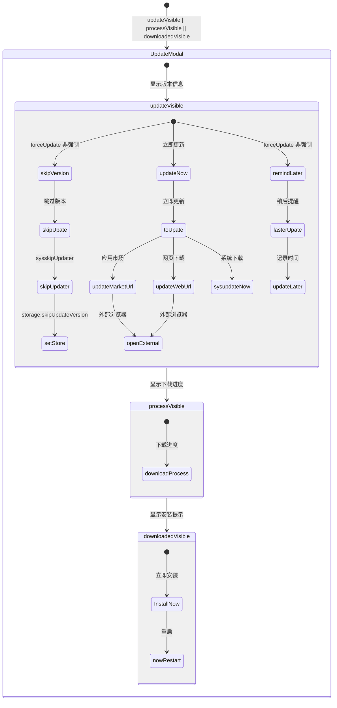
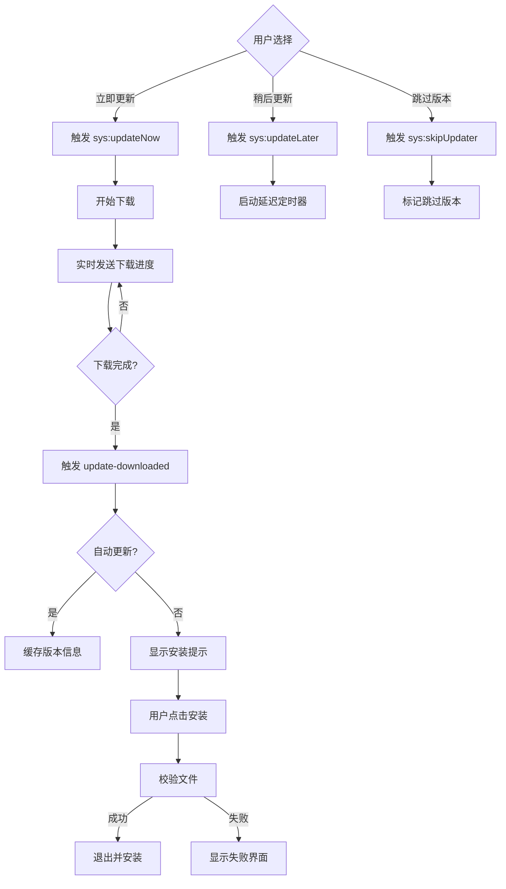
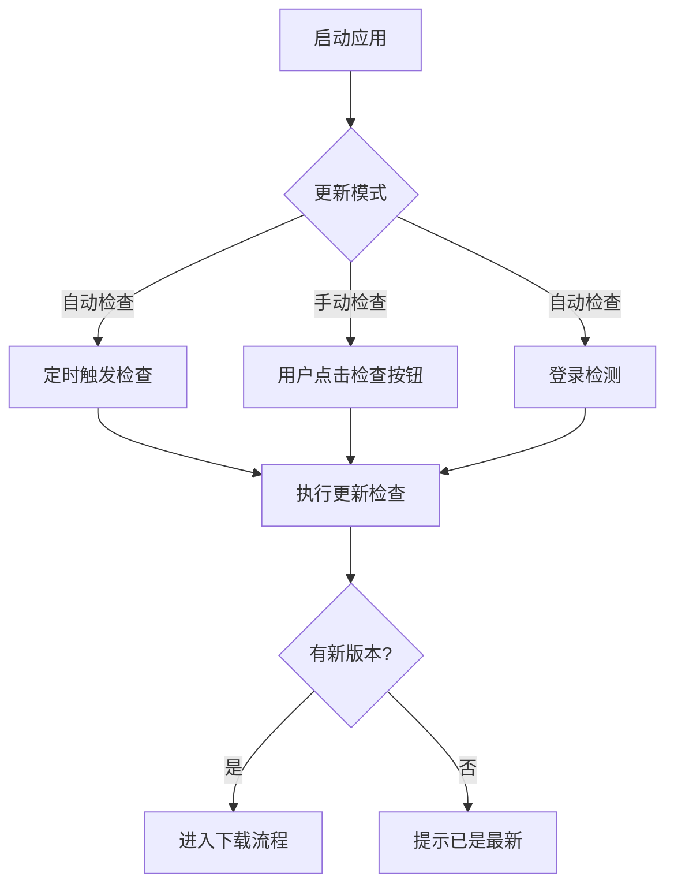
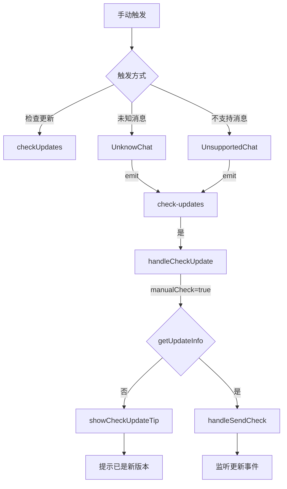
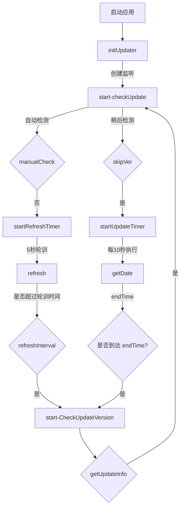
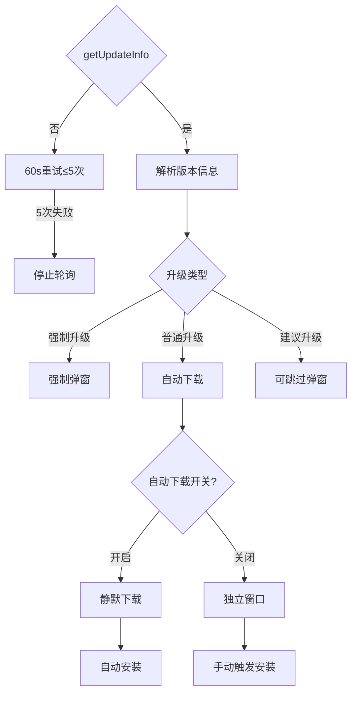

# 升级系统

> 应用版本更新的完整实现，包含自动检查、手动检查、强制更新、静默更新等策略。

## 升级窗口状态



## 更新流程



## 触发机制



### 手动触发



### 自动检测



## 更新类型



| updateType | 含义 | 行为 |
|------------|------|------|
| 0 | 不需要更新 | 无操作 |
| 1 | 强制更新 | 弹窗不可跳过 |
| 2 | 普通更新 | 弹窗可关闭 |
| 3 | 建议更新 | 可跳过版本 |

## 状态管理 (Vuex)

```javascript
const state = {
  updateVisible: false,      // 更新提示对话框
  downloadedVisible: false,  // 下载完成提示
  processVisible: false,     // 下载进度条
  newVersion: "",            // 新版本号
  newVersionInfo: "",        // 版本更新说明 (Markdown)
  downloadProcess: 0,        // 下载进度 (0-100)
  downloadSize: 0,           // 已下载字节数
  fileSize: "",              // 文件大小
  forceUpdate: false,        // 是否强制更新
  canSkipUpdate: false,      // 是否允许跳过
  updateMarketUrl: "",       // 应用市场下载地址
  updateWebUrl: "",          // 网页版下载地址
  device: {},                // 设备信息
};
```

## 核心 API

### getUpdateInfo

获取设备更新信息并触发更新检查。

```javascript
export async function getUpdateInfo(hid, manualCheck) {
  const info = await deviceInfo(hid);
  if (process.env.NODE_ENV === "development") return Promise.resolve();

  return getVersionInfo(info).then((res) => {
    if (res) {
      ipcRenderer.send("start-checkUpdate", {
        ...res,
        manualCheck,
        autoUpdateDownload: store.state.setting.autoUpdateOpen
          && store.state.userInfo.loginStatus === "LOGINFINISH",
      });
      sessionStorage.checkUpdateStatus = "checked";
    }
  }).catch((err) => {
    // 错误重试: 每60秒重试一次, 最多5次
    let versionNum = 0;
    const versionTimer = setInterval(() => {
      if (versionNum > 5) { clearInterval(versionTimer); return; }
      versionNum++;
      getVersionInfo(info).then((res) => { /* ... */ });
    }, 60 * 1000);
  });
}
```

### getVersionInfo

```javascript
export function getVersionInfo(postParm) {
  postParm.userId = postParm.hid;
  return commonUCRequest({
    baseURL: getBaseSpaceUserURL(),
    url: `/configUpdate/v1/info`,
    method: "POST",
    data: JSON.stringify(postParm),
    headers: { "Content-Type": "application/json", "C-Type": "windows" },
    params: { deviceType: "win", clienttype: "win" },
  }, false);
}
```

### deviceInfo

采集设备信息用于更新检查:

- `platform`: 操作系统 (win/osx)
- `release`: 系统版本
- `arch`: 系统架构
- `cpu`: CPU 型号
- `networkType`: 网络类型
- `osVer`: Windows 版本 (7/8/10)
- `locaSyslLang`: 系统语言
- `version`: 应用版本
- `vendor`: 设备制造商
- `deviceModel`: 设备型号
- `countryCode`: 国家代码

## AppUpdater 类

主进程更新管理器，基于 `electron-updater`。

### 关键配置

```javascript
autoUpdater.autoDownload = false;        // 禁用自动下载
autoUpdater.allowDowngrade = false;      // 禁止降级
autoUpdater.autoInstallOnAppQuit = false; // 退出时不自动安装
autoUpdater.forceDevUpdateConfig = true;  // 强制开发更新配置
```

### IPC 事件

| 事件 | 说明 |
|------|------|
| `sys:updateNow` | 立即更新，开始下载 |
| `sys:updateLater` | 稍后更新，启动延迟定时器 |
| `sys:skipUpdater` | 跳过版本，记录跳过信息 |
| `sys:nowRestart` | 立即重启，校验文件后安装 |
| `sys:cancelUpdate` | 取消下载 |
| `sys:continueUpdate` | 继续更新（网络恢复后） |

### 网络错误处理

检测以下网络错误并支持断点续传:

- `net::ERR_INTERNET_DISCONNECTED`
- `net::ERR_PROXY_CONNECTION_FAILED`
- `net::ERR_CONNECTION_RESET`
- `net::ERR_CONNECTION_CLOSE`
- `net::ERR_NAME_NOT_RESOLVED`
- `net::ERR_CONNECTION_TIMED_OUT`

### 安装流程

1. 下载完成后校验 SHA512 哈希
2. 校验通过 → 关闭主窗口 → 打开安装程序
3. 校验失败 → 显示失败界面
4. 自动更新模式: 通过 `spawnThen` 启动安装并传入 `--updated --force-run` 参数
