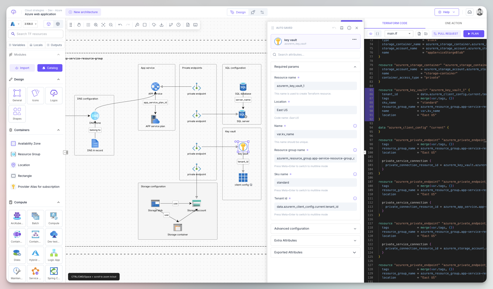
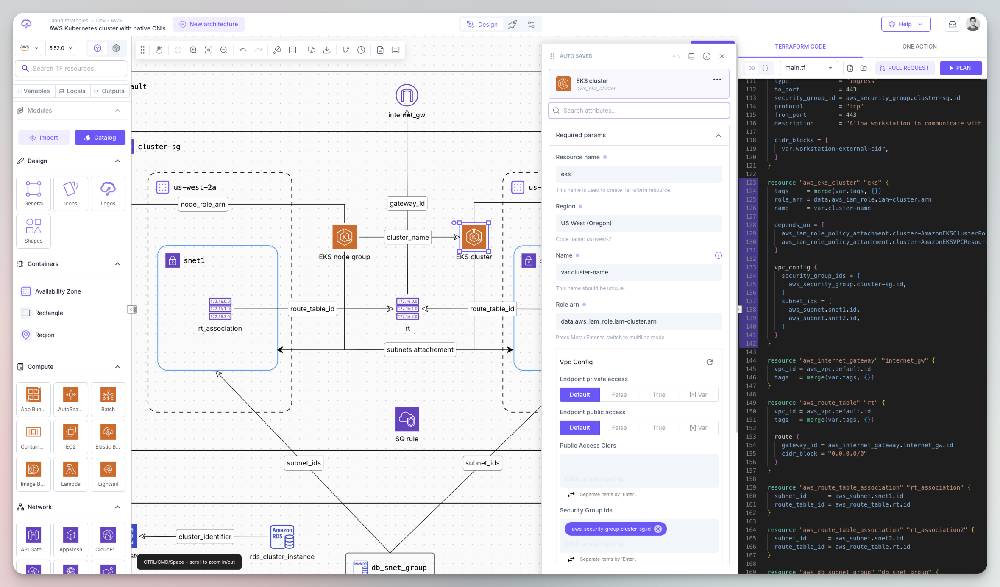
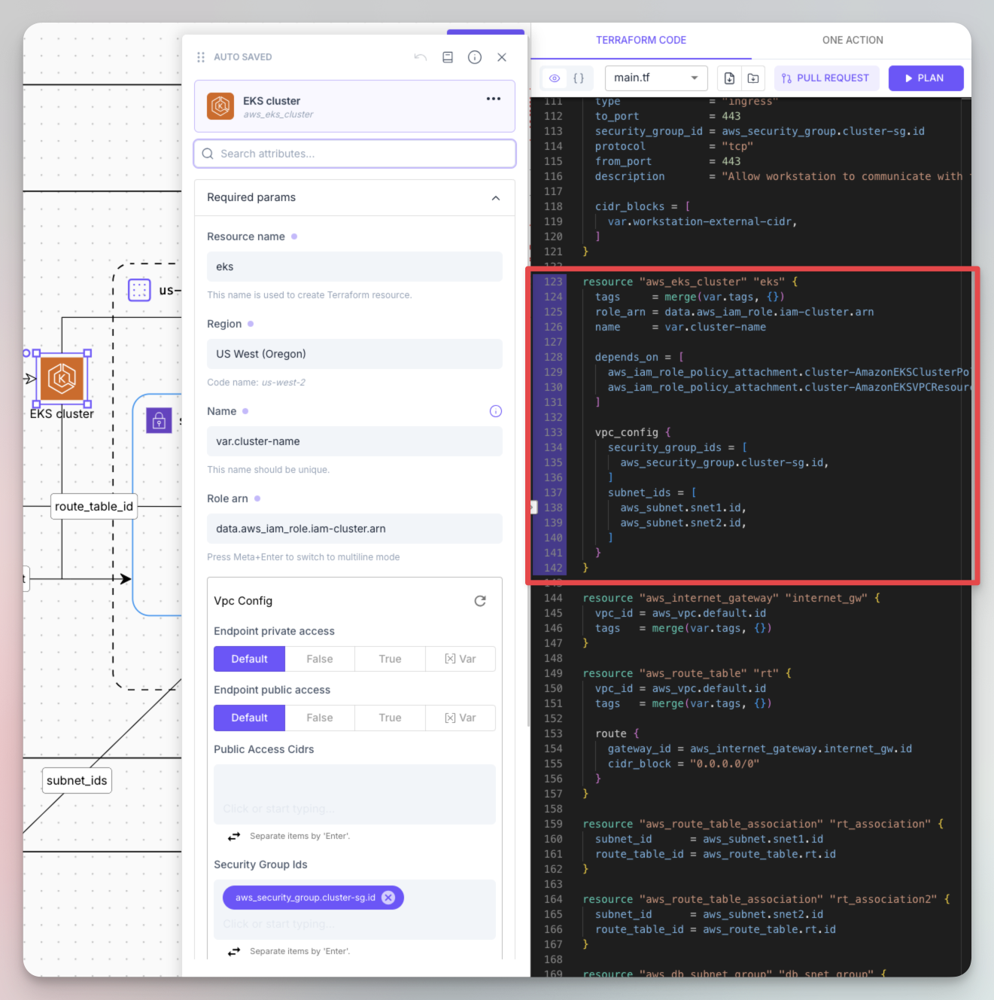
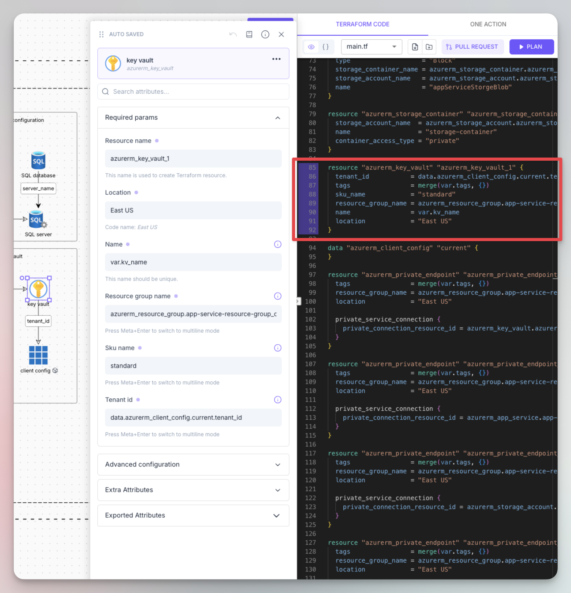
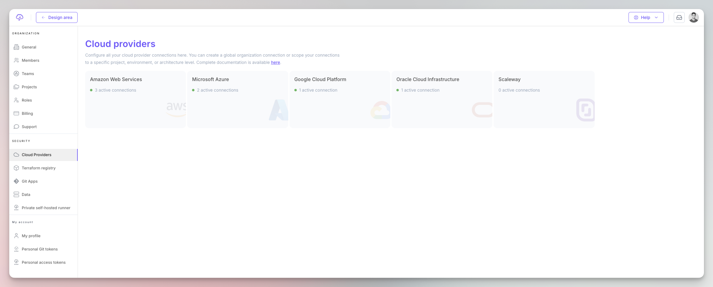
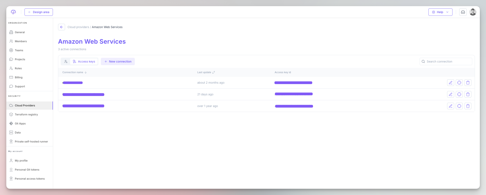
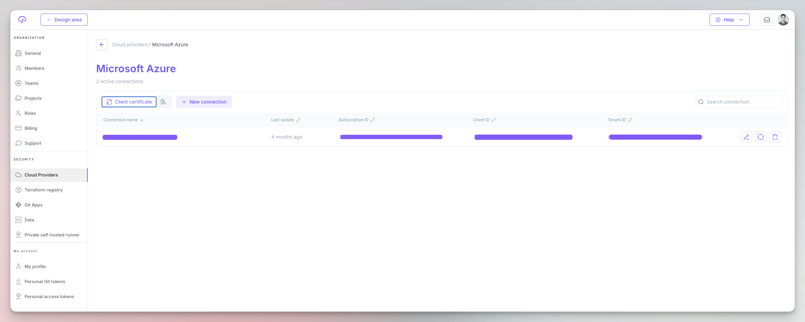
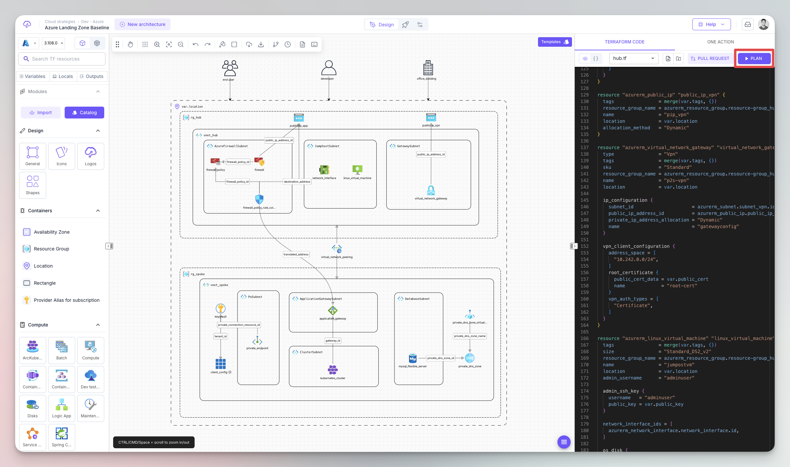
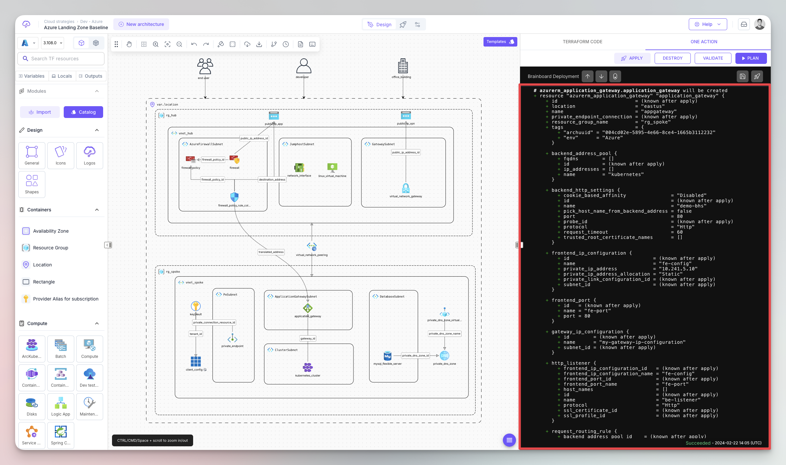

# Fast track

### 1. Create an account

Register [here](https://app.brainboard.co/register) to create your account. You can sign up with your Google or Microsoft login.

### 2. Create a new architecture

* Click on the `New architecture` button in the top left part.
* Select `From scratch` option.

<figcaption>
New architecture
</figcaption>

### 3. Add cloud resources

Drag and drop cloud resources from the _Leftbar_ to the design area to build your architecture. Customize the cloud configuration of the resources

#### Azure

<figcaption>
Azure resource configuration menu
</figcaption>

#### AWS

<figcaption>
AWS resource configuration menu
</figcaption>

### 4. Inspect the auto-generated Terraform code

See the auto-generated Terraform code on the right pane.

Code for Azure & AWS resources:

<figcaption>
AWS resource with Terraform
</figcaption>

 

<figcaption>
Azure resource with Terraform
</figcaption>

Please refer to the support providers page to have the complete list of all supported cloud providers.

### 5. Add your cloud credentials

If you want to deploy your architecture, add your preferred cloud provider credentials [here](https://app.brainboard.co/settings/cloud-providers).

<figcaption>
Cloud credentials
</figcaption>

Examples for **AWS** and **Azure** credentials.

<figcaption>
AWS list of credentials
</figcaption>

 

<figcaption>
Azure list of credentials
</figcaption>

### 6. Trigger a plan

After adding your cloud credentials, you can trigger the Terraform / OpenTofu plan directly from the design area and get the output in real time.

<figcaption>
Terraform plan action
</figcaption>

#### Execution output

You see the output of the plan in the design area, in the tab next to the Terraform code:

<figcaption>
Terraform / OpenTofu plan output
</figcaption>
