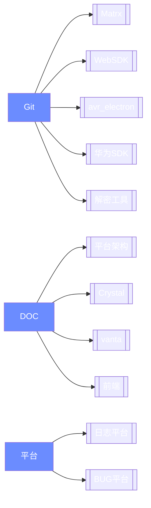
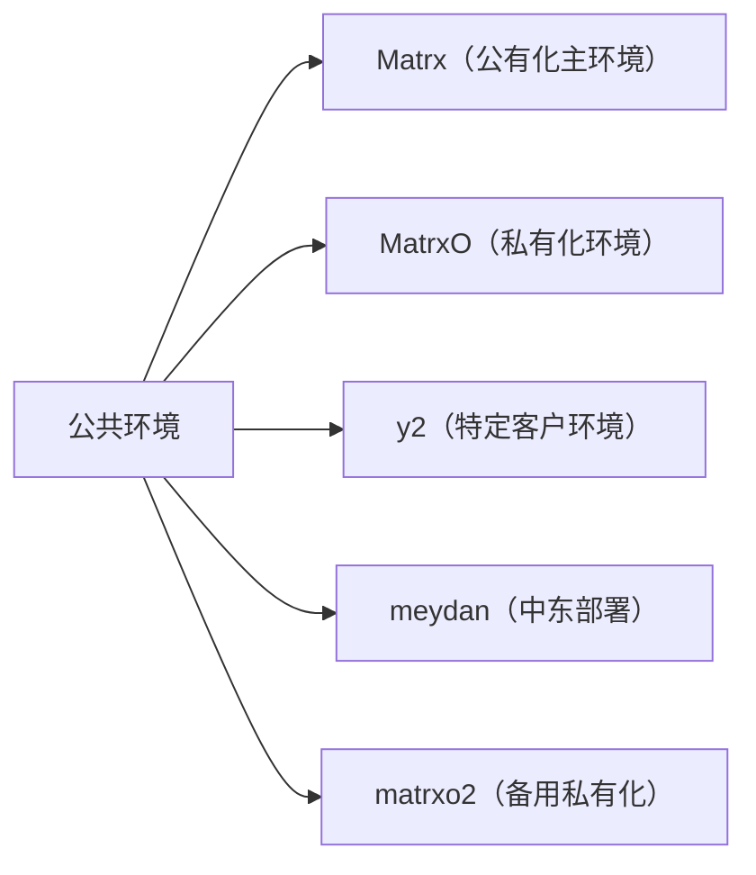

# 账户列表

## 环境账户

| 环境名称  | 描述说明                       | 用途说明（推测）                       |
| --------- | ------------------------------ | -------------------------------------- |
| `Matrx`   | 主公共环境（公有化版本）       | 主要面向公有化场景的测试与验证         |
| `MatrxO`  | 私有化环境                     | 测试或部署私有化定制版本 MatrxO        |
| `y2`      | 可能是某个客户或特定部署环境   | 用于对接特定客户或内部测试             |
| `meydan`  | 可能为特定项目或区域命名环境   | 中东相关部署环境（"Meydan"为迪拜地名） |
| `matrxo2` | 可能是第二套私有化测试部署环境 | 拓展性部署测试                         |

> io 环境

| Account                   | Password   |
| ------------------------- | ---------- |
| `fanxuan32@qq.com`        | `Qwer1234` |
| `tzp1@linshiyouxiang.net` | `Aa111111` |
| `584393661@qq.com`        | `Aa123456` |

> tech 环境

| Account   | Password    |      |
| --------- | ----------- | ---- |
| `AA00008` | `Aa123123`  |      |
| `TT00002` | `Ty5324174` |      |
| `zb0005`  | `Ty5324174` | 直播 |

> work 环境

| Account   | Password    |
| --------- | ----------- |
| `AA00008` | `Aa123123`  |
| `TT00002` | `Ty5324174` |

> MatrxO 环境

| Account   | Password    | Server                                  |
| --------- | ----------- | --------------------------------------- |
| `AA00008` | `Aa123123`  | `prod-matrxo.matrx.work:8011`           |
| `TT00001` | `Ty5324174` | `prod-matrxo.matrx.work:8011`           |
| `AA00008` | `Aa123123`  | `test-matrxo.matrx.work:8011`           |
| `TT00002` | `Ty5324174` | `test-matrxo.matrx.work:8011`           |
|           |             | `https://apiserver01.mo.matrx.work:443` |

> y2

| Account    | Password   | Server               |
| ---------- | ---------- | -------------------- |
| `MOI00001` | `Moi12345` | `mtx.silverknox.net` |
| `moi00014` | `Moi12345` | `mtx.silverknox.net` |
| `MOI00020` | `Moi12345` | `mtx.silverknox.net` |

> 其他环境说明

| 环境名称  | 说明         |
| --------- | ------------ |
| `y2`      | 暂无账户信息 |
| `meydan`  | 暂无账户信息 |
| `matrxo2` | 暂无账户信息 |

## 其他账户

| Account                   | Password       | Server                 |
| ------------------------- | -------------- | ---------------------- |
| `yongmao.tian@ctechm.com` | `Tym727213959` | https://www.figma.com/ |

## 相关平台

| Account  | Password | Server                                     |
| -------- | -------- | ------------------------------------------ |
| 日志平台 |          | https://fed.corp.matrx.team/matrx-log/view |

