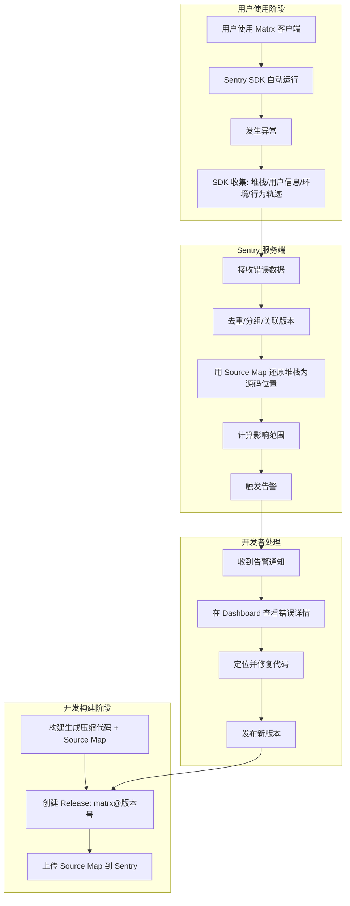

# 监控与代码质量工具

> 本文档面向新加入团队的开发者，介绍项目中使用的 Sentry 错误监控和 SonarQube 代码质量扫描工具。

## 一句话理解

| 工具 | 做什么的 | 什么时候用 |
|------|---------|-----------|
| **Sentry** | 线上应用报错了，自动收集错误信息并通知你 | 应用发布后，持续监控运行时异常 |
| **SonarQube** | 在代码提交前/后，自动检查代码质量 | 开发阶段，确保代码没有 bug、漏洞、坏味道 |

---

## Sentry 错误监控

### 什么是 Sentry

Sentry 是一个**应用错误监控平台**。当用户使用 Matrx 客户端时，如果发生了 JavaScript 异常、Promise 未处理、接口请求失败等错误，Sentry SDK 会自动捕获这些错误并上报到 Sentry 服务器。开发者可以在 Sentry Dashboard 中看到：

- 哪行代码报了错
- 影响了多少用户
- 在什么操作系统/版本上发生
- 用户操作的行为轨迹 (Breadcrumbs)

### 在 Matrx 项目中的作用

Matrx 是 Electron + Vue 应用，构建后的 JS 代码是压缩混淆的（如 `app.js:1:145732`），直接看报错堆栈无法定位问题。通过 Sentry + Source Map：

1. 构建时生成 Source Map 文件
2. 构建后执行 `upload-sourcemaps.js` 上传到 Sentry
3. 用户端报错时，Sentry 用 Source Map 还原成**源码位置**
4. 开发者在 Dashboard 直接看到 `src/views/Login.vue:42` 这样的精确位置

### 工作原理



### 项目配置

#### Sentry 服务器信息

| 配置项 | 值 | 说明 |
|--------|---|------|
| 服务器地址 | `https://sentry.fe.matrx.io/` | 自建 Sentry 服务 |
| 组织 (org) | `sentry` | |
| 项目 (project) | `electron` | |
| DSN | `https://c4cff...@sentry.fe.matrx.io/2` | SDK 上报地址 |

#### 配置文件

项目根目录有两个 Sentry 配置文件：

- **`.sentryclirc`** — Sentry CLI 配置 (INI 格式)，包含服务器地址、org、project、auth token
- **`sentry.properties`** — 同上内容的 properties 格式，供 `upload-sourcemaps.js` 使用

#### SDK 初始化代码

文件位置: `src/sentry/sentryInit.js`

```js
import * as Sentry from '@sentry/browser';
import { version, isDev } from '@/config/config';

Sentry.init({
  dsn: 'https://c4cff...@sentry.fe.matrx.io/2',
  debug: isDev,                    // 开发环境打印 debug 日志
  environment: process.env.NODE_ENV, // 区分 development / production
  release: `matrx@${version}`,    // 关联版本号，如 matrx@1.25.0
  beforeSend: event => {
    // 将 Electron 的 app:// 协议替换为 http:// 以匹配 Source Map
    event.request.url = event.request.url.replace('app://./', 'http://tym369.top/source-map/');
    // 同样替换堆栈帧中的文件路径
    // ...
    return event;
  }
});
```

**关键点解释：**

| 参数 | 作用 |
|------|------|
| `dsn` | Sentry 项目的数据上报地址，每个项目唯一 |
| `release` | 版本标识，格式为 `matrx@版本号`，用于关联 Source Map 和错误 |
| `environment` | 环境标识，区分开发/生产环境的错误 |
| `beforeSend` | 发送前的钩子，这里把 Electron 的 `app://` 路径替换为 HTTP 路径，使 Source Map 能正确匹配 |

### Source Map 上传

文件位置: `upload-sourcemaps.js` (项目根目录)

```js
const SentryCli = require('@sentry/cli');
const sentryCli = new SentryCli('./sentry.properties');
const { version } = require('./package.json');

async function main() {
  await sentryCli.execute([
    'releases', 'files',
    'matrx@' + version,           // Release 名称，需与 SDK 中的 release 一致
    'upload-sourcemaps',
    '--url-prefix', 'http://tym369.top/source-map/js',  // 需与 beforeSend 中的替换路径匹配
    './dist_electron/bundled/js',   // 构建产物中 Source Map 所在目录
    '--rewrite'
  ], true);
}

main().catch(e => console.error(e));
```

**使用方式：**

```sh
# 先构建项目
npm run build

# 然后上传 Source Map
node upload-sourcemaps.js
```

### 日常使用指南

#### 查看错误

1. 打开 Sentry Dashboard: `https://sentry.fe.matrx.io/`
2. 进入 `electron` 项目
3. 左侧导航 **Issues** 查看错误列表
4. 点击具体错误，可以看到：
   - 还原后的源码堆栈
   - 影响的用户数量和频次
   - 用户的操作系统、Electron 版本
   - Breadcrumbs (用户操作轨迹)

#### 处理错误

1. **认领** — 把错误分配给自己
2. **定位** — 根据堆栈找到源码位置
3. **修复** — 提交修复代码
4. **标记** — 修复后在 Sentry 中标记为 Resolved
5. **回归检测** — 如果同一错误在新版本中再次出现，Sentry 会自动重新打开

#### 手动上报错误

在代码中需要主动上报时：

```js
import * as Sentry from '@sentry/browser';

// 捕获异常
try {
  someRiskyOperation();
} catch (err) {
  Sentry.captureException(err);
}

// 上报自定义消息
Sentry.captureMessage('某个操作发生了异常情况');

// 添加上下文信息
Sentry.setUser({ id: userId, email: userEmail });
Sentry.setTag('module', 'login');
```

---

## SonarQube 代码质量扫描

### 什么是 SonarQube

SonarQube 是一个**代码质量管理平台**，它会扫描你的源代码并检测：

| 检测项 | 说明 | 举例 |
|--------|------|------|
| **Bug** | 可能导致运行时错误的代码 | 空指针引用、类型错误 |
| **漏洞 (Vulnerability)** | 安全风险 | XSS、SQL 注入、硬编码密码 |
| **代码异味 (Code Smell)** | 不影响运行但降低可维护性的代码 | 过长函数、重复代码、未使用变量 |
| **重复代码** | 复制粘贴的代码块 | 两处以上相同逻辑 |
| **覆盖率** | 测试代码覆盖了多少生产代码 | 未被测试覆盖的分支 |

### 项目配置

#### 服务器信息

| 配置项 | 值 |
|--------|---|
| 服务器地址 | `https://sonar.corp.matrx.team` |
| 项目标识 | `frontend_matrx_windows` |

#### 配置文件

文件位置: `sonar-project.properties` (项目根目录)

```properties
# 项目唯一标识
sonar.projectKey=frontend_matrx_windows

# SonarQube 服务器地址
sonar.host.url=https://sonar.corp.matrx.team

# 当前分支名 (按实际分支修改)
sonar.branch.name=feat_0430_all

# 认证 token (建议通过环境变量注入，不要明文写在文件里)
sonar.login=<your_token>

# 源码目录和文件类型
sonar.sources=src/
sonar.inclusions=src/**/*.js,src/**/*.vue,src/**/*.jsx

# 源码编码
sonar.sourceEncoding=GBK
```

**配置项说明：**

| 字段 | 作用 |
|------|------|
| `sonar.projectKey` | 项目在 SonarQube 中的唯一标识 |
| `sonar.host.url` | SonarQube 服务器地址 |
| `sonar.branch.name` | 扫描的分支，不同分支的结果独立展示 |
| `sonar.login` | 认证令牌，**应通过环境变量 `$SONAR_TOKEN` 注入** |
| `sonar.sources` | 要扫描的源码目录 |
| `sonar.inclusions` | 只扫描这些类型的文件 |
| `sonar.sourceEncoding` | 源码编码，项目历史原因使用 GBK |

### 使用方式

#### 执行扫描

```sh
# 方式一: 直接运行 (token 在配置文件中)
sonar-scanner

# 方式二: 通过环境变量传入 token (推荐)
sonar-scanner -Dsonar.login="$SONAR_TOKEN"

# 方式三: 指定分支
sonar-scanner \
  -Dsonar.branch.name="$(git branch --show-current)" \
  -Dsonar.login="$SONAR_TOKEN"
```

#### 查看扫描结果

1. 打开 SonarQube Dashboard: `https://sonar.corp.matrx.team`
2. 找到 `frontend_matrx_windows` 项目
3. 可以查看：
   - **概览** — 整体代码质量评级 (A/B/C/D/E)
   - **Issues** — 按严重程度分类的问题列表
   - **Measures** — 覆盖率、重复率等指标
   - **Code** — 具体文件中标记了问题的代码行

#### 质量门 (Quality Gate)

质量门是 SonarQube 的"合格线"，代码必须满足以下条件才算通过：

| 指标 | 要求 |
|------|------|
| 代码覆盖率 | > 80% |
| 重复代码比例 | < 3% |
| 严重 Bug 数量 | = 0 |
| 安全漏洞数量 | = 0 |

如果质量门不通过，CI 流水线会失败，代码无法合并。

### 常见问题类型及修复

| 问题类型 | 示例 | 修复方式 |
|---------|------|---------|
| 未使用的变量 | `const x = 1;` 但从未读取 | 删除未使用的声明 |
| 空 catch 块 | `catch(e) {}` | 至少记录日志 `catch(e) { console.error(e) }` |
| 硬编码密码 | `password = "123456"` | 改用环境变量或配置中心 |
| 认知复杂度过高 | 函数嵌套过深、条件过多 | 拆分为更小的函数 |
| 重复代码块 | 两处以上相同逻辑 | 提取为公共函数 |

---

## 安全提醒

项目中的以下文件包含敏感信息 (auth token)，**不应泄露或提交到公开仓库**：

| 文件 | 包含 |
|------|------|
| `.sentryclirc` | Sentry auth token |
| `sentry.properties` | Sentry auth token |
| `sonar-project.properties` | SonarQube login token |

建议在 CI 中通过环境变量注入 token：

```sh
# Sentry
export SENTRY_AUTH_TOKEN=***

# SonarQube
sonar-scanner -Dsonar.login="$SONAR_TOKEN"
```
