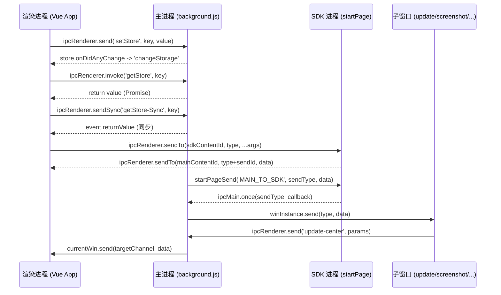

# IPC 通信架构

## 概述

Matrx Windows 客户端基于 Electron 20 + Vue 2 架构，采用多进程模型。IPC（Inter-Process Communication）通信是主进程（Main Process）与渲染进程（Renderer Process）之间数据交换的核心机制。本文档详细说明项目中 IPC 通信的整体架构设计、通道组织方式、数据序列化策略以及关键实现细节。

## 核心文件结构

```
src/
├── background.js                       # 主进程入口，注册大量 ipcMain 通道
├── preload.js                          # 预加载脚本，暴露安全 IPC 接口
├── IPCRenderChannel.js                 # 渲染进程 IPC 通道封装（SQLite 请求/响应）
├── main/
│   ├── IPCMainChannel.js              # 主进程通用 IPC 监听器（用户数据、文件路径、剪贴板等）
│   ├── store.js                       # electron-store 数据存储与 IPC 同步
│   ├── mainWindow/index.js            # 主窗口 IPC（窗口控制、消息转发）
│   ├── mainToPage.js                  # 主进程到 SDK 页面的 IPC 桥接
│   ├── startPage.js                   # SDK 进程窗口管理与 IPC
│   ├── commonOption.js                # 公共 webPreferences 配置
│   ├── constants.js                   # IPC 通道名称常量定义
│   ├── callfeedback/channel.js        # 通话反馈通道常量
│   ├── notification.js                # 系统通知 IPC
│   ├── globalShortcut.js              # 全局快捷键 IPC
│   ├── meetingSDK.js                  # 会议 SDK IPC
│   ├── screenshot/capture-main.js     # 截图功能 IPC
│   ├── tray.js                        # 系统托盘 IPC
│   ├── toaster.js                     # Toast 提示 IPC
│   ├── update/index.js                # 应用更新 IPC
│   └── ...                            # 其他子窗口模块
└── utils/
    └── ipc/
        └── ipcSend.js                 # 渲染进程 IPC 工具集
```

## Electron IPC 通信模型

### 进程架构

Matrx 客户端运行时包含以下关键进程：

```
┌─────────────────────────────────────────────────┐
│                   主进程 (Main Process)            │
│  background.js + src/main/**                      │
│  - 窗口管理、系统 API、文件操作、SDK 调用           │
└───────┬──────────┬──────────┬───────────┬────────┘
        │          │          │           │
   ipcMain    ipcMain    ipcMain     ipcMain
        │          │          │           │
┌───────▼───┐ ┌────▼────┐ ┌──▼───────┐ ┌─▼──────────┐
│ 主窗口     │ │ SDK 进程 │ │ 截图窗口  │ │ 子窗口群    │
│ currentWin │ │ startPage│ │ capture  │ │ (更新/会议/ │
│ (Vue App)  │ │          │ │          │ │  预览/反馈) │
└────────────┘ └──────────┘ └──────────┘ └────────────┘
```

项目中 `webPreferences` 的关键配置位于 `src/main/commonOption.js`：

```javascript
// src/main/commonOption.js
export const commonWebPreferences = {
    nodeIntegration: true,       // 允许渲染进程直接使用 Node.js API
    webSecurity: false,          // 禁用同源策略
    contextIsolation: false,     // 未启用上下文隔离
    spellcheck: false
};
```

由于 `contextIsolation: false` 且 `nodeIntegration: true`，渲染进程可以直接通过 `require('electron')` 获取 `ipcRenderer`，无需通过 contextBridge。这是 Electron 较早版本（20）的常见做法。

### 四种通信模式

项目中使用了 Electron IPC 的以下四种通信模式：

#### 1. 单向发送 (ipcRenderer.send -> ipcMain.on)

最常用的模式，渲染进程向主进程发送消息，不等待返回值。

```javascript
// 渲染进程 - 发送
ipcRenderer.send('setStore', 'storage.lang', 'en');
ipcRenderer.send('WINDOW-CONTROL', 'Minimize');

// 主进程 - 监听
ipcMain.on('setStore', (e, key, value) => {
    setStore(key, value);
});
ipcMain.on('WINDOW-CONTROL', (e, val) => {
    switch (val) {
        case 'Minimize': currentWin.minimize(); break;
        case 'Maximize': currentWin.maximize(); break;
        case 'Close': currentWin.close(); break;
    }
});
```

#### 2. 请求-响应 (send + event.reply)

渲染进程发送消息后，主进程通过 `event.reply()` 回复到同一渲染进程。

```javascript
// 渲染进程 - 发送并监听响应
ipcRenderer.send('get-document-download-path');
ipcRenderer.on('get-document-download-path-res', (e, docPath) => {
    // 处理返回的路径
});

// 主进程 - 处理并回复
ipcMain.on('get-document-download-path', (event, arg) => {
    let docPath = getDocumentPath();
    event.reply('get-document-download-path-res', docPath);
});
```

#### 3. 同步通信 (ipcRenderer.sendSync)

渲染进程发送同步消息，阻塞等待主进程通过 `event.returnValue` 返回。

```javascript
// 渲染进程 - 同步获取
let data = ipcRenderer.sendSync('getStore-Sync', 'storage');

// 主进程 - 同步响应
ipcMain.on('getStore-Sync', (e, key, type) => {
    e.returnValue = getStore(key);
});
```

#### 4. invoke/handle 双向异步 (ipcRenderer.invoke -> ipcMain.handle)

基于 Promise 的异步请求-响应模式，是 Electron 推荐的双向通信方式。

```javascript
// 渲染进程 - 异步调用
const store = await ipcRenderer.invoke('getStore', 'storage');
const files = await ipcRenderer.invoke('clipboad-multiple-get');

// 主进程 - 处理并返回
ipcMain.handle('getStore', (e, key) => {
    return getStore(key);
});
ipcMain.handle('clipboad-multiple-get', (event, arg) => {
    return clipboard.readFiles();
});
```

## 主进程通道注册

### IPCMainChannel.js - 通用通道

`src/main/IPCMainChannel.js` 导出 `ipcListener()` 函数，在应用启动时调用，注册一系列通用的 IPC 通道：

```javascript
// src/main/IPCMainChannel.js
export function ipcListener() {
    // 用户数据清理
    ipcMain.on('REMOVE_USER_DATA', (event, arg) => { ... });

    // 崩溃日志
    ipcMain.on('get-pre-crash-log', async (event, arg) => { ... });
    ipcMain.on('set-pre-crash-log', async (event, arg) => { ... });

    // 剪贴板操作
    ipcMain.handle('clipboad-multiple-get', (event, arg) => { ... });
    ipcMain.on('set-clipboad-multiple', (event, arg) => { ... });

    // 路径管理
    ipcMain.on('set-record-path', (event, arg) => { ... });
    ipcMain.on('get-document-download-path', (event, arg) => { ... });
    ipcMain.on('set-document-download-path', (e, {title, defaultPath}) => { ... });

    // 数据存储
    ipcMain.handle('sys:win32ComputerSystem', async e => { ... });
    ipcMain.on('get-appdataStorage', async (e, data) => { ... });
    ipcMain.on('set-appdataStorage', async (e, data) => { ... });

    // 窗口间数据同步
    ipcMain.on('GET_CURRENT_WIN_DATA', async (e, data) => { ... });
    ipcMain.on('get-main-data', async (e, data) => { ... });
}
```

### background.js - 核心通道

`src/background.js` 作为 Electron 主入口文件，直接注册了大量核心 IPC 通道，包括：

- 窗口控制（`WINDOW-CONTROL`、`GET-IS-MAXIMIZED`）
- 文件操作（`SAVE-AS-PIC`、`OPEN-FILE-LOCATION`、`SAVE-FILE-CHOOSE-PATH`、`DELETE_FILE`）
- 磁盘空间检查（`check-disk-space`、`get-logical-disk`）
- 加解密（`Encryptd-Content`、`Decryptd-Content`）
- 应用生命周期（`CLEAR-TEMP-USER-RES`、`UPDATE_AND_QUIT_APP`、`MAIN_APP_RESART`）
- 系统设置（`SET_AUTO_LAUNCH`、`ipcChangeAppLang`、`CLEAR_COOKIE`）

### store.js - 数据同步

`src/main/store.js` 基于 `electron-store-atomically` 实现持久化存储，并通过 IPC 暴露读写接口：

```javascript
// 写入
ipcMain.on('setStore', (e, key, value) => { setStore(key, value); });
ipcMain.on('updateStore', (e, type, data) => { updateStore(type, data); });

// 同步读取
ipcMain.on('getStore-Sync', (e, key, type) => { e.returnValue = getStore(key); });
ipcMain.on('getStore', (e, key) => { e.returnValue = getStore(key); });

// 异步读取
ipcMain.handle('getStore', (e, key) => { return getStore(key); });
```

当 store 数据变化时，通过 `onDidAnyChange` 监听器自动同步到所有渲染进程：

```javascript
store.onDidAnyChange((newValue, oldValue) => {
    if (!isEqual(newValue.storage, oldValue.storage)) {
        ipcMain.emit('SEND-CURRENT-WIN-MSG', {
            type: 'changeStorage',
            data: newValue.storage
        });
    }
});
```

## 渲染进程通道封装

### IPCRenderChannel.js

`src/IPCRenderChannel.js` 提供渲染进程侧的 IPC 初始化和同步消息：

```javascript
// src/IPCRenderChannel.js
export const IPCRenderChannel = {
    init() {
        // 监听 SQLite 数据库操作响应
        ipcRenderer.on('sqliteRsp', async (event, callId, error, data) => {
            const callInfo = pendingCalls[callId];
            delete pendingCalls[callId];
            if (callInfo) {
                if (error) {
                    callInfo.reject(error);
                } else {
                    callInfo.resolve(data);
                }
            }
        });
    },
    loginSuccess() {
        ipcRenderer.send('syncMsg', 'loginSuccess');
    }
};
```

该模块实现了基于 `callId` 的请求-响应匹配机制，使用 `pendingCalls` 对象存储待处理的 Promise，实现 SQLite 数据库操作的异步调用。

### ipcSend.js - 工具集

`src/utils/ipc/ipcSend.js` 是渲染进程最核心的 IPC 工具模块，封装了多种通信方式：

```javascript
// 基础发送
export function ipcSend(type, ...args) {
    ipcRenderer.send(type, ...args);
}

// invoke 异步调用
export function ipcInvoke(type, ...args) {
    return ipcRenderer.invoke(type, ...args);
}

// 带回调的 invoke
export function ipcInvokeThen(type, args, callback) {
    ipcRenderer.invoke(type, args).then(result => callback(result));
}

// 跨窗口发送 (sendTo)
export function ipcSendTo(to, type, ...args) {
    ipcRenderer.sendTo(to, type, ...args);
}

// SDK 通信（基于 sendTo + UUID 响应匹配）
export function sendSdk(type, ...args) {
    return new Promise(resolve => {
        const sendId = uuidv4();
        ipcRenderer.once(type + sendId, (e, data, ts) => {
            resolve(data);
        });
        sendToSdk(type, ...args, sendId);
    });
}
```

## 通道命名规范

项目中 IPC 通道名称采用以下几种风格：

| 命名风格 | 示例 | 使用场景 |
|---------|------|---------|
| `UPPER_SNAKE_CASE` | `REMOVE_USER_DATA`、`WINDOW-CONTROL` | 核心系统操作 |
| `kebab-case` | `get-document-download-path`、`capture-screen` | 功能模块通道 |
| `camelCase` | `setStore`、`getStore`、`showMainWin` | 数据存储与简单操作 |
| 常量引用 | `MEETING_INFO_CREATE_WINDOW` | 通过 `constants.js` 统一管理 |
| 前缀分组 | `sys:`、`start-page-`、`electron-` | 按模块前缀归类 |

响应通道通常在原通道名后追加 `-res`、`-Res`、`_RES` 或 `-back` 后缀：

```
get-document-download-path  ->  get-document-download-path-res
SAVE-FILE-CHOOSE-PATH      ->  SAVE-FILE-CHOOSE-PATH-Res
Encryptd-Content            ->  Encryptd-Content-Res
ipc_decrypt_public          ->  ipc_decrypt_public_back
```

## 数据序列化

### 自动序列化

Electron IPC 使用结构化克隆算法（Structured Clone Algorithm）进行数据序列化，支持：
- 基本类型（string、number、boolean、null、undefined）
- 对象和数组
- Date、RegExp、Map、Set
- ArrayBuffer、TypedArray
- Buffer（Node.js）

### 项目中的序列化实践

在加密模块中，使用 Buffer 传输二进制数据：

```javascript
// 主进程加密操作，直接传输 Buffer
ipcMain.on('Encryptd-Content', (e, msg, key, iv) => {
    let res = SDKSSEncryptd(msg, key, iv);  // 返回 Buffer
    e.reply('Encryptd-Content-Res', res);
});
```

在 SDK 通信中，使用 JSON 字符串进行 Base64 编码：

```javascript
function strToBase64(str) { /* ... */ }
function base64ToStr(base64) { /* ... */ }
```

## 多窗口通信架构

### 主窗口消息转发

主窗口是整个应用的消息中枢，`sendMainWinMsg` 和 `sendWinMsg` 负责安全地向主窗口发送消息：

```javascript
// src/main/mainWindow/index.js
export function sendMainWinMsg(msg) {
    if (currentWin && currentWin.webContents &&
        !currentWin.webContents.isCrashed() &&
        !currentWin.webContents.isLoading()) {
        if (typeof msg === 'string') {
            currentWin.send(msg);
        } else {
            currentWin.send(msg.type, msg.data);
        }
    } else {
        loadingMsgs.push(msg);  // 缓存未发送的消息
    }
}
```

当窗口正在加载时，消息会被缓存在 `loadingMsgs` 数组中，待 `did-finish-load` 事件触发后统一发送。

### 跨窗口通信 (sendTo)

渲染进程之间通过 `ipcRenderer.sendTo(webContentsId, channel, ...args)` 直接通信：

```javascript
// src/utils/ipc/ipcSend.js
export function sendToSdk(type, ...args) {
    ipcRenderer.sendTo(getSdkContentId(), type, ...args);
}
```

`webContentsId` 通过 store 共享，存储在 `storage.sdkContentId` 和 `storage.mainContentId` 中。

### SDK 桥接进程

SDK 进程（startPage）作为会议 SDK 的宿主，主进程通过 `mainToSdk` 实现到 SDK 进程的异步请求：

```javascript
// src/main/mainToPage.js
export function mainToSdk(data) {
    return new Promise(resolve => {
        const sendType = uuidv4();
        ipcMain.once(sendType, (e, res) => {
            resolve(res);
        });
        startPageSend('MAIN_TO_SDK', sendType, data);
    });
}
```

此模式使用 UUID 作为一次性通道名，确保请求和响应的一一对应关系。

## preload.js 安全层

`src/preload.js` 为子窗口提供受限的 IPC 接口：

```javascript
// src/preload.js
window.ipcRenderer = {
    send: (channel, ...args) => {
        ipcRenderer.send(channel, ...args);
    },
    receive: (channel, func) => {
        ipcRenderer.on(channel, (event, ...args) => func(...args));
    },
    removeListener: (channel, func) => {
        ipcRenderer.removeListener(channel, func);
    }
};

window.mainwindow = {
    isVisible() {
        return ipcRenderer.sendSync('main-window', {type: 'isVisible'});
    },
    isMinimized() {
        return ipcRenderer.sendSync('main-window', {type: 'isMinimized'});
    }
};
```

此 preload 脚本刻意剥离了 `event` 对象中的 `sender` 信息，提供了一层基本的安全隔离。

## 通信流程总结



以上即为 Matrx Windows 客户端 IPC 通信的整体架构。各子模块（会议、截图、更新等）均遵循此模式进行进程间通信。
