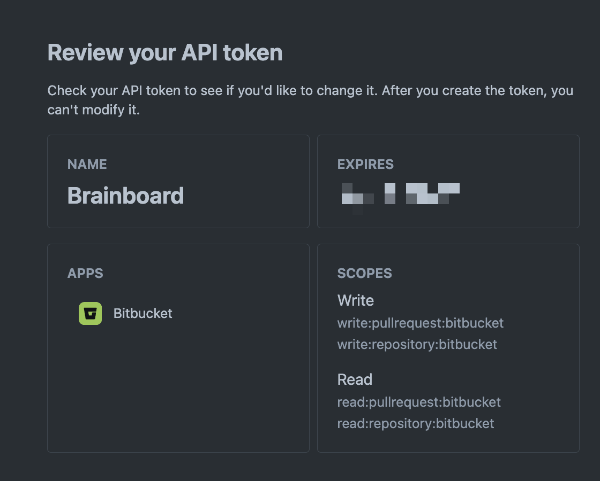

# Bitbucket

### Add Git connection

To add Bitbucket personal app password in Brainboard, you first need to generate it in your Bitbucket account.

Steps to generate an API token for your <strong>Bitbucket</strong> account.

1. Go to [API Token page in Atlassian Security center](https://id.atlassian.com/manage-profile/security/api-tokens)
2.  Create API token with scopes:

    * Set the name and expiry date you want
    * Select Bitbucket app
    * Select the following scopes:
      * `write:pullrequest:bitbucket`
      * `write:repository:bitbucket`
      * `read:pullrequest:bitbucket`
      * `read:repository:bitbucket`

    <figcaption></figcaption>
3. The token is generated, you can copy it to add to Brainboard:&#x20;

To add the generated token in Brainboard:

1. Go to the [Git integration](https://app.brainboard.co/settings/integrations/git) settings page.
2. Click on `Integrations`
3. In the section `Personal connections` Click on `Add connection`&#x20;
4.  Select `Bitbucket` tab 

    <figcaption></figcaption>
5. Add your credentials in the displayed window:
   * Name of the token. This is only for Brainboard, it will not be used when you do a pull request.
   * The URL of your Bitbucket server: by default Brainboard uses `https://api.bitbucket.org/2.0` but you can set your own URL.
   * Email: this is your Atlassian/Bitbucket email.
   * API token: the API Token generated.&#x20;
6. Then click on `Save and close` button.
7. Brainboard will verify if the credentials are valid:
   1.  If they are valid, Brainboard displays a success message and you can see the integration now in the Git connection page 

       <figcaption></figcaption>
   2.  If they are not, you'll receive an error about what is wrong. For example: 

       <figcaption></figcaption>

       <figcaption></figcaption>

### How to use

Please refer to the page [pull-requests.md](pull-requests.md "mention") to understand how you can use your git connections whether you want to do a pull request and import your code from Git.

### Edit or delete connection

1. Go to the [Git integration](https://app.brainboard.co/settings/integrations/git) settings page.
2. Click on `Integrations`
3. In the section `Personal connections` Click on `Bitbucket` integration that you want to edit or delete
4. Select the action you want to perform from the view

<figcaption></figcaption>
