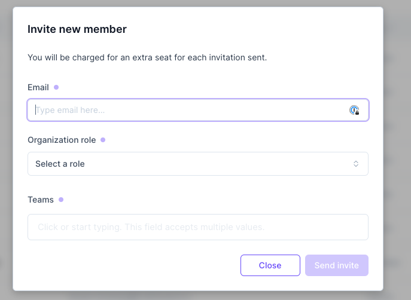

# Members

### Add members

You can invite your colleagues, customers, auditors or external contributors to your Brainboard organization.

To invite a new member:

1. Go to [members page](https://app.brainboard.co/settings/members)
2.  Click on the icon on the right&#x20;

    <figcaption></figcaption>
3. Add the following information and click `invite`:
   * Email address.
   * The `organization` role that you want this user to have. There are `4 roles` available:
     * **Owner**: can do any action in Brainboard.
     * **Admin**: can do most of the actions, except the billing.
     * **Member**: can only do actions authorized on specific projects.
     * **Guest**: this is read-only access. Suitable for auditors or team members that only need to view cloud architectures.
   *   The initial team of the user.&#x20;

       <figcaption></figcaption>

:::danger
A member can belong to **one and only one** organization, so if the user you are trying to invite already has an account in Brainboard. This user should delete his/her organization following [this documentation](organization.md#delete-an-organization-close-your-account).
:::

### Edit member's information

To edit a user's information:

1. Go to [members page](https://app.brainboard.co/settings/members).
2. Click on the `Edit` option that appears when you click on the three dots button at the end of the row for a member.
3. You can change the first name, last name, organization role or two-factor authentication status of the user.

### Disable members

You have the possibility to temporarily suspend a user, which means that the account still exists within your organization, but the user cannot access Brainboard until you enable it again.

:::note
When you disable a user, you will not be billed for this user until you enable it again.
:::

To suspend a member:

1. Go to [members page](https://app.brainboard.co/settings/members).
2. Click on the `Disable member` option that appears when you click on the three dots button at the end of the row for a member.
3. Click on `Disable member` in the confirmation window that will show.

### Remove members

To remove any member from your organization:

1. Go to [members page](https://app.brainboard.co/settings/members)
2. Click on the `Delete` option that appears when you click on the three dots button at the end of the row for a member.
3. Click on `Yes, delete user` in the confirmation window that will show.
