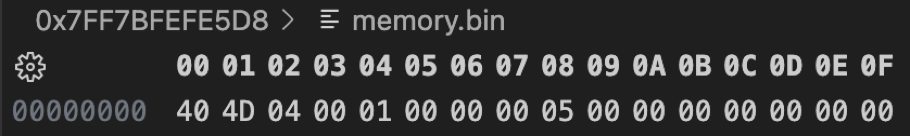
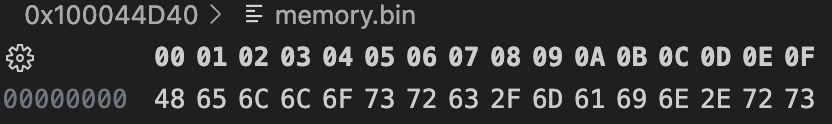
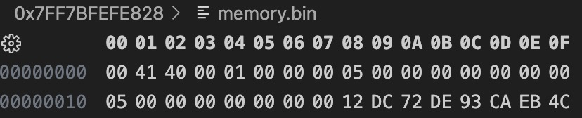
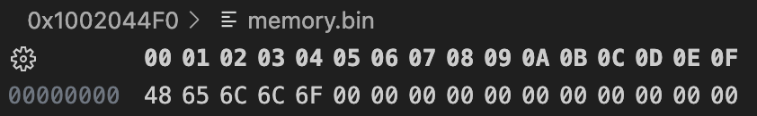
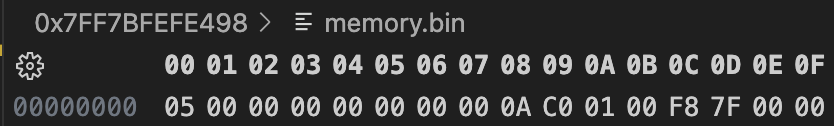

## 数据类型

本章我们不探讨所有权和生命周期


### 整形

| 位长度  | 有符号 | 无符号 |
| ------- | ------ | ------ |
| 8-bit   | i8     | u8     |
| 16-bit  | i16    | u16    |
| 32-bit  | i32    | u32    |
| 64-bit  | i64    | u64    |
| 128-bit | i128   | u128   |
| arch    | isize  | usize  |

我们看到语言设计者将类型定义的非常简短，i其实就是int的简写，u其实就对应unsigned int，再配合不同的数据长度组合而成。usize和c语言中的size_t非常类似，在c语言中32位系统下size_t被定义为unsigned int，64位系统下被定义为unsigned long。uszie和size_t类似，也是不同系统下的定义不同32位就被定义为u32,64为系统就被定义为u64. isize只是必usize多了个符号位而已

__和swift类似不同类型是不能相互运算的，如果想要运算需要类型强制转换，使用as关键字，如下__ 

```
let a = 32;
let b = 4.0;
let c = a as f32 / b;
```


### 进制

| 进制                 | 例          |
| -------------------- | ----------- |
| 十进制               | 222_111     |
| 十六进制             | 0xff        |
| 八进制               | 0o77        |
| 二进制               | 0b1111_0000 |
| 字节(只能表示 u8 型) | b'A'        |

__数字中间可以加下划线，测试发现加在哪里都行__，可能是为了让开发更直观看到大数字的值吧。其他规则和c类似也不区分大小写

__有时候我们再调试时更多的需要查看16进制的数据值，我们需要了解他们的打印方式，二进制: {:b} 八进制: {:o} 16进制: {:x}__


### 浮点数

| 位长度 | 类型 |
| ------ | ---- |
| 32-bit | f32  |
| 64-bit | f64  |

这里的没有double类型了，类似上面直接简写float和数据位数。默认情况下，64.0 将表示 64 位浮点数，因为现代计算机处理器对两种浮点数计算的速度几乎相同，但 64 位浮点数精度更高。 __rust默认浮点类型是f64__


### 布尔类型

这个用bool表示，值为true和false


### 字符类型

了解字符类型之前我们先了解几个编码规则 

> ASCII（American Standard Code for Information Interchange）：ASCII是最早的字符编码标准之一，定义了128个字符，包括基本的拉丁字母、数字、标点符号和一些控制字符。ASCII编码使用7位二进制表示一个字符，可以通过扩展的ASCII来使用8位二进制表示更多字符。然而，ASCII只适用于英语和一些西欧语言，无法表示其他语言的字符。
>
> Unicode：Unicode是一个用于字符编码的标准，旨在涵盖全球范围内的所有字符。它为每个字符分配了一个唯一的代码点，通过16位或32位二进制表示。Unicode包含了ASCII字符集，因此ASCII字符在Unicode中具有相同的编码。Unicode的目标是成为一个通用的字符编码标准，可以表示世界上所有语言的字符。
>
> UTF-8（Unicode Transformation Format-8）：UTF-8是一种Unicode的可变长度字符编码方案。它使用8位二进制表示字符，根据字符的Unicode代码点范围采用不同长度的字节序列。对于ASCII字符，UTF-8使用单个字节表示，与ASCII编码兼容。对于其他Unicode字符，UTF-8使用多个字节表示。UTF-8成为互联网上最常用的字符编码之一，因为它既支持ASCII字符，又能表示全球范围的字符。
>
> GBK（Guo Biao Kang Xi）：GBK是针对汉字的字符编码标准，主要用于中文字符。它是在GB2312标准的基础上进行扩展，采用双字节表示一个汉字，并支持繁体字和一些其他非中文字符。GBK编码兼容ASCII编码，其中的ASCII字符使用单个字节表示，非ASCII字符使用双字节表示。GBK主要用于中文环境中，而在国际化环境中使用UTF-8更为常见。

我们看到国际通用的编码方案是一路向上兼容的

* ASCII使用单字节表示，其中包括控制符 标点符号 英文和数字 0-127

* Unicode更通用，包含了ASCII和世界上几乎所有的字符，他由四个字节组成(最初2字节，后面不够用引入了为平面), 是兼容ASCII的，换句话说ASCII的字母和Unicode拥有相同的int值表达

* UFT8是Unicode的可变长方案，Unicode的缺陷是单字节的字符也需要消耗4字节的空间，UTF8通过牺牲1-4位的数据位来拓展更多的字节表示。这种方式和varint可变长的方案类似（protobuf），这是一种舍去一些位数提取特征的通用存储方案

__其他语言中字符都是指ASCII编码中的字符，但是rsut中将Unicode编码均拓展为字符，消耗的代价是更多的存储空间，不过他是兼容ASCII的，在rust字符中字母a的int表达仍然是97__

```
let character: char = 'a';
println!("字符'a'占用了{}字节的内存大小, 其值为{}",std::mem::size_of_val(&character), character as i32);
// 字符'a'占用了4字节的内存大小, 其值为97
```


### 字符串

字符串分为两种一种是`String`分配在堆上，一种是`&str` 引用类型

```
fn type_of<T>(_: &T) -> &'static str {
    std::any::type_name::<T>()
}

fn size_of<T>(_: &T) -> usize {
    std::mem::size_of::<T>()
}

let ss = "Hello"; 
println!("ss 类型:{}, 占用:{}", type_of(&ss), size_of(&ss)); // ss 类型:&str, 占用:16

let ss1 = String::from("Hello");
println!("ss1 类型:{}, 占用:{}", type_of(&ss1), size_of(&ss1)); // ss1 类型:alloc::string::String, 占用:24

let ss2 = &ss1;
println!("ss2 类型:{}, 占用:{}", type_of(&ss2), size_of(&ss2)); // ss2 类型:&alloc::string::String, 占用:8
```

我们通过内存布局(vs自带的16进制工具)逐个分析一下两个类型， 先来看ss（通过打印知道其占用16个字节）



我们看到ss的地址是0x7FF7BFEFE5D8 属于栈区，由于我们是小端序展示， 这个地址的16个字节分成两个8位为

`0x0000000100044D40 和 0x0000000000000005`

前8字节对应"Hello"真实的存储位置(指针)，后8个字节代表占用5 （Hello占用5个字节）



容量是5，那么我们取前五个字节 0x 48 65 6C 6F 73 对应的ASCII 刚好是 Hello。而且从地址看属于低地址，能验证字面量字符串存储在Data常量区

__字符串字面量引用占用16个字节，8字节指针，8字节长度__

我们紧接着看一下ss1的（通过打印知道其占用24个字节）



我们看到ss1的地址是0x7FF7BFEFE828 属于栈区，由于我们是小端序展示， 这个地址的24个字节分成三个8位为

`0x0000000100404100 和 0x0000000000000005 和 0x0000000000000005`

前8字节对应"Hello"真实的存储位置(指针)， 再有8个字节代表空间当前分配的大小容量也是5， 再8个字节代表占用5



容量是5，那么我们取前五个字节 0x 48 65 6C 6F 73 对应的ASCII 刚好是 Hello。而且从地址看属于低地址，能验证字面量字符串存储在堆区

__字符串占用24个字节，8字节指针，8字节容量，8字节长度__

__为什么同样是字符串引用，字面量的引用需要多8字节的长度描述，而String类型的引用不需要长度描述呢？__

因为字面量存储在数据区，并没有额外的空间去描述整体字符串的长度，因此引用字面量字符串在编译期就已经确定引用部分的代码所引用的字符串长度了。但是String分配在堆区，运行时分配24字节栈区空间来描述堆区内存情况，再对栈区空间引用已经不需要额外空间去描述内存情况了。简单来说一个指向的是数据区，一个指向的是栈区，字面量在编译时直接转化为地址偏移量

__字符串引用占用8个字节，指针__

| 类型    | 引用栈区大小                   | 使用                                  |
| ------- | ------------------------------ | ------------------------------------- |
| &str    | 16字节 [8]指针 [8]长度         | 参数声明(接收时可传入&String)，字面量 |
| String  | 24字节 [8]指针 [8]容量 [8]长度 | 字符串操作                            |
| &String | 8字节   [8]指针                | 字符串引用传递参数(避免所有权传递)    |

#### 字符串编码

现代语言几乎都是用UTF8或UTF16实现字符串编码，他们支持更好的兼容性和压缩率。__在rust中，字符串默认使用UTF-8编码__，虽然在做参数请求时我们不在需要转编码，UTF-8是采用类似varint舍弃部分为来获取更多的表示，其规则如下

> 单字节 -- 其最高位为0，后面的 7 位用于表示字符的 Unicode 码点。
>
> 双字节 -- 以 110 开头的字节，紧接着一个以 10 开头的字节。这样的字节序列可以表示码点范围 U+0080 到 U+07FF。
>
> 三字节 -- 以 1110 开头的字节，紧接着两个以 10 开头的字节。这样的字节序列可以表示码点范围 U+0800 到 U+FFFF。
>
> 四字节 -- 以 11110 开头的字节，紧接着三个以 10 开头的字节。这样的字节序列可以表示码点范围 U+10000 到 U+10FFFF。

#### 追加字符串

```
let mut ss3 = String::from("Hello "); // ss3占用24字节
ss3.push_str("world");
println!("追加字符串 push_str() -> {}", ss3); // 追加字符串 push_str() -> Hello world

let ss4 = &mut ss3; // ss4占用8字节，存储ss4地址
ss4.push_str("蜡笔小新");
println!("追加字符串 push_str() -> {}", ss4); // 追加字符串 push_str() -> Hello world蜡笔小新
```

这里我们不在贴图了，感兴趣的可以通过内存布局分析一下

#### 插入字符串

```
let mut ss5 = String::from("Hello world");
ss5.insert_str(6, "蜡笔小新 ");
println!("ss5追加字符串 push_str() -> {}, 字符串长度 {} {}", ss5, ss5.len(), ss5.chars().count()); // 字符串长度 24 16

// let ss6 = &mut ss5;
// ss6.insert_str(8, "5"); // 这里的index并不像其他语言中是UTF8或者UTF16的字符个数，这里是占用字节的index
// println!("ss6追加字符串 push_str() -> {}", ss6);
```

我们能看到String提供的方法中，位置相关的都是按照存储字节来表示的，但是一个中文字符占用3个字节，因此ss6会引发程序崩溃。那我们如果像在"Hello 蜡笔小新 world"的蜡笔后面插入一个字符串5我们应该怎么做呢。首先我们需要按照UTF8的格式去解析字符串的个数

```
fn inster_utf8_str(index: usize, input: &mut String, insert_str: &str) -> bool {
    if index > input.chars().count() {
        return false;
    }
    let mut i = 0;
    let mut byte_count = 0;
    let bytes = input.as_bytes();
    
    loop {
        if index == i {
            break;
        }
        let byte = bytes[byte_count];
        
        if (byte >> 7) == 0 { // 最高位为0 表示一个字节
            byte_count = byte_count + 1;
        } else {
            if (byte >> 5) == 0b110 { // 2字节
                byte_count = byte_count + 2;
            } else if (byte >> 4) == 0b1110 { // 三字节
                byte_count = byte_count + 3;
            } else if (byte >> 3) == 0b1110 { // 四字节
                byte_count = byte_count + 4;
            } else {
                return false;
            }
        }
        i += 1;
    }
    input.insert_str(byte_count, insert_str);
    return true;
}

inster_utf8_str(8, &mut ss5, "5");
println!("ss5插入字符串 push_str() -> {}", ss5); // ss5插入字符串 push_str() -> Hello 蜡笔5小新 world
```

__因为UTF8的规则非常简单，我们可以手动解析，苦于系统没有提供UTF8字符操作，我们可以利用UTF8的规则自定义一些方法适配UTF8字符串操作。当然我们也可以通过别人写好的库操作UTF8字符串，例如[utf8_slice](https://crates.io/crates/utf8_slice)___

#### 替换字符串

```
let mut ss7 = String::from("Hello 111 蜡笔小新 111");
let ss8 = ss7.replace("111", "world");
let ss9 = ss7.replacen("111", "world", 1);
println!("ss7替换字符串 push_str() -> ss7:{} ss8:{} ss9:{}", ss7, ss8, ss9); 
// ss7:Hello 111 蜡笔小新 111 
// ss8:Hello world 蜡笔小新 world 
// ss9:Hello world 蜡笔小新 111
```

__替换字符串方法replace， replacen除了作用于String或&String类型，还可以作用于&str类型，因为他生成了一份新的对象，感兴趣的可以通过内存地址观察__

```
let ss10 = &mut ss7;
ss10.replace_range(6..10, "world ");
println!("ss10替换字符串 push_str() -> ss10:{}", ss10); // ss10替换字符串 push_str() -> ss10:Hello world 蜡笔小新 111
```

这个range语法我们后面再讲，__replace_range方法可以修改原字符串__

#### 删除字符串

```
let mut ss11 = String::from("hello 中国");
let ch1 = ss11.pop();
if let Some(ch) = ch1 {
    println!("pop string {}", ch);
}
ss11.remove(0); // idx指的是字节，依然需要正确解析UTF8
println!("pop string {}", ss11);
ss11.truncate(4);
println!("truncate string {}", ss11);
ss11.clear();
println!("clear string {}", ss11);
```

* pop方法没有参数，会移除最后一个UTF8字符
* remove方法需要传入index，这个index是字节序列，需要传入合法的index, 移除固定index位置的UTF8字符
* truncate方法需要传入index，这个index是字节序列，需要传入合法的index，移除固定index之后的所有UTF8字符
* clear方法没有参数清除所有字符

#### 字符串拼接

```
let string_append = String::from("hello ");
let string_rust = String::from("rust");
let result = string_append + &string_rust;
// 类似 let result = string_append.add(&string_rust);
println!("result: {}", result);

let s4 = "hello";
let s5 = String::from("rust");
let s6 = format!("{} {}!", s4, s5);
println!("s6: {}", s6);
```

add方法和"+"操作一致，生成了新的字符串，但是这个方法并不支持 &str类型调用，原因是
```
fn add(mut self, other: &str) -> String {
    self.push_str(other);
    self
}
```

add方法实现调用了push_str，push_str只支持String和&String因此我们写下面的语句会报错
```
let sss = "你好" + "小虎"; // 编译不通过 相当于 "你好".add("小虎"), "你好"是 &str类型，搜索不到add方法
```


| 操作 | 方法定义                                                     | 适用类型              | 含义                                           | 使用注意                                            |
| ---- | ------------------------------------------------------------ | --------------------- | ---------------------------------------------- | --------------------------------------------------- |
| 追加 | push_str(&mut self, string: &str)                            | String或&String       | 在原字符串追加字符串                           |                                                     |
| 插入 | insert_str(&mut self, idx: usize, string: &str)              | String或&String       | 在原字符串插入字符串                           | index是字节序列，传入时必须是UTF8的可解析位置       |
| 替换 | replace<'a, P: Pattern<'a>>(&'a self, from: P, to: &str) -> String | String或&String或&str | 将from替换为to，生成新的字符串                 |                                                     |
| 替换 | replacen<'a, P: Pattern<'a>>(&'a self, pat: P, to: &str, count: usize) -> String | String或&String或&str | 将from替换为to，生成新的字符串，传入替换的个数 |                                                     |
| 替换 | replace_range<R>(&mut self, range: R, replace_with: &str)    | String或&String       | 将range中的字符替换为replace_with              | range是字节序列，传入时必须是UTF8的可解析位置及长度 |
| 删除 | pop(&mut self) -> Option<char>                               | String或&String       | 移除最后一个UTF8字符并返回                     |                                                     |
| 删除 | remove(&mut self, idx: usize) -> char                        | String或&String       | 移除相应位置的UTF8字符并返回                   | Idx是字节序列，传入时必须是UTF8的可解析位置         |
| 删除 | truncate(&mut self, new_len: usize)                          | String或&String       | 删除字符串中从指定位置开始到结尾的全部字符     | new_len是字节序列，传入时必须是UTF8的可解析位置     |
| 删除 | clear(&mut self)                                             | String或&String       | 删除全部字符串                                 |                                                     |
| 拼接 | add(self, s: &str) -> String                                 | String或&String       | 拼接两个字符串， 使用`+`便捷操作               | self参数并不是引用类型，存在所有权转移              |
| 拼接 | format!                                                      | String或&String或&str | 使用格式化控制符拼接两个字符串                 |                                                     |


### 切片

切片允许你引用集合中部分连续的元素序列，而不是引用整个集合
```
let slice_str = String::from("hello world"); // slice_str栈上  24字节 引用堆地址
let slice1 = &slice_str[0..5];
let slice2 = &slice_str[6..11];
println!("slice1: {}, slice2: {}", slice1, slice2); // slice1: hello, size_of slice1 16, type_of slice1 &str, slice2: world
```

我们盲猜一下slice1的存储形式， 切片的类型是 &str，占用16字节， 前8字节是指针指向堆中的‘hello’，后8字节是长度为5

通过内存地址得以验证，感兴趣的自己看看, 这里引用一张图方便大家直观感受


__切片的index也是字节序列，也必须落在可解析的UTF8上__， 我们来看看range的规则（字符串替换replace_range一致）

* [begin..end] 左闭右开，类似数学中的 [begin, end),   begin <= val < end
* [..end] 和 [0..end]相同
* [begin..] 和 [begin..len]相同 , len是集合结尾位置
* [..]和 [0..len]相同
* [begin..=end]，双闭区间

```
let a = [1, 2, 3, 4, 5];
let slice = &a[1..3];
println!("slice: {:?}, size_of slice {}, type_of slice {}", slice, size_of(&slice), type_of(&slice));
// slice: [2, 3], size_of slice 16, type_of slice &[i32]
```

数组切片和字符串切片类似，也属于16字节宽指针


### String 与 &str 的转换

在之前的代码中，已经见到好几种从 `&str` 类型生成 `String` 类型的操作：

- `String::from("hello,world")`
- `"hello,world".to_string()`

那么如何将 `String` 类型转为 `&str` 类型呢？答案很简单，取引用即可：

```
fn main() {
    let s = String::from("hello,world!");
    say_hello(&s);
    say_hello(&s[..]);
    say_hello(s.as_str());
}

fn say_hello(s: &str) {
    println!("{}",s);
}
```


### 元组

这里和swift中类似都是小括号中定义一组类型

```
let tup: (u8, u64, u16) = (10, 5, 1);
println!("size_of tup: {}, type_of tup: {}", size_of(&tup), type_of(&tup)); // size_of tup: 16, type_of tup: (u8, u64, u16)
println!("tup: ({}, {}, {})", tup.0, tup.1, tup.2);
let (x, y, _) = tup;
println!("x: {}, y: {}", x, y);
```

这里和swift一模一样，在开发中我们有时需要返回多个值，在c++中要么我们把返回值包裹成结构体或者类，但是有时我只想简单返回两个值，这样实现的话非常繁重，在c/c++中我们更多是使用指针在函数内部修改其指向的真实值。在rust和swift中优雅的解决了这个问题。

同样我们通过16进制工具来看一下元组的内存布局



我们看到16字节，0x0000000000000005 前8字节是5， 接着 0x0A 一个字节是10， 09号地址是padding内存对齐的结果，接着两字节是 0x0001 是 1

__我们看到元组不仅仅需要内存对齐，为了存取速度还会对字段进行内存排序__ 

再深的我们不再探索了，我想说的是每个做语言编译器的人都会对性能和存储有要求，不论swift和rust我们都能看到编译器对元组和结构体的内存布局优化

__既然编译器会对字段顺序和存储做优化，我们不需要做编译器开发，为什么要了解这部分?__

首先我们是做程序开发的，抱着疑问去学习是必要的，了解更深层次的知识有助于我们更深入理解这个语言。

其次，这个并不是毫无作用，在很多语言中我们都能遇到json和模型转换的需求，比如在OC中利用runtime运行时加速json数值向模型的存储，swift中直接通过布局规则读写内存，试想如果编译器的优化策略是稳定的，我们知道了布局规则，能直接通过memcyp等内存原语操作内存，这样速度和效率无疑都会最佳

> swift中HandyJson利用内存布局规则直接操作结构体实例内存来读取和赋值
>
> 但是这种依赖编译器规则的行为是非常危险的，作者也在库中说明了，后续苹果退出codeable协议后，HandyJson也慢慢退出历史舞台了

我们现在已经知道了元组的内存布局，我们尝试通过不安全的方式来修改tup的第一个元素，他在tup起始地址偏移8字节的位置

```
let tup1: (u8, u64, u16) = (10, 5, 1);
unsafe { // 通过内存读写直接修改u8的值
    let tup_ptr: *const (u8, u64, u16) = &tup1 as *const (u8, u64, u16);
    let first_element_ptr = tup_ptr as *mut u8;
    let second_element_ptr: *mut u8 = first_element_ptr.offset(8);
    *second_element_ptr = 20;
}
println!("tu1p: ({}, {}, {})", tup1.0, tup1.1, tup1.2); // tup1: (20, 5, 1)
```

__我们看到，虽然tup1声明为let，我们仍然通过一些手段直接对首个元素进行了覆盖__


### 数组

数组的三要素：

- 长度固定
- 元素必须有相同的类型
- 依次线性排列

```
let a = [1, 2, 3, 4, 5];
// a 是一个长度为 5 的整型数组

let b = ["January", "February", "March"];
// b 是一个长度为 3 的字符串数组

let c: [i32; 5] = [1, 2, 3, 4, 5];
// c 是一个长度为 5 的 i32 数组

let d = [3; 5];
// 等同于 let d = [3, 3, 3, 3, 3];

let first = a[0];
let second = a[1];
// 数组访问

a[0] = 123; // 错误：数组 a 不可变
let mut a = [1, 2, 3];
a[0] = 4; // 正确
```

在c中我们往往使用 int a[10]来表明在栈上开辟10个连续的int空间，在rust中使用 let a: [i32; 10]来表示，在c中我们想初始化一个数组一般用 {0}来表示，在rust中使用 [0; 10]表示。其他用法和c等语言类似，唯一区别是修改权限的mut，这个权限描述和swift类似。


### 单元类型 unit

单元类型写作()或者unit， 无返回值的函数隐式返回了一个unit

对比下来rust有一个好处，他的类型很简单，而且大部分很直观的让你看到数据位数，防止在编码中出错。


### 字符串和数组互转

我们在业务需求中经常遇到需要把字符串以某个分隔符切割的效果

```
let str_array = ["aaa", "bbb", "ccc", "ddd", "eee"];
let str = str_array.join(","); // 数组拼接为字符串
println!("join str {} type {}", str, type_of(&str));
let array: Vec<&str> = str.split(",").collect(); // 字符串拆分为数组
println!("join str {:?} type {}", array, type_of(&array));
```

感兴趣的去看一下函数定义


### 类型溢出

Debug环境下整型溢出会触发*panic*， 但是在Release数据溢出会像其他语言一样触发补码循环，例如u8 0 - 255，会一直在0-255循环

标准库中给出了一些关于溢出的方法

- 使用 `wrapping_*` 方法在所有模式下都按照补码循环溢出规则处理，例如 `wrapping_add`
- 如果使用 `checked_*` 方法时发生溢出，则返回 `None` 值
- 使用 `overflowing_*` 方法返回该值和一个指示是否存在溢出的布尔值
- 使用 `saturating_*` 方法，可以限定计算后的结果不超过目标类型的最大值或低于最小值，例如:


### 浮点数判等

我们都知道浮点数有精度丢失问题，今天我们来探索一下为什么会精度丢失？

在生活中我们都使用10进制去表示数字，比如1个 2元等等，那么10进制有没有表示不了的数字呢，答案是肯定的例如我们小学的分数1/3，它转换成10进制表示是0.3的无限循环，但是我们知道0.3的循环乘以3是0.9的无限循环，在严格意义上 0.999... 并不等于1。 但是如果1/3使用3进制表示呢？我们定义一个3进制数
3进制符号为 0 1 2， 我们定义8位3进制数字 前四位为整数位，后四位为小数位， 描述数学实数中的1又1/3

```
4/3 = 1.33333.... // 10进制
0001 1000 // 3进制数 = 0*3^3 + 0*3^2 + 0*3^1 + 1*3^0 + 1*3^(-1) + 0*3^(-2) + 0*3^(-3) + 0*3^(-4) = 1 + 3^(-1) = 1.33333...
```

我们看到实数3/4，想要用用10进制数字表示是1.3的无限循环，但是用3进制数表示则是 0001 1000并没有出现丢失精度的问题

__我们得到一个现象，有的实数在10进制中缺少有限表示处于无限循环之中，但是在其他进制中却能完整表示__

我们先回顾一下10进制和2进制的转换

##### 整数部分

我们先表示出2进制转换10进制的通项式

 `(ab..mn)(n位) = a*2^(n-1) + b*2^(n-2) + ...... + m*2^1 + n*2^0`  

`1010 =  1*2^3 + 0*2^2 + 1*2^1 + 0*2^0 = 10`

通过这个公式很好将2进制表示为10进制， 那么10进制如何转换为2进制呢，我们首先锁定尾项n, 前面的项均为2的倍数都能被2整除，我们使整个通项式对2取余

`原式 % 2 =(a*2^(n-2) + b*2^(n-3) + ...... + m*2^0) ....... n `  

余数刚好就是n的值，并且`a*2^(n-2) + b*2^(n-3) + ...... + m*2^0`又可以继续取余求得m的值，直至求得a

```
10 % 2 = 5...0 
5  % 2 = 2...1  
2  % 2 = 1...0
1  % 2 = 0...1
求得 10(10) = 2(1010)
```

##### 小数部分

我们先表示出2进制转换10进制的通项式

`(.ab...mn)(n位) = a*2^(-1) + b*2^(-2) +...... + m*2^(1-n) + n*2^(-n)  `

`.1101 = 1*2^(-1) + 1*2^(-2) + 0*2^(-3) + 1*2^(-4) = 0.5 + 0.25 + 0 + 0.0625 = 0.8125  `

> 我们观察到2进制展开项最后一位小数一定是5，这就能说明2进制小数绝不可能精确表示最后一位小数非5的实数

通过这个公式很好将2进制表示为10进制， 那么10进制如何转换为2进制呢，我们首先锁定首项 a， 我们对整个式子乘以2

`原式 = a*2^(0) + b*2^(-1) +...... + m*2^(2-n) + n*2^(1-n)`

我们看到a晋升为了整数位，而且`b*2^(-1) +...... + m*2^(2-n) + n*2^(1-n)` 又可以继续此步骤直至求得n

```
0.8125//
0.8125 * 2 = 1 + 0.625
0.625  * 2 = 1 + 0.25
0.25   * 2 = 0 + 0.5
0.5    * 2 = 1 + 0.0
求得 10(0.8125) = 2(.1101)
```

##### 为什么会丢失精度

大家应该都明白了，从小数展开公式来看，即使我们计算机的小数位有无穷多位，我们也绝不可能精确表示大多数实数。我们还是探索一个经典的问题

```
assert!(0.1 + 0.2 == 0.3);
```

0.1 + 0.2为什么不等于0.3， 我们假设用8位来表示小数那么, 0.1 和 0.2 和 0.3用二进制表示为

```
// 0.1
0.1 * 2 = 0 + 0.2
0.2 * 2 = 0 + 0.4
0.4 * 2 = 0 + 0.8
0.8 * 2 = 1 + 0.6
0.6 * 2 = 1 + 0.2
0.2 * 2 = 0 + 0.4
0.4 * 2 = 0 + 0.8
0.8 * 2 = 1 + 0.6
10(0.1) = 2(.00011001) = 0.09765625

// 0.2
0.2 * 2 = 0 + 0.4
0.4 * 2 = 0 + 0.8
0.8 * 2 = 1 + 0.6
0.6 * 2 = 1 + 0.2
0.2 * 2 = 0 + 0.4
0.4 * 2 = 0 + 0.8
0.8 * 2 = 1 + 0.6
0.6 * 2 = 1 + 0.2
10(0.2) = 2(.00110011) = 0.19921875

// 0.3
0.3 * 2 = 0 + 0.6
0.6 * 2 = 1 + 0.2
0.2 * 2 = 0 + 0.4
0.4 * 2 = 0 + 0.8
0.8 * 2 = 1 + 0.6
0.6 * 2 = 1 + 0.2
0.2 * 2 = 0 + 0.4
0.4 * 2 = 0 + 0.8
10(0.3) = 2(.01001100) = 0.296875
```

我们看到几个存储的误差还是很大的，我们将0.1和0.2的二进制相加看看求得的值

```
2(.00011001) + 2(.00110011) = 2(.0100 1100) = 0.296875 
```

我们得到的结果却是0.1 + 0.2 == 0.3成立， 这是为什么呢？别急我们将小数位数扩展到15位

```
10(0.1) = 2(.00011001 1001100) = 0.0999755859375
10(0.2) = 2(.00110011 0011001) = 0.199981689453125
10(0.3) = 2(.01001100 1100110) = 0.29998779296875

2(.00011001 1001100) + 2(.00110011 0011001) = 2(.01001100 1100101) = 0.299957275390625
```

我们看到了误差，我们使用8位小数表示发现相等，15位小数表示不相等。

在rust和c中float和double的小数部分并不是指定位数的，它采用类似科学计数法的表示形式


正是由于这种不确定性，导致相同的小数配上不同的证书 比较结果却不相同。

```
let a:f64 = 0.1;
let b:f64 = true
let c:f64 = 0.3;
if a + b == c {
    println!("true");
} else {
    println!("false");
}
```

在rust中如果a b c用 f32描述得到的结果是true, 使用f64描述得到的结果是 false

正是由于这种不确定性，我们最常见的做法是`(0.1_f64 + 0.2 - 0.3).abs() < 0.00001`, 去和一个理想的精度做比较，小于理想精度即可

__在处理业务经常要性能和精度兼顾，比如金额处理，我们常见做法是化成分或者厘的统计单位或者使用固定精度的浮点类型，避免使用普通浮点类型处理金额。再比如音频视频处理中，为了加速浮点数运算, 会用整型后8位代表小数位(Q8，通项式展开和普通浮点类似)，这种Q格式参考https://www.ai2news.com/blog/2971001/__


